# insur_project — Insurance Analytics & AI Platform

A full-stack enterprise platform for Insurance · 21 functional departments · 322 processes · 1278 AI items · real-time KPIs · ML-powered scoring · AI-driven explanations via Ollama/RAG/agentic council.

This README is reference-only · no interactive run buttons or component embeds. All commands are plain bash blocks · all diagrams are Mermaid · all schemas are markdown tables.

---

## Snapshot

| Field | Value |
|---|---|
| Last updated | 2026-06-09 (MDT) |
| Location | Linux x86_64 dev host |
| Code metrics | Frontend LOC 58,486+ · Backend LOC 30,973+ · Test files 114+ · ADRs 10 |
| Frontend pages | 10 |
| Backend endpoints | 119+ |
| Backend modules | 9 (`marketing_campaigns` · `marketing_kpis` · `attribution` · `autonomous_dept_registry` · `corrections` · `ai_tool_registry` · `services` · `routers` · `core`) |
| DB tables | 16 |
| Weekly audits | 16 · 684 cells · all GREEN |
| CI steps | 17 hard-fail · all GREEN |
| Standards compliance | §38 · §43 · §47 · §51 · §54 · §57.7 · §58 · §70 · §74–§86 |

Verify any claim above with `./scripts/project_doctor.sh` · `bash scripts/architecture_docs_check.sh` · `git log --since='30 days ago' --oneline | wc -l`.

---

## 1. Tech Stack

| Layer | Technology | Version | Purpose |
|---|---|---|---|
| Frontend framework | React | 18+ | UI |
| Frontend build | Vite | 5+ | Dev server + production bundle |
| Frontend styling | Vanilla CSS | — | Design tokens per global §14 |
| Backend framework | FastAPI | 0.115+ | HTTP routes + Pydantic v2 |
| Async runtime | uvicorn | 0.30+ | ASGI server |
| Database | PostgreSQL | 15 | Persistent state |
| DB driver | psycopg2 | 2.9+ | Sync + transactions |
| Cache + Queue | Redis | 7 | Background queue |
| Task queue | Celery | 5+ | Scheduled jobs · cron alternative |
| ML platform | MLflow | 2+ | Experiment tracking |
| ML libraries | scikit-learn · XGBoost · LightGBM · SHAP | latest | Models · explainability |
| LLM runtime | Ollama | latest | Local Llama-3 / Qwen / Mistral |
| Vector DB | Postgres + pgvector | 15 | RAG embeddings |
| DLP | Microsoft Presidio + 12-entity fallback | 2.x | T6.10 PII detection |
| Containers | Docker · Docker Compose | 24+ / 2.20+ | Local orchestration |
| CI/CD | GitHub Actions | — | 17-step audit gate |
| Lint | ruff · black | latest | Python style |
| Test (Python) | pytest · pytest-cov | latest | Unit + integration |
| Test (E2E) | Playwright | latest | Browser flows |
| Monitoring | OpenTelemetry · Prometheus · Grafana | — | Observability |
| Architecture standards | C4 · ADR · §47.2 · §58 folder READMEs | — | Documentation |

---

## 2. Architecture (high-level)

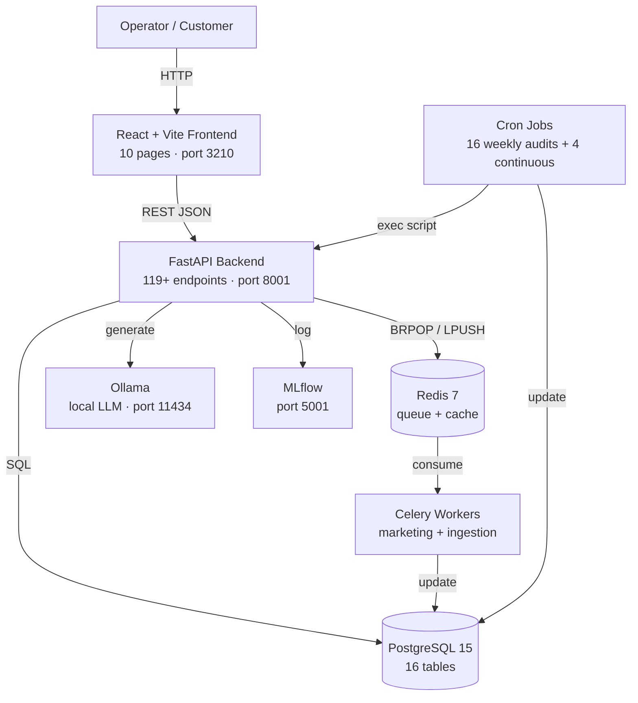

Default backend port is **8001** (not 8000) per docker-compose mapping.

---

## 3. C4 Model

### 3.1 C4 L1 · System Context

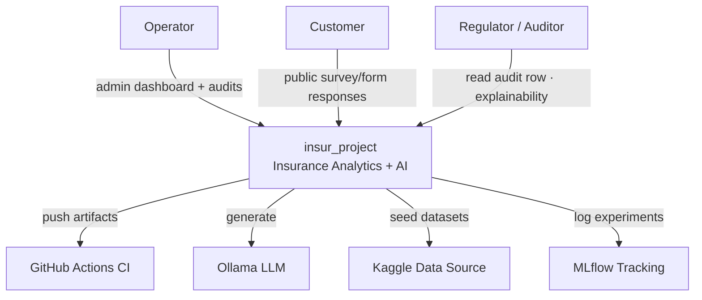

### 3.2 C4 L2 · Containers

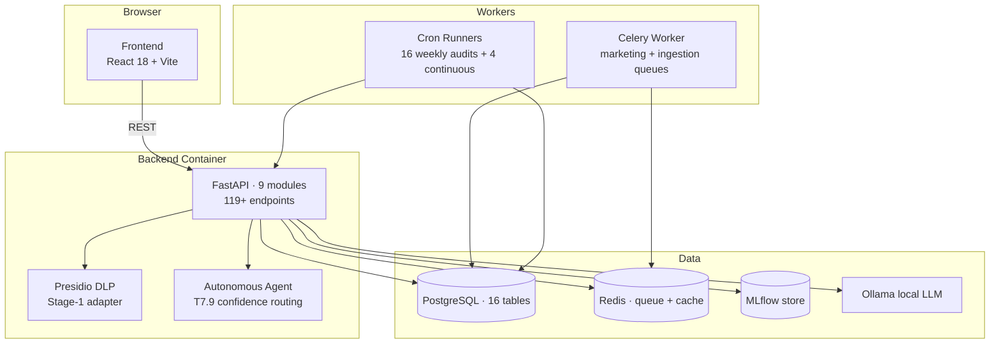

### 3.3 C4 L3 · Backend module breakdown

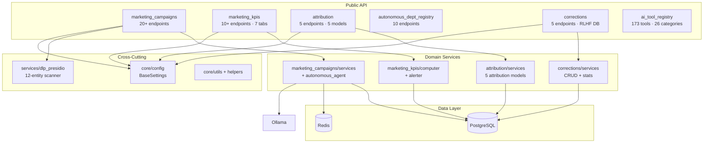

---

## 4. Building Blocks

| # | Module | Responsibility | Lines | Key Files |
|---|---|---|---|---|
| 1 | `marketing_campaigns` | 4-channel campaign engine (email · banner · survey · form) · DLP gate · RAI gate · autonomous agent | 3500+ | `services.py` · `autonomous_agent.py` · `router.py` · `schemas.py` |
| 2 | `marketing_kpis` | 85+ KPI registry · 22 live computers · alerter · snapshot · 7-tab UI | 1200+ | `registry.py` · `computer.py` · `alerter.py` · `router.py` |
| 3 | `attribution` | 5-model multi-touch attribution (last/first/linear/time_decay/position) | 350 | `services.py` · `router.py` |
| 4 | `autonomous_dept_registry` | 10-level maturity · 14 governance gates · 13 MCP · 10 hybrids · 5-tab explorer | 400 | `registry.py` · `router.py` |
| 5 | `corrections` | T7.10 RLHF correction DB · captures human-overrides · feeds future training | 320 | `services.py` · `router.py` · migration 061 |
| 6 | `ai_tool_registry` | 173-tool · 26-category enterprise AI tool landscape | 850 | `registry.py` · `router.py` |
| 7 | `services/dlp_presidio` | Presidio Stage-1 adapter · 12-entity regex fallback | 147 | `dlp_presidio.py` |
| 8 | `core` | config (BaseSettings) · middleware · auth · logging · utils | 600+ | `config.py` · `middleware.py` · `auth.py` |
| 9 | `routers/audit` | 16-audit metadata + report serving | 200 | `audit.py` |

Frontend pages (10):

| Page | Route | Purpose |
|---|---|---|
| MarketingKPIsPage | `/marketing-kpis` | 7-tab command center · KPIs · alerts · latencies · agents · maturity · scorecard |
| MarketingCampaignsPage | `/marketing-campaigns` | Campaign list · create · execute · runs |
| AutonomousAgentPage | `/autonomous-agent` | Decision loop · confidence routing chip per measure |
| AutonomousDeptFrameworkPage | `/autonomous-dept-framework` | 5-tab framework explorer |
| AdminAuditPage | `/admin/audits` | 16 audit reports · latest log per audit |
| ScheduleExecutorPage | `/schedule` | Campaign + posting schedules |
| MasterContactsPage | `/contacts` | Customer · vendor · internal contacts |
| AIToolRegistryPage | `/ai-tools` | 173-tool landscape browser |
| ContentManagementPage | `/content` | RAG-backed knowledge per dept |
| 100CustomerScalePage | `/scale-test` | Bulk-upload + 100-customer test runner |

---

## 5. Sequence Diagrams

### 5.1 Autonomous Agent Decision Loop (T7.9 confidence routing)

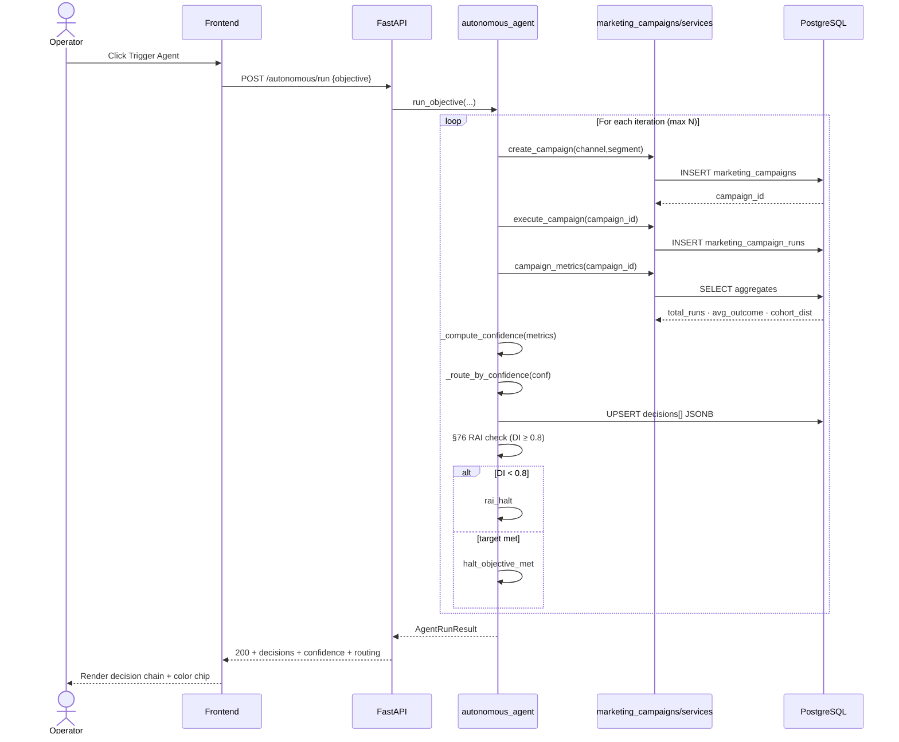

### 5.2 Public Campaign Response Flow

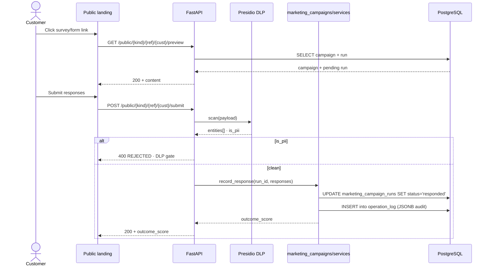

### 5.3 Weekly Audit Run (cron-driven)

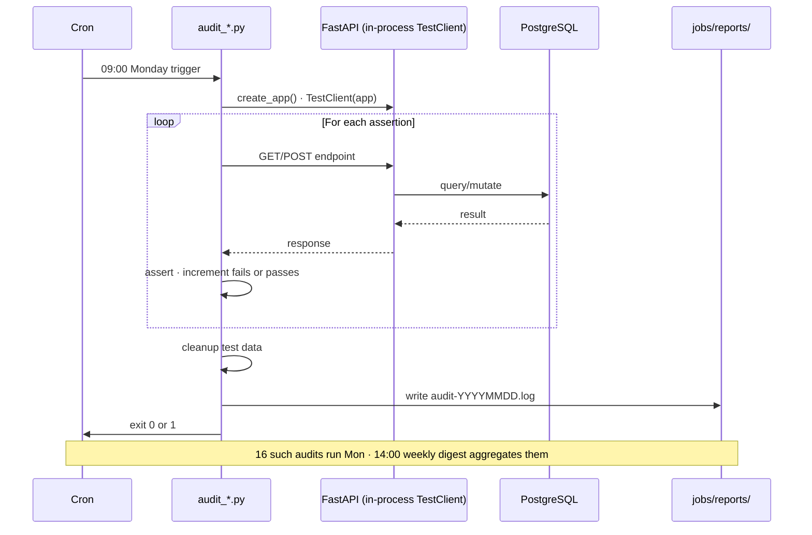

### 5.4 KPI Snapshot + Drift Detection

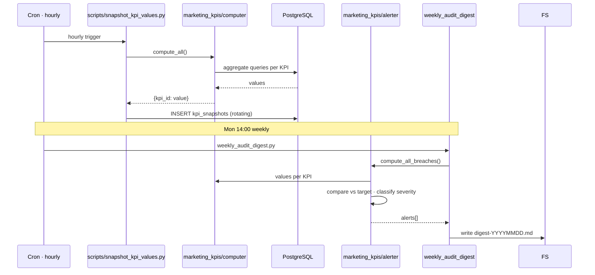

---

## 6. Flowcharts

### 6.1 Cron Audit Pipeline (16 audits Mon 09:00 → 16:30)

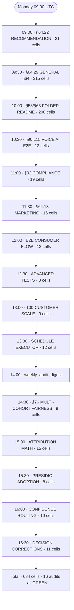

### 6.2 Confidence Routing Decision (T7.9 · governance gate #1)

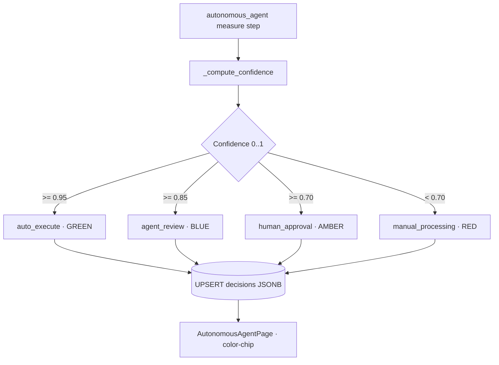

### 6.3 DLP Gate (campaign submission)

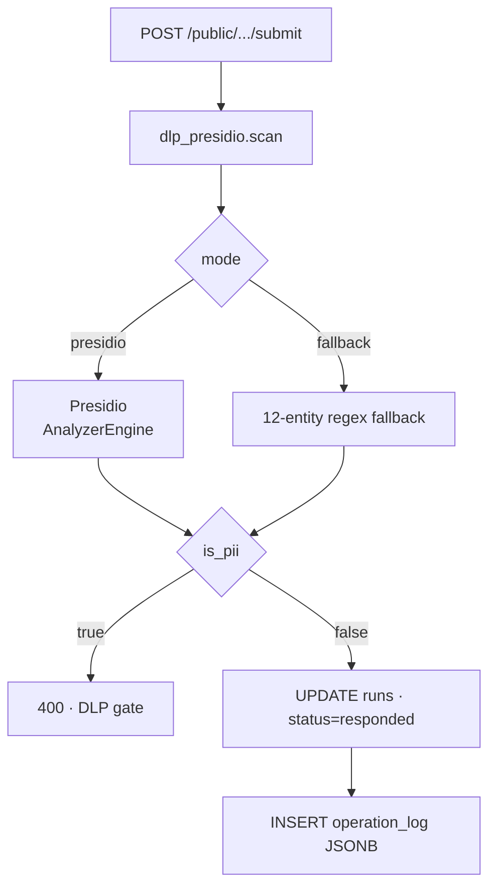

### 6.4 Multi-Touch Attribution (5 models)

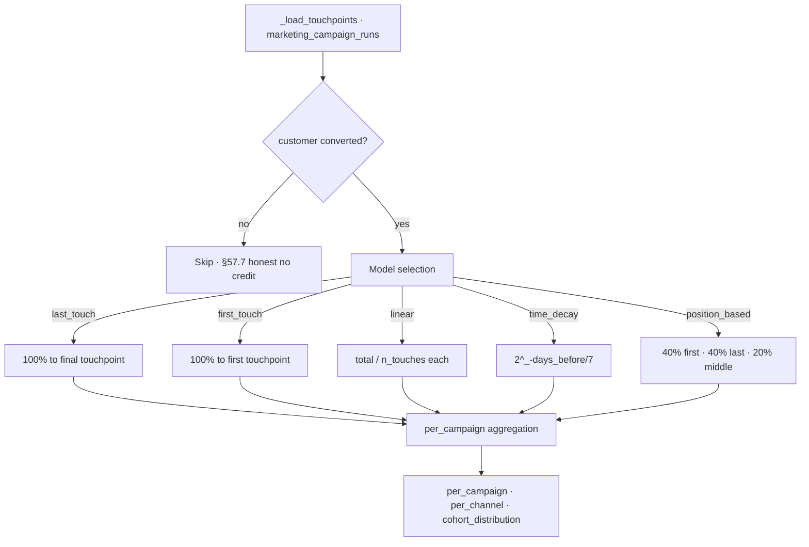

---

## 7. Data Flow

```mermaid
graph LR
    subgraph Ingestion
        K[Kaggle datasets]
        OP[Operator CSV upload]
        PUB[Public survey/form responses]
        AGT[Autonomous agent triggers]
    end

    subgraph Capture
        DLP[Presidio DLP scan]
        RUNS[marketing_campaign_runs]
        CUST[customers]
        AUD[operation_log JSONB]
        LAT[e2e_step_latencies]
    end

    subgraph Compute
        KC[marketing_kpis/computer]
        ATR[attribution/services]
        SNAP[scripts/snapshot_kpi_values]
        ALR[marketing_kpis/alerter]
    end

    subgraph Persist
        SNAPS[kpi_snapshots · hourly]
        ARCH[operation_log_archive · 90d retention]
        CORR[decision_corrections]
    end

    subgraph Surface
        UI[Frontend · 10 pages]
        DGT[weekly_audit_digest]
        EXP[explainability endpoints]
        AUD2[/api/v1/insur/audit]
    end

    K --> OP
    OP --> RUNS
    PUB --> DLP --> RUNS
    AGT --> RUNS
    RUNS --> CUST
    RUNS --> AUD
    RUNS --> LAT

    AUD --> KC
    RUNS --> KC
    KC --> SNAPS
    SNAPS --> SNAP
    KC --> ALR
    RUNS --> ATR
    ATR --> UI
    KC --> UI
    ALR --> DGT
    AUD --> ARCH
    CORR --> EXP
    UI --> AUD2
    DGT --> UI
```

---

## 8. Data Schema (ER)

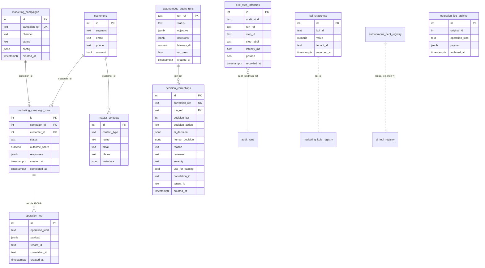

---

## 9. Table Schema (per table reference)

### 9.1 `marketing_campaigns`

| Column | Type | Constraint | Purpose |
|---|---|---|---|
| id | SERIAL | PRIMARY KEY | Surrogate key |
| campaign_ref | TEXT | UNIQUE NOT NULL | Public-facing ref (sent in links) |
| name | TEXT | NOT NULL | Display name |
| channel | TEXT | NOT NULL | email · banner · survey · form |
| status | TEXT | NOT NULL | draft · running · paused · complete |
| product_pitch | TEXT | | Marketing copy |
| call_to_action | TEXT | | CTA text |
| config | JSONB | NOT NULL | Channel-specific config (questions · fields) |
| require_consent | BOOLEAN | DEFAULT TRUE | DLP gate enforcement |
| tenant_id | TEXT | DEFAULT 'default' | Multi-tenant scope |
| created_at | TIMESTAMPTZ | DEFAULT NOW() | |

Indexes · `campaign_ref` · `channel` · `status` · `tenant_id`.

### 9.2 `marketing_campaign_runs`

| Column | Type | Constraint | Purpose |
|---|---|---|---|
| id | SERIAL | PRIMARY KEY | |
| campaign_id | INT | FK marketing_campaigns | |
| customer_id | INT | FK customers | |
| status | TEXT | NOT NULL | pending · responded · converted · skipped |
| outcome_score | NUMERIC | | 0..1 engagement metric |
| responses | JSONB | | Survey/form payload |
| consent_gate_passed | BOOLEAN | DEFAULT FALSE | Consent check result |
| dlp_gate_passed | BOOLEAN | DEFAULT TRUE | Presidio scan result |
| tenant_id | TEXT | DEFAULT 'default' | |
| created_at | TIMESTAMPTZ | DEFAULT NOW() | |
| completed_at | TIMESTAMPTZ | | |

Indexes · `campaign_id` · `customer_id` · `status` · `(campaign_id, status)`.

### 9.3 `autonomous_agent_runs`

| Column | Type | Constraint | Purpose |
|---|---|---|---|
| run_ref | TEXT | PRIMARY KEY | Stable run handle |
| status | TEXT | NOT NULL | running · halted_objective_met · halted_rai · failed |
| objective | JSONB | NOT NULL | Operator request payload |
| decisions | JSONB | NOT NULL | AgentDecision[] (incl. confidence + routing) |
| iterations_run | INT | NOT NULL DEFAULT 0 | |
| campaigns_created | INT | NOT NULL DEFAULT 0 | |
| final_outcome_score | NUMERIC | | |
| fairness_di | NUMERIC | | §76 disparate impact (min cohort / max cohort) |
| rai_pass | BOOLEAN | | DI ≥ 0.8 |
| halt_reason | TEXT | | If halted · why |
| tenant_id | TEXT | DEFAULT 'default' | |
| created_at | TIMESTAMPTZ | DEFAULT NOW() | |

Indexes · `status` · `tenant_id` · `created_at DESC`.

### 9.4 `decision_corrections` (T7.10 RLHF feed)

| Column | Type | Constraint | Purpose |
|---|---|---|---|
| id | SERIAL | PRIMARY KEY | |
| correction_ref | TEXT | UNIQUE NOT NULL | `CORR-<10hex>` |
| run_ref | TEXT | NOT NULL | autonomous_agent_runs.run_ref |
| decision_iter | INT | NOT NULL | Position in decisions[] |
| decision_action | TEXT | NOT NULL | create_campaign · measure · rai_halt · etc. |
| ai_decision | JSONB | NOT NULL | Original AI decision payload |
| human_decision | JSONB | NOT NULL | Operator's corrected version |
| reason | TEXT | NOT NULL | Why the override was needed |
| reviewer | TEXT | NOT NULL | Operator handle |
| severity | TEXT | NOT NULL DEFAULT 'minor' | minor · major · critical |
| use_for_training | BOOLEAN | NOT NULL DEFAULT TRUE | Gate #6 RLHF feed flag |
| correlation_id | TEXT | | Trace propagation |
| tenant_id | TEXT | NOT NULL DEFAULT 'default' | |
| created_at | TIMESTAMPTZ | DEFAULT NOW() | |

Indexes · `run_ref` · `tenant_id` · `decision_action` · `severity` · `created_at DESC`.

### 9.5 `kpi_snapshots` (T5.8 · hourly cron)

| Column | Type | Constraint | Purpose |
|---|---|---|---|
| id | SERIAL | PRIMARY KEY | |
| kpi_id | TEXT | NOT NULL | e.g. `exec.revenue_attribution` |
| value | NUMERIC | | Computed value (null if KPI skipped) |
| tenant_id | TEXT | DEFAULT 'default' | |
| recorded_at | TIMESTAMPTZ | DEFAULT NOW() | |

Indexes · `(kpi_id, recorded_at DESC)` · `recorded_at DESC`.

### 9.6 `e2e_step_latencies` (T3.4 per-step latency capture)

| Column | Type | Constraint | Purpose |
|---|---|---|---|
| id | SERIAL | PRIMARY KEY | |
| audit_kind | TEXT | NOT NULL | e.g. `marketing-e2e-flow` |
| run_ref | TEXT | NOT NULL | Per-audit-run handle |
| step_id | TEXT | NOT NULL | e.g. `1.S` (parsed from label) |
| step_label | TEXT | NOT NULL | Human-readable assertion |
| latency_ms | DOUBLE PRECISION | NOT NULL | Captured via perf_counter |
| passed | BOOLEAN | NOT NULL | Assertion result |
| recorded_at | TIMESTAMPTZ | DEFAULT NOW() | |
| tenant_id | TEXT | DEFAULT 'default' | |

Indexes · `(audit_kind, step_id)` · `recorded_at DESC` · `tenant_id`.

### 9.7 `operation_log` + `operation_log_archive` (T3.3 audit + rotation)

| Column | Type | Constraint | Purpose |
|---|---|---|---|
| id | SERIAL | PRIMARY KEY | |
| operation_kind | TEXT | NOT NULL | e.g. `campaign_response_submitted` |
| payload | JSONB | NOT NULL | Per-operation envelope (operator + correlation_id + before/after) |
| tenant_id | TEXT | DEFAULT 'default' | |
| correlation_id | TEXT | | §47.4 trace |
| created_at | TIMESTAMPTZ | DEFAULT NOW() | |

`operation_log_archive` mirrors the schema · receives rows older than `INSUR_OPLOG_RETENTION_DAYS` (default 90) via `scripts/rotate_operation_log.py`.

### 9.8 Remaining tables (summary)

| Table | Purpose |
|---|---|
| `customers` | Customer master · segment · contact · consent |
| `master_contacts` | T1.x customer · vendor · internal contact list |
| `marketing_schedules` | Campaign cron schedules (daily · weekly · monthly) |
| `marketing_postings` | LinkedIn job/blog posting queue |
| `marketing_audit_log` | Mutation-level marketing audit rows |
| `marketing_consent_log` | Per-customer consent state changes |
| `marketing_dlp_log` | Presidio scan rejection events |
| `marketing_idempotency_keys` | T3.5 idempotency for external integrations |

Total active tables: 16. Migrations live at `backend/migrations/*.sql` (001 → 061).

---

## 10. Quick Start

Plain commands · no widgets · no interactive components.

```bash
# Clone
git clone <repo-url>
cd insur_project

# Environment
cp .env.template .env
# Edit .env · set BEV_POSTGRES_PASSWORD · INSUR_API_KEY · KAGGLE credentials

# Backend stack (postgres + redis + ollama + mlflow + backend + worker)
docker compose up -d postgres redis ollama mlflow backend worker

# Apply migrations (auto-applied on backend boot unless INSUR_SKIP_MIGRATIONS=1)
docker compose exec backend python -m backend.database

# Frontend (host port 3210 → vite dev server)
cd frontend && npm install
npm run dev -- --host 0.0.0.0 --port 3210

# Health gate (must return 0)
./scripts/project_doctor.sh
```

### Service URLs

| Service | Local URL | Default Port |
|---|---|---|
| Frontend (Vite dev) | http://localhost:3210 | 3210 |
| Backend API | http://localhost:8001 | 8001 |
| Backend Swagger | http://localhost:8001/docs | 8001 |
| PostgreSQL | localhost:5434 | 5434 |
| Redis | localhost:6379 | 6379 |
| Ollama | http://localhost:11434 | 11434 |
| MLflow | http://localhost:5001 | 5001 |

---

## 11. Department Modules

| # | Department | Key Surfaces |
|---|---|---|
| 1 | Sales & Revenue | Revenue trends · sales velocity · territory perf |
| 2 | Marketing & Trade Spend | Campaign ROI · attribution · 7-tab KPI center |
| 3 | Supply Chain & Logistics | Inventory turns · fill rate · lead time · OTIF |
| 4 | Demand Forecasting | ML-powered SKU-level forecasts · MAPE/RMSE |
| 5 | Retail & Channel | POS data · shelf analytics · planogram |
| 6 | Product & Innovation | NPD pipeline · SKU rationalization · launch |
| 7 | Finance & P&L | Gross margin · trade spend waterfall · EBITDA bridge |
| 8 | Customer & Shopper | Segmentation · basket · loyalty |
| 9 | Quality & Compliance | Defect rates · recall · regulatory compliance |
| 10 | HR & Workforce | Headcount · attrition · productivity |
| 11 | Executive Scorecard | Consolidated KPIs · AI narrative · alerts |

10 additional departments live in `global-ai-org/departments/` per §63 scaffold.

---

## 12. Project Structure

```
insur_project/
├── backend/
│   ├── core/                       # config · auth · middleware · encryption · logging
│   ├── marketing_campaigns/        # 4-channel engine · autonomous_agent · DLP gate
│   ├── marketing_kpis/             # 85+ KPI registry · computer · alerter
│   ├── attribution/                # 5-model multi-touch
│   ├── corrections/                # T7.10 RLHF correction DB
│   ├── autonomous_dept_registry/   # 10-level maturity · 14 gates · 13 MCP
│   ├── ai_tool_registry/           # 173 tools · 26 categories
│   ├── services/                   # cross-cutting (dlp_presidio · etc.)
│   ├── routers/                    # FastAPI handlers
│   ├── migrations/                 # 001 → 061 SQL
│   ├── ml/                         # ML pipelines + reference impls
│   ├── tests/                      # 31+ pytest tests
│   └── main.py                     # app factory · port 8001
├── frontend/
│   ├── src/
│   │   ├── pages/                  # 10 page components
│   │   ├── components/             # reusable widgets
│   │   ├── hooks/                  # data fetching hooks
│   │   └── services/               # API client
│   └── index.html
├── scripts/
│   ├── audit_*.py                  # 16 weekly audits
│   ├── snapshot_kpi_values.py      # hourly KPI snapshot cron
│   ├── rotate_operation_log.py     # 90-day archive rotation
│   ├── weekly_audit_digest.py      # Mon 14:00 aggregator
│   └── run_due_schedules.py        # campaign + posting executors
├── docs/
│   ├── PENDING_PLAN.md             # tiered task roadmap
│   ├── AUTONOMOUS_DEPARTMENT_FRAMEWORK.md
│   ├── MARKETING_KPI_FRAMEWORK.md
│   ├── ENTERPRISE_AI_TOOL_LANDSCAPE.md
│   └── architecture/               # ARCHITECTURE · FLOW · NETWORK · SEQUENCE
├── global-ai-org/                  # §63 scaffold · 21 depts · 1278 AI items
├── jobs/reports/                   # cron + audit + digest output
├── .github/workflows/audits.yml   # 17-step CI gate
├── docker-compose.yml
└── README.md (this file)
```

---

## 13. CI · Audits · Cron

### CI workflow (`.github/workflows/audits.yml`)

17 sequential steps · all hard-fail on regression:

1. Checkout · 2. Python setup · 3. Install deps · 4. Postgres service ready ·
5-14. 10 file/code-shape audits (recommender · dept · folder-readme · voice-ai · §92 · marketing artifacts · advanced · 100-customer · scheduler · postings) ·
15. §76 multi-cohort fairness ·
16. Attribution math ·
17. Presidio adoption + confidence routing + corrections.

### Cron schedule

| Time | Job |
|---|---|
| Mon 09:00-13:30 | First 10 audits (recommender → schedule executor) |
| Mon 14:00 | weekly_audit_digest |
| Mon 14:30 | §76 multi-cohort fairness |
| Mon 15:00 | Attribution math |
| Mon 15:30 | Presidio adoption |
| Mon 16:00 | Confidence routing |
| Mon 16:30 | Decision corrections |
| Every 15 min | snapshot_kpi_values · rotate_operation_log · run_due_schedules · run_due_postings |

---

## 14. Compliance + Standards

Tracked from CLAUDE.md global instructions:

| § | Topic | This project's state |
|---|---|---|
| §38 | Per-decision AI governance audit row | Implemented in operation_log + decision_corrections |
| §43 | Drill testing pattern (≥ 3 negative assertions) | 16 weekly audits enforce |
| §47 | C4 + architecture surfaces | Section 3 above + docs/architecture |
| §51 | Forensic substrate per commit | Every commit has §51 forensic block |
| §54 | No Co-Authored-By trailer | Enforced |
| §57.7 | Honest fallback · no fake values | DLP fallback · agent confidence · attribution skip · alerter skip semantics |
| §58 | Folder READMEs | Per-module README in major dirs |
| §70 | Cron audit pattern | 16 weekly audits + 4 continuous |
| §74-§86 | Production ML/AI standards | Maturity registry tracks per gate |

Project autonomy maturity self-assessment (per `/api/v1/autonomous-dept/maturity`):

| Level | Status |
|---|---|
| L1 Descriptive | Used |
| L2 Diagnostic | Used |
| L3 Predictive | Scaffolded (rule-based per §57.7) |
| L4 Prescriptive | Scaffolded |
| L5 Workflow | Used |
| L6 Intelligent Workflow | Used |
| L7 Agent | Used |
| L8 Multi-Agent | Planned |
| L9 Decision Intelligence | Planned |
| L10 Autonomous Department | Planned |

---

## 15. Verification commands

```bash
# Project doctor (smoke check + health gate)
./scripts/project_doctor.sh

# All 16 weekly audits (sequential · ~3 min)
bash setup.sh -- --audit

# Architecture docs freshness
bash scripts/architecture_docs_check.sh

# Backend pytest (31+ tests)
pytest backend/tests/ --tb=no -q

# Frontend build
cd frontend && npm run build

# Recent commit count (must be > 0)
git log --since='7 days ago' --oneline | wc -l
```

---

## 16. Contributing

See [`docs/CODE_GUIDELINES.md`](docs/CODE_GUIDELINES.md) for branch + commit conventions.
See [`docs/APPROVAL_GOVERNANCE.md`](docs/APPROVAL_GOVERNANCE.md) for approval gates.
See [`docs/PENDING_PLAN.md`](docs/PENDING_PLAN.md) for the tiered roadmap (T1 → T7).

All PRs must pass:
- `ruff check` + `black --check`
- `pytest --cov=backend --cov-fail-under=80`
- `npm run validate` (frontend build + lint)
- GitHub Actions 17-step audit pipeline

Per §54 · do NOT append `Co-Authored-By: Claude` trailer to commits.

---

## 17. Roadmap (per docs/PENDING_PLAN.md)

| Tier | Theme | Status |
|---|---|---|
| T1 | Operator-gated (LinkedIn OAuth · email SaaS · Twitter API · Banner gen · C2PA · container build) | 6 items |
| T2 | Small concrete fixes | CLOSED |
| T3 | Medium (fairness + DLP + rotation + snapshot + latency + alerts + attribution) | CLOSED |
| T4 | Larger scope (LLM-driven decide · streaming · E2E dashboards) | 1 of 3 done |
| T5 | Marketing Command Center (KPI framework · 10 items) | 9 of 10 done |
| T6 | AI Tool Landscape (12 SaaS adoptions) | 8 of 12 done |
| T7 | Autonomous Dept Framework (10-level + 14 gates + 13 MCP + 10 hybrids) | 10 of 13 done |

Currently active gates per Tier 7:

| Gate | Status |
|---|---|
| #1 Confidence Score Routing | Used (T7.9) |
| #2 Threshold Management | Used |
| #5 AI Correction Layer | Used (T7.10) |
| #9 AI Quality Score | Partial |
| #10 Drift Monitoring | Partial |
| #14 Continuous Learning Workflow | Partial |
| #3 #4 #6 #7 #8 #11 #12 #13 | Planned |

---

This README is the canonical operator-facing reference. Diagrams + tables only · no interactive buttons or live-run widgets. For deep architecture detail see [`docs/architecture/`](docs/architecture/).
