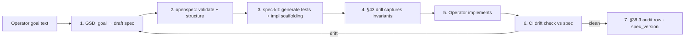

# Spec Pipeline Reference Impl · GSD → openspec → spec-kit

> Operator-requested reference flow showing how spec-driven dev tools compose.
> Per §59 (TDDD/DDD/ORF/MDD) + §90 (each use-case stub IS a spec).

## The flow



## Files

| File | Purpose |
|---|---|
| `1-goal.md` | Operator-written goal · plain English |
| `2-spec.yaml` | GSD-generated structured spec |
| `3-spec.openspec.yaml` | openspec-validated schema · machine-readable |
| `4-tests.yaml` | spec-kit-generated test contracts |
| `5-impl-scaffolding.py` | spec-kit-generated implementation stub |
| `6-drill.py` | §43-compliant drill · 1 positive + 1 negative assertion |
| `Makefile` | One-command run of the full pipeline |

## Run

```bash
cd ai-agents/_shared/examples/spec_pipeline
make all
```

## Per-stage gates (per §90.3)

- After **GSD**: spec has all 28 mandatory subsections (per §90 G1-G18 + top 10)
- After **openspec**: schema validates against canonical JSON Schema · no missing required fields
- After **spec-kit**: at least 1 positive + 1 negative test per spec invariant (per §43)
- After **drill**: invariants drill-locked · CI gate
- After **impl**: operator-implemented · code passes drill
- After **verify**: drift score = 0 · §38.3 audit row created

## Composes with

§43 (drill discipline) · §47.3 (each spec → ADR) · §51 (forensic substrate per spec change) · §59 (TDDD/DDD/ORF/MDD design approaches) · §74 (lifecycle phases = specs) · §90 (each use-case stub IS a 28-subsection spec) · §91 (LangGraph DAG implements spec).
