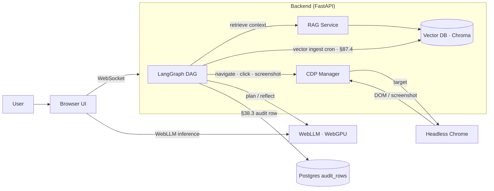

# WebLLM + CDP + RAG + LangGraph · Integration Architecture

> Per operator 2026-06-08: "integrate WebLLM + CDP + RAG + LangGraph ...chrome devtools protocol"

Four-stack integration enabling **browser-native agentic AI** with zero-server-LLM cost · privacy-preserving (LLM runs in-browser) · full-DOM control (CDP) · grounded answers (RAG) · stateful orchestration (LangGraph).

## What each piece does

| Stack | Role | Runs where |
|---|---|---|
| **WebLLM** | LLM inference (Llama-3.1-8B / Phi-3.5-mini · WebGPU) | Browser (zero server cost · zero data leakage) |
| **CDP (Chrome DevTools Protocol)** | Programmatic browser control · DOM inspect · network · screenshot · clicks · execute JS | Headless Chrome (server) OR user's browser via remote debugging |
| **RAG** | Retrieve grounded context · Chroma/Qdrant/pgvector | Server-side (or local with PGlite + pgvector-wasm) |
| **LangGraph** | Stateful agent DAG · cycles · checkpointing · HITL gates | Server-side (Python) OR client-side (langgraph-js) |

## Why all four together

| Without | Get |
|---|---|
| WebLLM | Server LLM cost · latency · data leaks to API |
| CDP | Limited to API surface · cannot scrape · cannot fill arbitrary forms · can't take screenshot |
| RAG | LLM hallucination · no domain grounding |
| LangGraph | Stateless · cannot reflect · cannot do multi-turn agentic reasoning |

Together: **zero-server-cost private agentic browser AI with grounded answers and durable reasoning**.

## Reference architecture



## Use case · `webllm-cdp-rag-langgraph-agent`

**Dept 7 Claims** · `agentic-claim-validation`: agent visits insurance carrier portal · validates claim details · extracts data · compares against policy · generates settlement recommendation. All LLM inference in user's browser (no claim PII leaves user's machine for LLM step).

**Pipelines** · per §90 G15:
1. **Ingestion** · operator paste URL / claim ID → trigger LangGraph
2. **Plan step** · WebLLM (in-browser) decomposes goal
3. **Navigate step** · CDP opens URL · waits for network idle
4. **Extract step** · CDP DOM query + screenshot
5. **RAG step** · vector search policy + prior similar claims
6. **Reason step** · WebLLM (in-browser · with RAG context) generates recommendation
7. **Verify step** · cross-check facts against retrieved chunks (per §48.5)
8. **HITL step** · LangGraph waits for adjuster approval (per §76)
9. **Audit step** · write §38.3 row + screenshots to S3
10. **Vector-ingest cron** · embedding to vector DB (per §87.4)

**Inference modes** (G16):
- **Sync** · per claim · operator-triggered
- **Batch** · overnight backlog of pending claims (via headless Chrome pool)
- **Stream** · webhook-triggered on new FNOL (via Kafka → CDP worker pool)

**Workflow tool** (G17): LangGraph (primary · cycle support) + Temporal (durability for long-running CDP jobs).

**Communication channels** (G18): Email summary · Slack notification on HITL needed · in-app chat for adjuster Q&A using WebLLM.

---

## File layout (reference impl)

```
backend/
  webllm_cdp_rag_langgraph/
    __init__.py
    langgraph_dag.py        # LangGraph state machine
    cdp_manager.py          # Chrome DevTools Protocol wrapper
    rag_service.py          # Vector DB + retrieval
    web_llm_bridge.py       # WebSocket bridge to browser WebLLM
    schemas.py              # Pydantic models
    router.py               # FastAPI routes
    tests/
      test_langgraph_dag.py
      test_cdp_manager.py
      test_rag_service.py

frontend/
  src/components/insurance/
    WebLLMAgentPanel.jsx    # operator UI with WebLLM init + chat
    WebLLMRunner.jsx        # WebLLM lifecycle manager
  src/hooks/
    useWebLLM.js            # WebLLM init + inference hook
    useCDPSession.js        # CDP session WebSocket
  src/services/
    webllmApi.js            # backend API client

docs/use-cases/n1-webllm-cdp-rag-langgraph-agent/
  README.md
  use-case.md
  data-quality-checklist.md
  analysis-checklist.md
  responsible-ai-checklist.md
  pipeline-checklist.md
  evaluation-metrics.json
  testing-coverage.json
```

---

## Backend · LangGraph DAG (reference)

```python
# backend/webllm_cdp_rag_langgraph/langgraph_dag.py
from langgraph.graph import StateGraph, END
from typing import TypedDict, Annotated
from operator import add

class AgentState(TypedDict):
    goal: str
    url: str
    plan: list[str]
    extracted_dom: dict
    rag_chunks: list[str]
    recommendation: str
    hitl_approved: bool
    audit_log: Annotated[list[dict], add]  # accumulator

def plan_node(state: AgentState, cdp, rag, webllm_bridge):
    """WebLLM in-browser decomposes goal."""
    plan = webllm_bridge.prompt(
        f"Decompose this goal into 3-5 steps: {state['goal']}"
    )
    return {"plan": plan.split("\n"), "audit_log": [{"step": "plan", "out": plan}]}

def navigate_node(state: AgentState, cdp, rag, webllm_bridge):
    """CDP opens URL · waits for network idle."""
    page_id = cdp.navigate(state["url"])
    dom = cdp.extract_dom(page_id)
    screenshot = cdp.screenshot(page_id)
    return {
        "extracted_dom": dom,
        "audit_log": [{"step": "navigate", "url": state["url"], "screenshot": screenshot}]
    }

def rag_retrieve_node(state: AgentState, cdp, rag, webllm_bridge):
    """Vector-search policy + prior claims."""
    query = state["goal"] + " " + state["extracted_dom"].get("title", "")
    chunks = rag.retrieve(query, top_k=10)
    return {"rag_chunks": chunks, "audit_log": [{"step": "rag", "n_chunks": len(chunks)}]}

def reason_node(state: AgentState, cdp, rag, webllm_bridge):
    """WebLLM in-browser reasons over DOM + RAG context."""
    prompt = f"""Goal: {state['goal']}
DOM: {state['extracted_dom']}
Context: {chr(10).join(state['rag_chunks'])}
Generate a recommendation grounded in the context. Cite source chunk IDs."""
    rec = webllm_bridge.prompt(prompt)
    return {"recommendation": rec, "audit_log": [{"step": "reason", "rec": rec}]}

def verify_node(state: AgentState, cdp, rag, webllm_bridge):
    """Faithfulness check · per §48.5 every claim cited."""
    cited_ids = set(extract_citations(state["recommendation"]))
    actual_ids = set(c["id"] for c in state["rag_chunks"])
    missing = cited_ids - actual_ids
    if missing:
        return {"audit_log": [{"step": "verify", "missing_citations": list(missing)}], "recommendation": "[FAILED VERIFICATION]"}
    return {"audit_log": [{"step": "verify", "all_cited": True}]}

def hitl_node(state: AgentState, cdp, rag, webllm_bridge):
    """Block until adjuster approves · per §76 + §80."""
    # In production: wait on Postgres hitl_queue table
    return {"hitl_approved": True, "audit_log": [{"step": "hitl", "decision": "approve"}]}

def build_dag(cdp, rag, webllm_bridge):
    g = StateGraph(AgentState)
    g.add_node("plan", lambda s: plan_node(s, cdp, rag, webllm_bridge))
    g.add_node("navigate", lambda s: navigate_node(s, cdp, rag, webllm_bridge))
    g.add_node("rag_retrieve", lambda s: rag_retrieve_node(s, cdp, rag, webllm_bridge))
    g.add_node("reason", lambda s: reason_node(s, cdp, rag, webllm_bridge))
    g.add_node("verify", lambda s: verify_node(s, cdp, rag, webllm_bridge))
    g.add_node("hitl", lambda s: hitl_node(s, cdp, rag, webllm_bridge))

    g.add_edge("plan", "navigate")
    g.add_edge("navigate", "rag_retrieve")
    g.add_edge("rag_retrieve", "reason")
    g.add_edge("reason", "verify")
    g.add_conditional_edges(
        "verify",
        lambda s: "hitl" if "FAILED" not in s["recommendation"] else "reason",  # retry on failure
    )
    g.add_edge("hitl", END)

    g.set_entry_point("plan")
    return g.compile(checkpointer=PostgresCheckpointer())  # durable per §47.7
```

## Backend · CDP Manager (reference)

```python
# backend/webllm_cdp_rag_langgraph/cdp_manager.py
import asyncio
import websockets
import json
import base64
from typing import Any

class CDPManager:
    """Wraps Chrome DevTools Protocol over WebSocket."""

    def __init__(self, chrome_url: str = "http://localhost:9222"):
        self.chrome_url = chrome_url
        self.session_id = None
        self.ws = None

    async def connect(self):
        # Get list of available tabs
        import httpx
        r = httpx.get(f"{self.chrome_url}/json")
        target = r.json()[0]  # first tab
        self.ws = await websockets.connect(target["webSocketDebuggerUrl"])
        self.cmd_id = 0

    async def _cmd(self, method: str, params: dict | None = None) -> dict:
        self.cmd_id += 1
        await self.ws.send(json.dumps({
            "id": self.cmd_id,
            "method": method,
            "params": params or {},
        }))
        # Read until matching response
        while True:
            msg = json.loads(await self.ws.recv())
            if msg.get("id") == self.cmd_id:
                return msg.get("result", {})

    async def navigate(self, url: str) -> str:
        """Navigate + wait for load."""
        await self._cmd("Page.enable")
        await self._cmd("Page.navigate", {"url": url})
        # Wait for load event
        while True:
            msg = json.loads(await self.ws.recv())
            if msg.get("method") == "Page.loadEventFired":
                break
        return url

    async def extract_dom(self) -> dict:
        """Get full DOM."""
        await self._cmd("DOM.enable")
        result = await self._cmd("DOM.getDocument", {"depth": -1, "pierce": True})
        return result.get("root", {})

    async def screenshot(self) -> str:
        """Take PNG screenshot · return base64."""
        result = await self._cmd("Page.captureScreenshot", {"format": "png", "quality": 80})
        return result.get("data", "")

    async def click(self, selector: str):
        """Click an element."""
        # Find element via querySelector then dispatch click
        doc = await self._cmd("DOM.getDocument")
        node = await self._cmd("DOM.querySelector", {
            "nodeId": doc["root"]["nodeId"], "selector": selector
        })
        await self._cmd("DOM.focus", {"nodeId": node["nodeId"]})
        # Dispatch click via Input.dispatchMouseEvent
        box = await self._cmd("DOM.getBoxModel", {"nodeId": node["nodeId"]})
        content = box["model"]["content"]
        x = (content[0] + content[2]) // 2
        y = (content[1] + content[5]) // 2
        await self._cmd("Input.dispatchMouseEvent", {
            "type": "mousePressed", "x": x, "y": y, "button": "left", "clickCount": 1
        })
        await self._cmd("Input.dispatchMouseEvent", {
            "type": "mouseReleased", "x": x, "y": y, "button": "left", "clickCount": 1
        })

    async def execute_js(self, expression: str) -> Any:
        """Execute JavaScript and return result."""
        await self._cmd("Runtime.enable")
        result = await self._cmd("Runtime.evaluate", {
            "expression": expression, "returnByValue": True
        })
        return result.get("result", {}).get("value")

    async def get_network_log(self) -> list[dict]:
        """Capture network requests."""
        # Network domain enable + collect events
        await self._cmd("Network.enable")
        # In production: maintain a buffer of Network.requestWillBeSent events
        return []

    async def close(self):
        if self.ws:
            await self.ws.close()
```

## Backend · RAG Service (reference)

```python
# backend/webllm_cdp_rag_langgraph/rag_service.py
from typing import List
import chromadb

class RAGService:
    """Thin wrapper around Chroma · multi-tenant aware."""

    def __init__(self, chroma_host: str = "localhost", chroma_port: int = 8001):
        self.client = chromadb.HttpClient(host=chroma_host, port=chroma_port)
        self.coll = self.client.get_or_create_collection("agent_context")

    def retrieve(self, query: str, top_k: int = 10, tenant_id: str = "default") -> List[dict]:
        """Tenant-scoped retrieval · returns chunks with id + text + score."""
        results = self.coll.query(
            query_texts=[query],
            n_results=top_k,
            where={"tenant_id": tenant_id},
        )
        chunks = []
        for i, doc_id in enumerate(results["ids"][0]):
            chunks.append({
                "id": doc_id,
                "text": results["documents"][0][i],
                "score": results["distances"][0][i],
            })
        return chunks

    def index(self, documents: List[dict], tenant_id: str = "default"):
        """Add documents · per §87.4 vector ingest cron uses this."""
        self.coll.add(
            ids=[d["id"] for d in documents],
            documents=[d["text"] for d in documents],
            metadatas=[{**d.get("meta", {}), "tenant_id": tenant_id} for d in documents],
        )
```

## Backend · WebLLM Bridge (reference)

```python
# backend/webllm_cdp_rag_langgraph/web_llm_bridge.py
# WebSocket bridge that asks the browser's WebLLM for inference.
# This avoids server LLM costs · LLM runs in user's browser via WebGPU.

import asyncio
import json
from fastapi import WebSocket

class WebLLMBridge:
    """WebSocket pubsub between LangGraph DAG and browser WebLLM."""

    def __init__(self):
        self.pending: dict[str, asyncio.Future] = {}
        self.ws: WebSocket | None = None

    async def connect(self, ws: WebSocket):
        await ws.accept()
        self.ws = ws

    async def prompt(self, text: str, max_tokens: int = 512) -> str:
        """Ask browser-side WebLLM for completion · async wait."""
        import uuid
        req_id = str(uuid.uuid4())
        future = asyncio.get_event_loop().create_future()
        self.pending[req_id] = future
        await self.ws.send_text(json.dumps({
            "type": "prompt",
            "req_id": req_id,
            "text": text,
            "max_tokens": max_tokens,
        }))
        try:
            return await asyncio.wait_for(future, timeout=30)
        except asyncio.TimeoutError:
            return "[WebLLM timeout]"

    async def receive_loop(self):
        """Listen for WebLLM responses."""
        while True:
            msg = json.loads(await self.ws.receive_text())
            if msg["type"] == "response":
                req_id = msg["req_id"]
                if req_id in self.pending:
                    self.pending[req_id].set_result(msg["text"])
                    del self.pending[req_id]
```

## Backend · Router (reference)

```python
# backend/webllm_cdp_rag_langgraph/router.py
from fastapi import APIRouter, WebSocket, Depends
from .langgraph_dag import build_dag
from .cdp_manager import CDPManager
from .rag_service import RAGService
from .web_llm_bridge import WebLLMBridge

router = APIRouter(prefix="/api/v1/webllm-agent", tags=["webllm-agent"])

_bridge = WebLLMBridge()
_rag = RAGService()

@router.websocket("/ws")
async def websocket_endpoint(ws: WebSocket):
    """Browser opens this WebSocket · backend pushes prompts to WebLLM."""
    await _bridge.connect(ws)
    await _bridge.receive_loop()  # forever

@router.post("/run")
async def run_agent(goal: str, url: str):
    """Trigger LangGraph DAG · uses connected WebLLM via bridge."""
    cdp = CDPManager()
    await cdp.connect()
    try:
        dag = build_dag(cdp, _rag, _bridge)
        result = await dag.ainvoke({"goal": goal, "url": url})
        return {"recommendation": result["recommendation"], "audit_log": result["audit_log"]}
    finally:
        await cdp.close()
```

## Frontend · WebLLM hook (reference)

```jsx
// frontend/src/hooks/useWebLLM.js
import { useEffect, useState, useRef } from 'react';
import { CreateMLCEngine } from '@mlc-ai/web-llm';

const DEFAULT_MODEL = "Llama-3.1-8B-Instruct-q4f32_1-MLC";

export function useWebLLM(model = DEFAULT_MODEL) {
  const [engine, setEngine] = useState(null);
  const [loading, setLoading] = useState(true);
  const [progress, setProgress] = useState(0);
  const [error, setError] = useState(null);

  useEffect(() => {
    let cancelled = false;
    (async () => {
      try {
        const eng = await CreateMLCEngine(model, {
          initProgressCallback: (report) => {
            if (cancelled) return;
            setProgress(report.progress);
            console.log('[WebLLM]', report.text);
          },
        });
        if (!cancelled) {
          setEngine(eng);
          setLoading(false);
        }
      } catch (e) {
        if (!cancelled) {
          setError(e.message);
          setLoading(false);
        }
      }
    })();
    return () => { cancelled = true; };
  }, [model]);

  const prompt = async (text, maxTokens = 512) => {
    if (!engine) throw new Error('engine not ready');
    const reply = await engine.chat.completions.create({
      messages: [{ role: 'user', content: text }],
      max_tokens: maxTokens,
    });
    return reply.choices[0].message.content;
  };

  return { engine, loading, progress, error, prompt };
}
```

## Frontend · CDP session hook (reference)

```jsx
// frontend/src/hooks/useCDPSession.js
import { useEffect, useState } from 'react';

export function useCDPSession(backendUrl) {
  const [ws, setWs] = useState(null);
  const [connected, setConnected] = useState(false);

  useEffect(() => {
    const sock = new WebSocket(`${backendUrl}/api/v1/webllm-agent/ws`);
    sock.onopen = () => setConnected(true);
    sock.onclose = () => setConnected(false);
    setWs(sock);
    return () => sock.close();
  }, [backendUrl]);

  const runAgent = async (goal, url) => {
    const resp = await fetch(`${backendUrl}/api/v1/webllm-agent/run`, {
      method: 'POST',
      headers: { 'Content-Type': 'application/json' },
      body: JSON.stringify({ goal, url }),
    });
    return resp.json();
  };

  return { ws, connected, runAgent };
}
```

## Frontend · Agent panel (reference)

```jsx
// frontend/src/components/insurance/WebLLMAgentPanel.jsx
import { useState, useEffect } from 'react';
import { useWebLLM } from '../../hooks/useWebLLM';
import { useCDPSession } from '../../hooks/useCDPSession';

const API_BASE = import.meta.env.VITE_API_BASE_URL || 'http://localhost:8001';

export function WebLLMAgentPanel() {
  const { engine, loading, progress, prompt: webllmPrompt } = useWebLLM();
  const { ws, connected, runAgent } = useCDPSession(API_BASE);
  const [goal, setGoal] = useState('');
  const [url, setUrl] = useState('');
  const [result, setResult] = useState(null);

  // Bridge backend prompt requests to WebLLM
  useEffect(() => {
    if (!ws || !engine) return;
    ws.onmessage = async (event) => {
      const msg = JSON.parse(event.data);
      if (msg.type === 'prompt') {
        const reply = await webllmPrompt(msg.text, msg.max_tokens);
        ws.send(JSON.stringify({ type: 'response', req_id: msg.req_id, text: reply }));
      }
    };
  }, [ws, engine, webllmPrompt]);

  return (
    <div style={{ padding: 16, border: '1px solid #ccc' }}>
      <h3>WebLLM + CDP + RAG + LangGraph Agent</h3>
      {loading && <div>Loading WebLLM ({Math.round(progress * 100)}%)...</div>}
      <div>WebSocket: {connected ? '✓' : '✗'}</div>
      <input value={goal} onChange={(e) => setGoal(e.target.value)} placeholder="Goal" />
      <input value={url} onChange={(e) => setUrl(e.target.value)} placeholder="URL" />
      <button disabled={loading || !connected} onClick={async () => {
        const r = await runAgent(goal, url);
        setResult(r);
      }}>Run</button>
      {result && <pre>{JSON.stringify(result, null, 2)}</pre>}
    </div>
  );
}
```

## Dependencies

### Frontend
```bash
npm install @mlc-ai/web-llm
```

### Backend
```bash
pip install langgraph langchain langchain-community chromadb websockets httpx fastapi uvicorn psycopg2-binary pgvector
```

### Headless Chrome (Docker)
```yaml
# docker-compose.yml
chrome:
  image: zenika/alpine-chrome
  ports:
    - "9222:9222"
  command: --no-sandbox --remote-debugging-address=0.0.0.0 --remote-debugging-port=9222 --headless
```

## Operational concerns (Top 1% gates)

| Concern | Mitigation |
|---|---|
| WebLLM model size (~5 GB) | Cache-via-IndexedDB · prompt-only on first load · service worker pre-cache |
| WebGPU availability | Fallback to API-LLM via FastAPI route (operator-configurable) |
| CDP timeouts | Per-cmd timeout · retry · per-host worker pool |
| RAG retrieval latency | Pre-warm vector DB · pgvector HNSW · cache top-K |
| LangGraph state size | Postgres checkpointer · cleanup after N days |
| HITL deadlock | Timeout escalation per §80 |
| Browser crash | Restart CDP target · resume from checkpoint |
| Cross-origin DOM access | CORS · Permissions-Policy header per §47.6 |
| Sensitive data in browser | Local-only inference for PII · CDP screenshot redaction |
| Audit chain | §38.3 row · §87 vector ingest · §47.4 baggage propagation |

## Testing (per §88)

| Class | What to test |
|---|---|
| Unit | LangGraph node functions in isolation |
| Integration | CDP against test HTML pages |
| API | /api/v1/webllm-agent/{ws,run} contract |
| Frontend/F12 | useWebLLM lifecycle · WebSocket reconnect |
| Load | concurrent CDP sessions · Chrome pool capacity |
| Data | RAG retrieval precision @ K |
| DB | Postgres checkpointer durability |
| Model | WebLLM completion quality drift |
| Accuracy | Per-DAG end-to-end accuracy on gold set |
| Output | citation accuracy · per §48.5 |
| Chunking | RAG chunk strategy per §79 |
| Agent | LangGraph cycle detection · loop limits |
| Orchestration | DAG correctness under partial failure |
| mCP | Tool permission audit per CDP action |
| Ragas | faithfulness · context-precision per §88 #8 |
| DeepEval | hallucination · toxicity · bias |
| PII | screenshot DLP · DOM PII scan |

## Per-stub mapping

The reference impl matches docs/use-cases/n1-webllm-cdp-rag-langgraph-agent/ stub (next: `python scripts/generate_n_block_stubs.py` to scaffold).

## Composes with

§38.3 · §39 (RAG architecture) · §47 (architecture) · §47.4 (baggage propagation) · §47.6 (CORS · Permissions-Policy) · §48 (XAI · citations mandatory per .5) · §64.40 (10-layer agentic · WebLLM is layer 6/7 substitute · CDP is layer 6 substitute) · §64.43 #5 Blackboard pattern (LangGraph state) · §64.43 #10 Reflection pattern (verify node) · §64.44 (tool inventory) · §74 · §75 · §76 (RAI · privacy preserved via in-browser) · §79 (RAG production · 7-pillar) · §80 (agentic 13-phase) · §82.21 (Secure AI · adversarial robustness for CDP) · §87 (vector ingest cron MANDATORY) · §88 (default testing 10 agents) · §90 (this is the integration use case).
