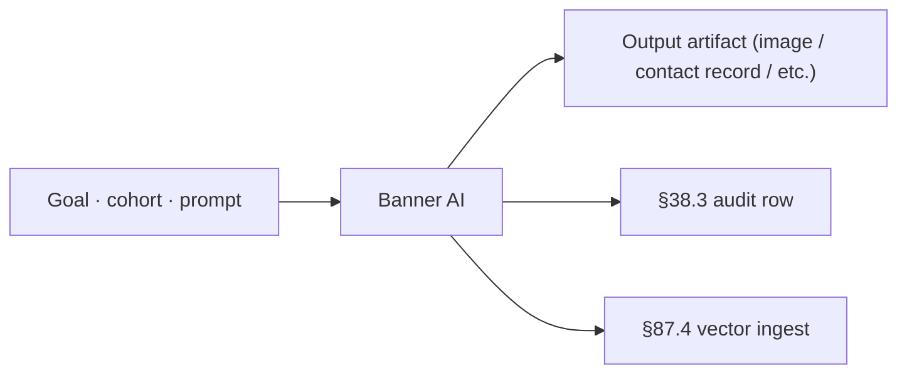

# Banner AI · Deep Dive

> Dynamic visual banner generation · per-cohort variants · A/B winner · multi-channel (Email · Web · Ads · Social · Push) · with C2PA watermarking + accessibility validator.

## 1. Overview + when-to-use

Dynamic visual banner generation · per-cohort variants · A/B winner · multi-channel (Email · Web · Ads · Social · Push) · with C2PA watermarking + accessibility validator.

### When to use Banner AI

| Use Banner AI when... | Use alternative when... |
|---|---|
| (operator fills) | (operator fills) |

## 2. Architecture (composite)



## 3. Install

```bash
./scripts/setup_ai_agent_stack.sh --tool banner-ai
```

## 4. §91 integration

Composes with existing §91 stack. See [`../../../_shared/policies/WEBLLM_CDP_RAG_LANGGRAPH.md`](../../../_shared/policies/WEBLLM_CDP_RAG_LANGGRAPH.md).

## 5. Code examples

(operator-implemented · per §90.3)

## 6. Top-1% gates

- ✓ Per-action audit row (§38.3)
- ✓ Per-tenant isolation (§41.3)
- ✓ PII/PHI redaction (§76)
- ✓ Consent/provenance record (§76 + §82.21)
- ✓ Watermark · C2PA on banner output (§76 + §82.21)
- ✓ Accessibility WCAG AA validator (§46 extended)
- ✓ Cohort fairness audit (§76)
- ✓ Drift monitor on quality / CTR / engagement (§82.7)
- ✓ Explainability per output (§48)
- ✓ Vector ingest for downstream RAG (§87.4)
- ✓ GDPR delete propagation (for contact-ai)

## 7. Troubleshooting

| Symptom | Likely cause | Fix |
|---|---|---|
| Low CTR | Brand tone drift | Re-tune guardrail · A/B refresh |
| Accessibility fail | Color contrast / alt text | Inline a11y validator gate |
| Cross-tenant leak | Missing tenant filter | §41.3 enforcement at boundary |
| Duplicate contact | Entity resolution miss | Lower similarity threshold + manual merge UI |
| Slow batch | Image gen GPU saturation | Queue + horizontal scale |

## 8. References

- §90 catalog: [`../../../_shared/policies/AI_USE_CASES.md`](../../../_shared/policies/AI_USE_CASES.md)
- Tool setup catalog: [`../../../_shared/catalogs/TOOL_SETUP.md`](../../../_shared/catalogs/TOOL_SETUP.md)

## 9. Composes with

§38.3 · §41.3 · §47 · §47.4/.6 · §48 · §64.40 · §76 · §80 · §82.7 · §82.21 (Secure AI · provenance MANDATORY for banner-ai) · §87 · §88 G18 · §90 (L13 banner OR L14 contact) · §91.
