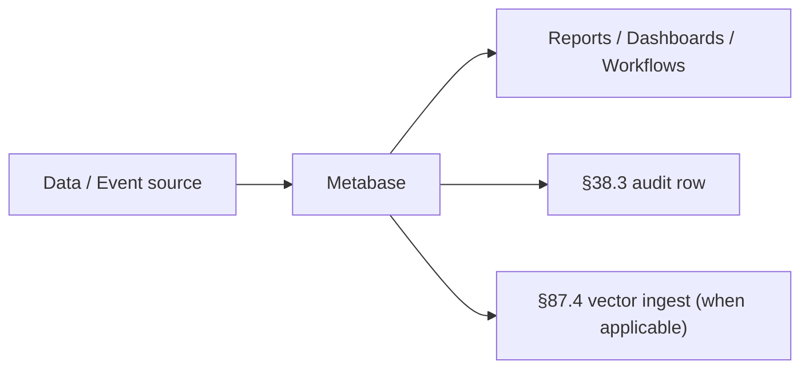

# Metabase · Deep Dive

> OSS BI · SQL + GUI dashboards · embedded analytics · 30+ data sources
> Category: BI / Dashboards · License: AGPL-3 · Port: 3000

## 1. Overview + when-to-use

OSS BI · SQL + GUI dashboards · embedded analytics · 30+ data sources

### When to use Metabase

| Use Metabase when... | Use alternative when... |
|---|---|
| (operator fills · per use case) | (operator fills) |

## 2. Architecture



Key concerns:

- **Privacy**: per §76 5-pillar · web analytics MUST anonymize per GDPR
- **Consent**: cookie banner · tracking opt-out (per §76.10 Art. 50)
- **Data residency**: per-tenant (per §41.3)
- **Auditability**: every dashboard view / workflow action logged (§38.3)

## 3. Install + setup

```bash
./scripts/setup_ai_agent_stack.sh --tool metabase
```

Or:

```bash
docker run -p 3000:3000 metabase/metabase
```

### Configuration

MB_DB_TYPE · MB_DB_HOST

## 4. Integration with §91 stack

| §91 layer | Default | With Metabase |
|---|---|---|
| LLM in browser | WebLLM | unchanged |
| Browser control | CDP | unchanged |
| Retrieval | Chroma RAG | unchanged |
| Orchestration | LangGraph | Metabase plugs in as a tool/data-source |
| Side-effect channel | (per use case) | **Metabase** |

### Wiring into LangGraph node

```python
# ai-agents/metabase/deep/backend/adapter.py (operator-implemented)
# Per §64.40 layer 10 (Enterprise Application integration)
```

## 5. Code examples

### Minimal smoke test

(operator-implemented · place runnable script in `deep/examples/`)

### Production usage

(operator-implemented · per the 28 §90.3 mandatory subsections)

## 6. Top-1% gates

- ✓ Per-action audit row (§38.3)
- ✓ Per-tenant isolation (§41.3)
- ✓ PII redaction / anonymization (§76 · MANDATORY for web analytics)
- ✓ Consent record per session (§76.10 Art. 50 · web analytics)
- ✓ Data residency per tenant (§41.3)
- ✓ Cost tracking per dashboard / workflow run
- ✓ Per-action latency budget (sync < 500 ms · batch < 30 min · §90.3 G16)
- ✓ Kill switch + circuit breaker (§47.7)
- ✓ HITL gate for high-stakes actions (§80)
- ✓ Cohort fairness audit on derived metrics (§76)
- ✓ Explainability of dashboard insights / workflow decisions (§48)
- ✓ Vector ingest of insights / triggers for downstream RAG (§87.4)

## 7. Troubleshooting

| Symptom | Likely cause | Fix |
|---|---|---|
| Auth fail | Missing env var or expired token | Check MB_DB_TYPE · MB_DB_HOST |
| Slow dashboard | Unindexed query · large table scan | Materialized views · index · cache |
| Workflow stuck | External tool timeout · token expired | Per-step retry · backoff · refresh |
| Connection refused | Port in use OR service not started | `docker compose ps` · change port via env |
| Storage growth | Event / report retention | Per §38 retention policy · cleanup cron |
| Database connection drops | Conn pool exhausted | Pool size · circuit breaker |
| OOM | Memory budget exceeded | Smaller batch · GPU/CPU sizing |
| GDPR opt-out not honored | Cookie banner / consent state desync | Audit consent flow · §76 5-pillar privacy |

## 8. References

- Tool homepage: search "Metabase"
- Universal installer: [`../../_shared/scripts/setup_ai_agent_stack.sh`](../../_shared/scripts/setup_ai_agent_stack.sh)
- §91 integration: [`../../_shared/policies/WEBLLM_CDP_RAG_LANGGRAPH.md`](../../_shared/policies/WEBLLM_CDP_RAG_LANGGRAPH.md)
- Tool catalog: [`../../_shared/catalogs/TOOL_SETUP.md`](../../_shared/catalogs/TOOL_SETUP.md)

## 9. Composes with

§38.3 · §41.3 · §47/.4/.6/.7 · §48 (XAI) · §64.40 (layer 10 enterprise integration) · §64.43 · §64.44 · §76 (RAI 5-pillar · GDPR for web analytics MANDATORY) · §80 (HITL for high-stakes) · §82.7 (drift) · §82.21 (Secure AI) · §87 (audit + vector ingest) · §88 (testing · G18 channels) · §90 (mandatory use cases) · §91 (WebLLM+CDP+RAG+LangGraph).
