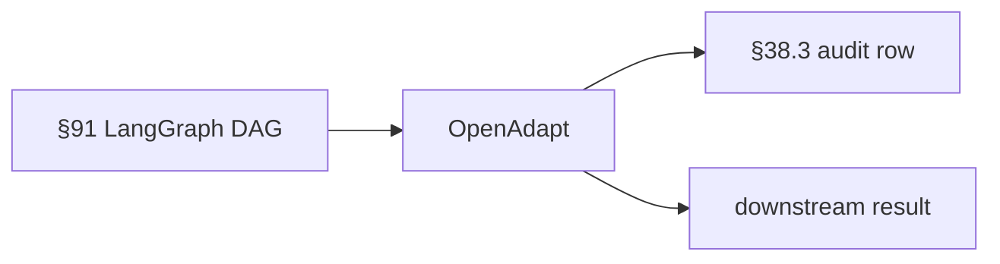

# OpenAdapt · Deep Dive

> Desktop+browser process recorder/replayer. Captures human workflows for agent training.
> License: MIT · Port: n/a

## Table of contents

1. [Overview + when-to-use](#overview)
2. [Architecture](#architecture)
3. [Install + setup](#install)
4. [Integration with §91 stack](#integration)
5. [Code examples](#examples)
6. [Best practices · Top 1% gates](#top-1)
7. [Troubleshooting](#troubleshooting)
8. [References](#references)

## Overview

Desktop+browser process recorder/replayer. Captures human workflows for agent training.

### When to use OpenAdapt

| Use OpenAdapt when... | Use alternative when... |
|---|---|
| (operator fills · per project use case) | (operator fills) |

## Architecture



Key concerns:
- **Privacy**: per §76 5-pillar · what crosses the trust boundary?
- **Cost**: token / GPU / docker container resource budget
- **Latency**: p95 target · sync vs batch vs stream (per §90.3 G16)
- **Tenancy**: per-tenant isolation per §41.3

## Install

```bash
pip install openadapt
```

Or use the universal installer (preferred):
```bash
./scripts/setup_ai_agent_stack.sh --tool openadapt
```

## Integration with §91 stack

### How OpenAdapt composes with WebLLM + CDP + RAG + LangGraph

| §91 layer | Default | With OpenAdapt |
|---|---|---|
| LLM in browser | WebLLM | unchanged |
| Browser control | CDP raw | (operator fills · what does OpenAdapt replace?) |
| Retrieval | Chroma RAG | unchanged |
| Orchestration | LangGraph | unchanged |
| Observability | (none) | (operator fills) |

### Wiring into LangGraph node

```python
# ai-agents/openadapt/deep/backend/<adapter>.py (operator-implemented)
# Follows §91 cdp_manager interface where applicable.
# See ai-agents/_shared/policies/WEBLLM_CDP_RAG_LANGGRAPH.md for the interface.
```

## Code examples

### Minimal smoke test

(operator-implemented · place runnable .py / .sh in `deep/examples/`)

### Production usage

(operator-implemented · per the 28 §90.3 mandatory subsections)

## Top-1% gates

- ✓ Per-action audit row (§38.3) with tenant_id + actor + correlation_id
- ✓ Per-tenant isolation enforced at boundary (§41.3)
- ✓ Screenshot/payload DLP scan before crossing trust boundary (§76)
- ✓ Per-call cost tracked (token · GPU minutes · docker minutes)
- ✓ Per-call latency budget (sync < 500 ms / batch < 30 min · per §90.3 G16)
- ✓ Per-tool kill switch + circuit breaker (§47.7)
- ✓ HITL escalation when uncertainty above threshold (§80)
- ✓ Vector ingest cron for downstream RAG (§87.4)
- ✓ Drift monitoring on output (§82.7)
- ✓ Fairness audit per cohort (§76)
- ✓ Explainability artifact per decision (§48)

## Troubleshooting

| Symptom | Likely cause | Fix |
|---|---|---|
| Port already in use | Another instance on n/a | `docker compose down` or change port via env |
| Install fails | Missing system dep | See operator's pre-flight script |
| Slow first inference | Cold start · model loading | Warm-up cron |
| OOM | Memory budget exceeded | Smaller batch · gradient checkpointing |
| Permission denied | Docker socket access | Add user to docker group OR rootless |
| Timeout under load | Concurrency limit | Pool · queue · §47.10 5-phase load test |

## References

- Tool homepage: (per tool · in install script or top README)
- §91 integration: [`../../../_shared/policies/WEBLLM_CDP_RAG_LANGGRAPH.md`](../../../_shared/policies/WEBLLM_CDP_RAG_LANGGRAPH.md)
- Tool catalog: [`../../../_shared/catalogs/TOOL_SETUP.md`](../../../_shared/catalogs/TOOL_SETUP.md)
- Universal installer: [`../../../_shared/scripts/setup_ai_agent_stack.sh`](../../../_shared/scripts/setup_ai_agent_stack.sh)

## Composes with

§38.3 (audit) · §41.3 (multi-tenant) · §47 (architecture) · §47.4 (baggage) · §47.6 (SOC2) · §47.7 (rollback) · §48 (XAI) · §64.40 (10-layer agentic) · §64.43 (pattern) · §64.44 (tool inventory) · §76 (RAI) · §80 (decisions) · §82.7 (drift) · §82.21 (Secure AI) · §87 (audit + vector ingest) · §88 (testing) · §90 (mandatory use cases) · §91 (WebLLM+CDP+RAG+LangGraph).
