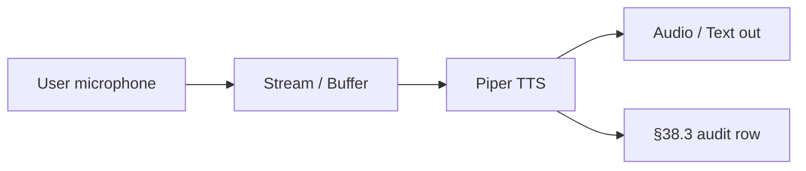

# Piper TTS · Deep Dive

> OSS fast neural TTS · runs offline · CPU-only · 80+ voices
> Category: TTS · License: MIT · Port: none

## 1. Overview + when-to-use

OSS fast neural TTS · runs offline · CPU-only · 80+ voices

### When to use Piper TTS

| Use Piper TTS when... | Use alternative when... |
|---|---|
| (operator fills · per use case) | (operator fills) |

## 2. Architecture



Key concerns (per §76 + §46):

- **Privacy**: voice = biometric · per §76 5-pillar privacy
- **Consent**: recording disclosure · age verification (per §46 TTS consent applies to STT too)
- **Watermarking**: per §46 every synthesized voice MUST be watermarked
- **PII redaction**: real-time DLP on transcripts before downstream consumers (per §76)
- **Latency**: streaming vs batch · per §90.3 G16

## 3. Install + setup

### Universal installer (preferred)

```bash
./scripts/setup_ai_agent_stack.sh --tool piper-tts
```

### Manual

```bash
pip install piper-tts
```

### API keys (if needed)

none

## 4. Integration with §91 stack

| §91 layer | Default | With Piper TTS |
|---|---|---|
| LLM in browser | WebLLM | unchanged |
| Browser control | CDP | unchanged |
| Retrieval | Chroma RAG | unchanged |
| Orchestration | LangGraph | Piper TTS plugs into LangGraph as a voice tool |
| Audio I/O | (none in §91 default) | **Piper TTS** |

### Wiring into LangGraph node

```python
# ai-agents/piper-tts/deep/backend/adapter.py (operator-implemented)
# Follows §91 interface · invoked from LangGraph node via tool call.
# See ai-agents/_shared/policies/WEBLLM_CDP_RAG_LANGGRAPH.md
```

## 5. Code examples

### Minimal smoke test

(operator-implemented · place runnable script in `deep/examples/`)

### Production usage

(operator-implemented · per the 28 §90.3 mandatory subsections)

## 6. Top-1% gates

- ✓ Recording disclosure banner before STT capture (per §46 + §76.10 Art. 50)
- ✓ Per-call audit row (§38.3) with tenant_id + actor + correlation_id + voice consent record
- ✓ Per-tenant isolation at boundary (§41.3)
- ✓ Real-time PII/PHI redaction on transcripts (per §76 + G14 edge cases)
- ✓ Voice watermark on every synthesized voice (per §46 TTS policy applied to all TTS outputs)
- ✓ Per-call latency budget (sync streaming < 200 ms p95)
- ✓ Per-call cost tracked (minute-billing or token-billing)
- ✓ Kill switch + circuit breaker (§47.7)
- ✓ HITL escalation when uncertainty above threshold (§80)
- ✓ Accent + language fairness audit per cohort (§76)
- ✓ Explainability artifact (transcript + decision · §48)
- ✓ Vector ingest for downstream RAG (transcripts → vector DB · §87.4)
- ✓ Drift monitoring on transcript quality / WER (§82.7)

## 7. Troubleshooting

| Symptom | Likely cause | Fix |
|---|---|---|
| API 401 / unauthorized | Missing or expired API key | Set none · refresh from dashboard |
| Cold-start latency spikes | Model loading | Warm-up cron OR keep-alive pinger |
| Cross-talk / poor diarization | Multiple speakers · noisy channel | Per-tool diarization config · or use specialized diarization (pyannote) |
| Multilingual mis-detection | Wrong language hint | Pass language code explicitly |
| Streaming dropouts | WebSocket flaps | Reconnect with jittered backoff |
| Voice cloning blocked | Public-figure restriction | Watermark + consent record (per §46) |
| Real-time latency budget breach | Network or model size | Smaller model / lower bitrate / regional endpoint |
| Account-level rate limit | Concurrent calls > tier | Upgrade tier OR queue+backoff |

## 8. References

- Tool homepage: (search) Piper TTS
- Universal installer: [`../../_shared/scripts/setup_ai_agent_stack.sh`](../../_shared/scripts/setup_ai_agent_stack.sh)
- §91 integration: [`../../_shared/policies/WEBLLM_CDP_RAG_LANGGRAPH.md`](../../_shared/policies/WEBLLM_CDP_RAG_LANGGRAPH.md)
- §46 TTS policy (applies to all voice tools): in CLAUDE.md
- §90 Block J Voice AI (J1): [`../../_shared/policies/AI_USE_CASES.md`](../../_shared/policies/AI_USE_CASES.md)
- §88 G18 communication channels (Voice row)

## 9. Composes with

§38.3 · §41.3 · §46 (TTS consent · watermark · applies here too) · §47/.4/.6/.7 · §48 (XAI on voice decisions) · §64.40 · §64.43 · §64.44 · §76 (RAI 5-pillar · privacy MANDATORY for voice) · §80 · §82.7 (drift) · §82.21 (Secure AI · voice deepfake defense) · §87 (audit + vector ingest) · §88 G18 (Voice channel) · §90 Block J (J1 Voice AI) · §91 (WebLLM+CDP+RAG+LangGraph stack as agent host).
