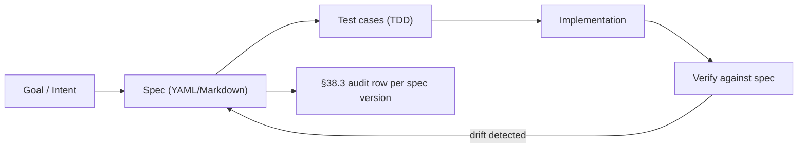

# Spec-Kit · Deep Dive

> GitHub spec-driven framework · automates spec → test → impl loop · YAML-based agent contracts
> Category: Spec-Driven Methodology · License: MIT · Port: none

## 1. Overview + when-to-use

GitHub spec-driven framework · automates spec → test → impl loop · YAML-based agent contracts

### When to use Spec-Kit

| Use Spec-Kit when... | Use alternative when... |
|---|---|
| Need spec-first discipline before coding | Spec already written + reviewed |
| LLM-assisted spec generation needed | Domain expert writes spec by hand |
| Cross-team alignment via canonical spec | Single dev sprint · less ceremony |

## 2. Architecture (spec-driven dev loop)



Key concerns:

- **Spec versioning**: every spec change tracked in git (§51 forensic substrate)
- **Spec → test traceability**: each test cites the spec line that requires it (§43 drill discipline)
- **Spec → ADR linkage**: every spec change generates / links to an ADR (§47.3)
- **Spec validation**: schema check before merge

## 3. Install + setup

### Universal installer (preferred)

```bash
./scripts/setup_ai_agent_stack.sh --tool spec-kit
```

### Manual

```bash
npm install -g @github/spec-kit OR pip install spec-kit
```

### Configuration

GITHUB_TOKEN (optional)

## 4. Integration with §91 stack

| §91 layer | Default | With Spec-Kit |
|---|---|---|
| LLM in browser | WebLLM | unchanged · WebLLM can suggest spec deltas |
| Browser control | CDP | unchanged |
| Retrieval | Chroma RAG | RAG over prior specs |
| Orchestration | LangGraph | DAG follows spec checkpoints |
| Methodology | (manual) | **Spec-Kit** drives the dev loop |

## 5. Code examples

### Minimal spec

(operator-implemented · place a sample spec in `deep/examples/spec.yaml`)

### Production usage

(operator-implemented · per the 28 §90.3 mandatory subsections · each subsection is a spec section)

## 6. Top-1% gates

- ✓ Every change starts with a spec PR (no code-first commits)
- ✓ Spec → ADR linkage (per §47.3)
- ✓ Spec → drill linkage (per §43)
- ✓ Spec version recorded in §38.3 audit row of any AI decision driven by it
- ✓ Spec review by council (per §38 + §64.43 #2 Council pattern)
- ✓ Spec drift monitoring (impl tests vs current spec) — fail CI on drift
- ✓ Forensic substrate per spec change (per §51)
- ✓ Spec-as-data: machine-readable for compliance audit

## 7. Troubleshooting

| Symptom | Likely cause | Fix |
|---|---|---|
| Spec / impl drift | Code changed without spec update | Pre-commit hook · CI gate |
| Spec ambiguity | LLM generated unclear spec | Operator review · structured template |
| Slow spec generation | Cold LLM cache | Warm-up · or use smaller model |
| Spec validation fails | Schema violation | Lint against canonical schema |
| Council disagreement on spec | Subjective requirement | Domain expert tie-break · or pivot to ADR |
| Forensic-substrate gap | Spec history not in git | Always commit spec.md before impl |

## 8. References

- Tool homepage: search "Spec-Kit"
- §43 (drill testing pattern · drills derive from specs)
- §47 (architecture · ADRs are formal specs)
- §51 (forensic substrate · spec history matters)
- §57 (production-grade discipline · spec-first)
- §59 (TDDD/DDD/ORF/MDD design approaches · all spec-driven)
- §64.43 #2 Council of Agents (spec review pattern)
- §90 (mandatory use cases · each IS a spec with 28 subsections)

## 9. Composes with

§38.3 · §43 · §44 (autonomous loop · drives next-iter spec) · §47 (ADRs · 7-surface architecture) · §51 (forensic substrate per spec change) · §57 (production-grade) · §59 (TDDD/DDD/ORF/MDD) · §64.40 (10-layer agentic) · §64.43 #2 (council) · §74 (ML lifecycle phases ARE specs) · §82.19 (ResAI · spec-driven accountability) · §90 (each use-case stub IS a spec) · §91 (LangGraph DAG implements spec).
