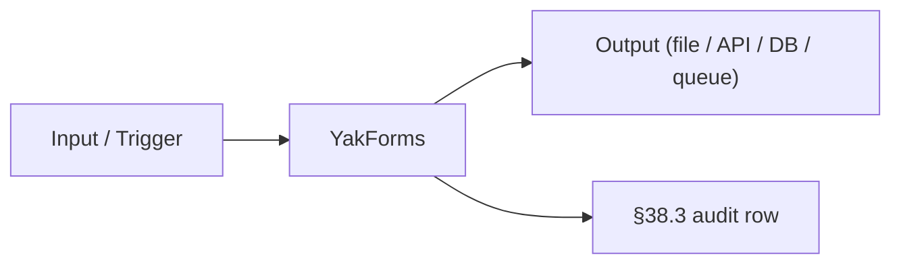

# YakForms · Deep Dive

> Form-builder by Framasoft · privacy-first · French-origin · LimeSurvey alternative
> Category: Survey/Forms · License: GPL-3 · Port: 8080

## 1. Overview + when-to-use

Form-builder by Framasoft · privacy-first · French-origin · LimeSurvey alternative

### When to use YakForms

| Use YakForms when... | Use alternative when... |
|---|---|
| (operator fills · per use case) | (operator fills) |

## 2. Architecture



Key concerns:

- **Privacy / PII**: per §76 5-pillar (especially relevant for email · survey · marketing categories)
- **Consent**: opt-in tracking · GDPR · CAN-SPAM (per §76.10 Art. 50 + EU AI Act)
- **Data residency**: where the data lives matters per tenant (§41.3)
- **Cost**: licence cost · self-hosting cost · per-message cost
- **Latency**: real-time vs batch (per §90.3 G16)
- **Watermarking**: AI-generated content provenance (image gen · per §76 + §82.21)

## 3. Install + setup

### Universal installer (preferred)

```bash
./scripts/setup_ai_agent_stack.sh --tool yakforms
```

### Manual

```bash
git clone https://framagit.org/yakforms/yakforms && docker compose up
```

### Configuration

DB creds

## 4. Integration with §91 stack

| §91 layer | Default | With YakForms |
|---|---|---|
| LLM in browser | WebLLM | unchanged |
| Browser control | CDP | unchanged |
| Retrieval | Chroma RAG | unchanged |
| Orchestration | LangGraph | YakForms plugs in as a tool/connector |
| Side-effect channel | (per use case) | **YakForms** (image / form / email) |

### Wiring into LangGraph node

```python
# ai-agents/yakforms/deep/backend/adapter.py (operator-implemented)
# Per §64.40 layer 10 (Enterprise Application integration)
```

## 5. Code examples

### Minimal smoke test

(operator-implemented · place runnable script in `deep/examples/`)

### Production usage

(operator-implemented · per the 28 §90.3 mandatory subsections)

## 6. Top-1% gates

- ✓ Per-action audit row (§38.3) with tenant_id + actor + correlation_id
- ✓ Per-tenant isolation at boundary (§41.3)
- ✓ PII/PHI redaction before downstream (§76)
- ✓ Opt-in / consent record per recipient (per §76.10 Art. 50)
- ✓ Provenance metadata on AI-generated outputs (per §82.21 · for image gen)
- ✓ Watermark on AI-generated images (per §76 · stylometric or C2PA)
- ✓ Per-message cost tracked (token / image / API call)
- ✓ Per-action latency budget (sync < 500 ms · batch < 30 min · per §90.3 G16)
- ✓ Kill switch + circuit breaker (§47.7)
- ✓ HITL gate for high-stakes outputs (§80)
- ✓ Bounce / delivery monitoring (for email tools · §82.7)
- ✓ Spam-rate guardrails (for email tools · CAN-SPAM compliance)
- ✓ Fairness audit per cohort (for marketing automation · §76)
- ✓ Explainability of why this recipient (for marketing automation · §48)

## 7. Troubleshooting

| Symptom | Likely cause | Fix |
|---|---|---|
| Connection refused | Port in use OR service not started | `docker compose ps` · change port via env |
| Slow generation | Model loading · GPU saturation | Warm-up cron OR queue throttle |
| Auth fail | Missing env var or expired token | Check DB creds |
| Mail delivery low | DNS / DKIM / SPF / DMARC | Verify records · monitor bounce rate |
| Survey response low | Distribution / opt-in / fatigue | Per-cohort fairness audit · re-target |
| Storage growth | Image / archive retention | Per §38 retention policy · cleanup cron |
| Database connection drops | Conn pool exhausted | Pool size · circuit breaker |
| OOM | Memory budget exceeded | Smaller batch · GPU/CPU sizing |

## 8. References

- Tool homepage: search "YakForms"
- Universal installer: [`../../_shared/scripts/setup_ai_agent_stack.sh`](../../_shared/scripts/setup_ai_agent_stack.sh)
- §91 integration: [`../../_shared/policies/WEBLLM_CDP_RAG_LANGGRAPH.md`](../../_shared/policies/WEBLLM_CDP_RAG_LANGGRAPH.md)
- Tool catalog: [`../../_shared/catalogs/TOOL_SETUP.md`](../../_shared/catalogs/TOOL_SETUP.md)
- §90 catalog: [`../../_shared/policies/AI_USE_CASES.md`](../../_shared/policies/AI_USE_CASES.md)

## 9. Composes with

§38.3 · §41.3 · §47/.4/.6/.7 · §48 (XAI) · §64.40 (layer 10 enterprise integration) · §64.43 · §64.44 · §76 (RAI 5-pillar) · §80 (HITL for high-stakes) · §82.7 (drift) · §82.21 (Secure AI · provenance) · §87 (audit + vector ingest) · §88 (testing) · §90 (mandatory use cases) · §91 (WebLLM+CDP+RAG+LangGraph).
