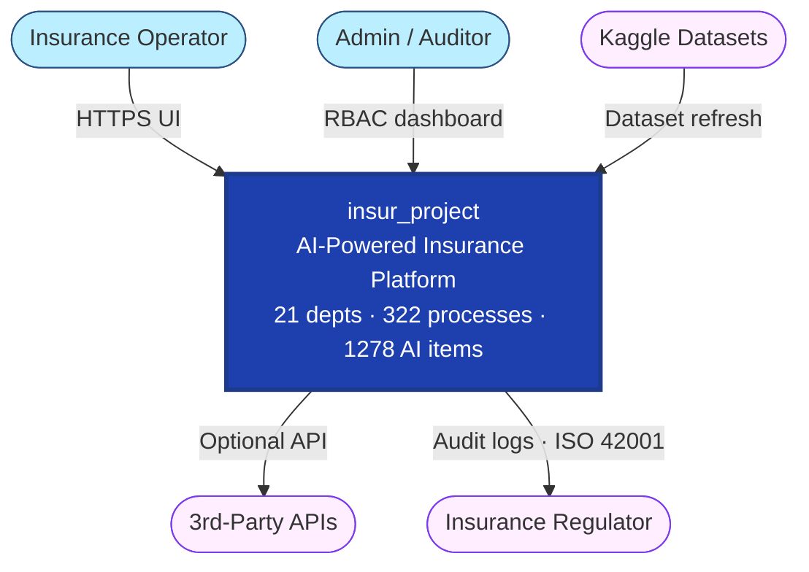
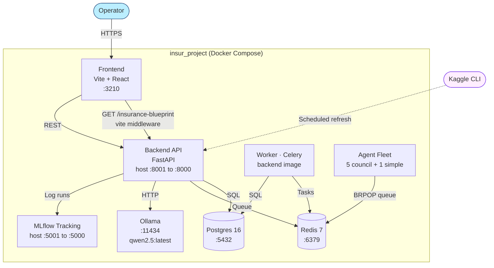

# Architecture · insur_project

> Per §47.2 C4 model. L1 Context · L2 Containers. Updated 2026-06-08.

## L1 — System Context

## L2 — Containers

## Components

| Component | Tech | Purpose | Status (2026-06-08) |
|---|---|---|---|
| Frontend | React 18 + Vite | UI (21 dept × 322 process catalog) | Running :3210 |
| Backend API | FastAPI + Python 3.12 | Business logic + ML serving | Image built · host port shifted to :8001 |
| Postgres | PostgreSQL 16 | Primary data store | **NOT running** (69 DB tests skip) |
| Redis | Redis 7 | Cache + Celery broker | Running (Docker IP 192.168.48.4) |
| Worker | Celery | Background tasks | Running |
| Agent Fleet | Council + simple agents | Multi-agent orchestration | 5 council + 1 simple live |
| Ollama | Ollama runtime | LLM inference (qwen2.5) | Running :11434 |
| MLflow | MLflow 2.12 | Experiment tracking | Running :5001 · 4 exp · 21 runs |

## Key architectural decisions

- **ADR-001**: Vite middleware serves `/insurance-blueprint` directly (8.2 MB JSON) — bypasses backend for static catalog
- **ADR-002**: Host port 8001:8000 for backend (legacy bev-analytics squats on :8000)
- **ADR-003**: Lowercase canonical domains b2c/b2b/b2e (per `frontend/src/utils/insuranceNavigation.js`)
- **ADR-004**: Per-process detail = 21 tabs (Data · Model · Analysis · UserStory · UserDemo · Visualization · ResAI · ExpAI · GovernanceAI · Tests · Security + others)

## Known gaps (per DEEP_ERROR_ANALYSIS_REPORT_2026-06-08)

- OpenAPI catalog drift (12 live ops missing)
- Postgres + frontend + MLflow not started in compose right now
- Backend port wiring inconsistency (compose 8001 vs default app on 8000)
- RAG hardcodes Ollama host + model
- Generic `MLService.predict()` is placeholder inference

## Composes with

§47 (C4) · §80 (agentic 13-phase) · §84 (ISO 42001 + CMMI L3) · §86 (this standard)
