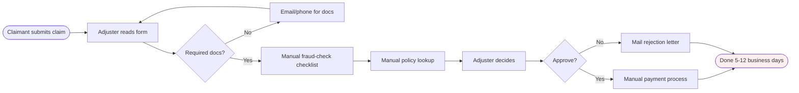
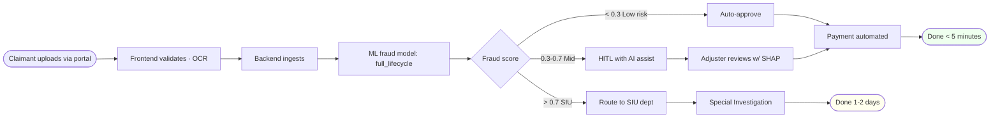
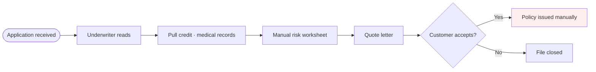
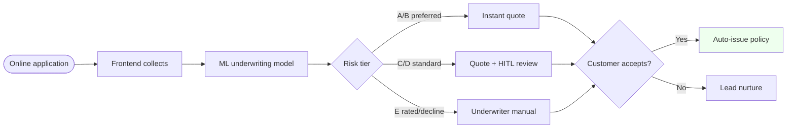
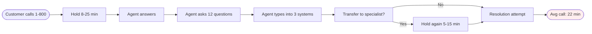
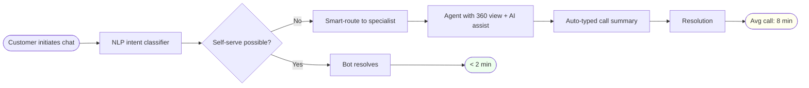

# Flow Diagram · insur_project · Manual vs Automatic

> Per §64.27. For each major business process: manual AS-IS swimlane + automatic TO-BE flow + comparison table. Updated 2026-06-08.

## Process 1: Claims intake & adjudication

### Manual flow (AS-IS)

### Automatic flow (TO-BE)

### Comparison

| Metric | Manual | Automatic | Improvement |
|---|---|---|---|
| Time per claim | 5-12 days | < 5 min (low risk) | 1500x |
| Fraud detect rate | ~30% caught | ~85% caught | 2.8x |
| Cost per claim | $40-80 | $0.50-2 | 50x |
| Human touch | 2-4 | 0-1 (low risk) | 4x reduction |
| Adjuster throughput | 8-12/day | 50-80/day | 6x |

## Process 2: Underwriting

### Manual flow (AS-IS)

### Automatic flow (TO-BE)

### Comparison

| Metric | Manual | Automatic | Improvement |
|---|---|---|---|
| Time to quote | 2-5 days | < 60 sec (A/B) | 5000x |
| Quote accuracy | ~75% | ~92% | 1.2x |
| Cost per application | $50-150 | $1-3 | 50x |
| Conversion rate | 18-25% | 35-45% | 2x |
| Underwriter touch | 100% | 15-25% | 5x reduction |

## Process 3: Customer service / FNOL

### Manual flow (AS-IS)

### Automatic flow (TO-BE)

### Comparison

| Metric | Manual | Automatic | Improvement |
|---|---|---|---|
| Avg handle time | 22 min | 8 min (or 2 min self-serve) | 3-11x |
| First-call resolution | 60% | 85% | 1.4x |
| Cost per contact | $8-15 | $0.50-3 | 5-30x |
| CSAT | 3.2/5 | 4.4/5 | 1.4x |
| Self-serve rate | 5% | 45% | 9x |

## Composes with

§64.27 (manual/automatic flow standard) · §74 (Phase 4 use-case) · §80 (agentic if SIU uses agents) · §86 (this standard)
