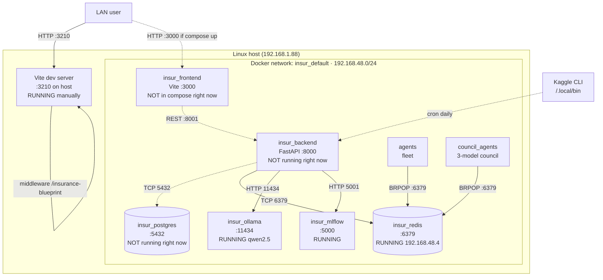
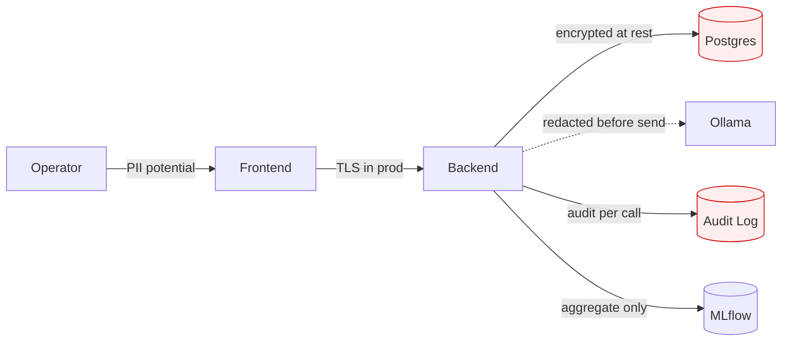

# Network Flow · insur_project · Deployment Topology

> Container topology · port map · service-to-service · external integrations · data-flow boundaries. Updated 2026-06-08.

## Container topology

## Port map (host:container)

| Service | Host port | Container port | Status |
|---|---|---|---|
| Frontend Vite (manual) | 3210 | 3000 | **RUNNING** |
| Frontend compose | 3000 | 3000 | Not in compose right now |
| Backend (compose-mapped) | **8001** | 8000 | Image built · not running |
| Backend (squatted by legacy) | 8000 | — | **bev-analytics responds here** |
| Postgres | 5432 | 5432 | Not running |
| Redis | 6379 | 6379 | Running (Docker IP 192.168.48.4) |
| Ollama | 11434 | 11434 | Running |
| MLflow | 5001 | 5000 | Running · 4 experiments · 21 runs |

## Service-to-service connections

| From | To | Protocol | Auth | Notes |
|---|---|---|---|---|
| Frontend | Backend | HTTP/REST | Bearer JWT (planned) | Compose maps to 8001 |
| Backend | Postgres | TCP/SQL | User+pwd env | `BEV_POSTGRES_HOST=postgres` |
| Backend | Redis | TCP | None (private net) | `REDIS_URL=redis://insur_redis:6379/0` |
| Backend | Ollama | HTTP | None | Hardcoded `http://localhost:11434` (bug per DEEP_ERROR_REPORT) |
| Backend | MLflow | HTTP | None | Tracking URI |
| Worker | Postgres | TCP/SQL | Same as backend | Celery |
| Worker | Redis | TCP | Same | Broker + result backend |
| Agents | Redis | TCP | Same | BRPOP for tasks |
| Vite (dev) | Disk | local FS | None | Serves `/insurance-blueprint` from `data/insurance/blueprint.json` |

## External integrations

| External | Purpose | Auth | Data sensitivity |
|---|---|---|---|
| Kaggle | Dataset refresh | `~/.kaggle/kaggle.json` (chmod 600) | Public datasets only |
| 3rd-party AI | Optional · not wired | OAuth2 future | Per §76 no-PHI to external |

## Data-flow boundaries

## Failure / DR

| Service | RPO | RTO | Notes |
|---|---|---|---|
| Postgres | 1h | 30 min | pg_dump + S3 (planned · not wired) |
| Redis | 1s | < 5 min | AOF persistence |
| Backend | stateless | < 2 min | horizontal scale via compose `--scale` |
| Frontend | static | < 1 min | CDN-cacheable |
| Worker | idempotent | < 5 min | Celery retries |

## Composes with

§47 (architecture · network = C4 deployment) · §76 (privacy · data-flow boundaries) · §86 (this standard)
