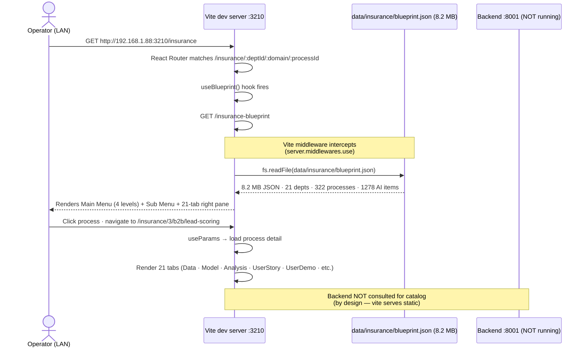
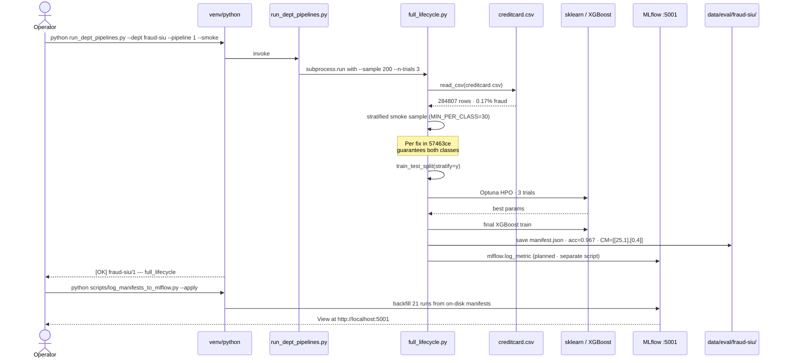

# Sequence Diagrams · insur_project · Top 3 User Flows

> Per §86 doc #5. Updated 2026-06-08.

## Flow 1: Operator opens Insurance Blueprint catalog



## Flow 2: ML pipeline smoke run (fraud-SIU)



## Flow 3: Error recovery — fix-loop nightly cron with disk unmount

```mermaid
sequenceDiagram
    participant Cron as cron :09:00
    participant Wrapper as with_venv_preflight.sh
    participant Loop as insur_fix_loop.sh
    participant Preflight as scripts/insur_preflight.sh
    participant Disk as /media/praveen/praveenlinux21
    participant Log as jobs/logs/insur_fix_loop.log
    participant Audit as .agent/auto_fix_audit.jsonl

    Cron->>Wrapper: invoke fix-loop with preflight
    Wrapper->>Preflight: check venv + kaggle + creds + disk
    alt disk unmounted
        Preflight-->>Wrapper: FAIL · venv at /media/.../cuda not reachable
        Wrapper->>Log: "preflight skip · disk unmounted · no error per §60"
        Wrapper-->>Cron: exit 0 (clean skip)
        Note over Wrapper,Cron: Per §60 path verification<br/>(d40a468 fix)
    else disk mounted
        Preflight-->>Wrapper: OK · all 5 checks pass
        Wrapper->>Loop: run 6 stages
        Loop->>Loop: scan ruff lint
        Loop->>Loop: dispatch council if --council
        Loop->>Audit: append jsonl per attempt
        Loop->>Log: write summary
        Loop-->>Wrapper: exit 0
        Wrapper-->>Cron: completed
    end
```

## Composes with

§47 (architecture · sequences are C4 dynamic views) · §57.5 (5-question runbook · flow 3 = incident response) · §60 (path verification · flow 3 fail-safe) · §86 (this standard)
