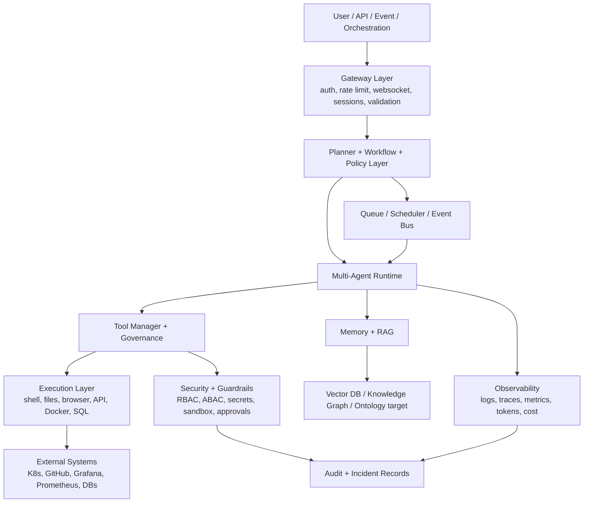
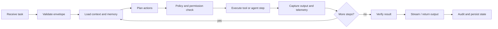
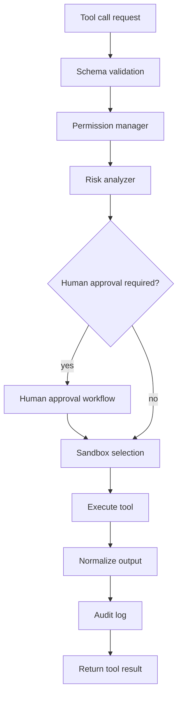
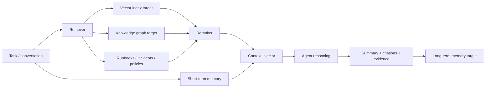
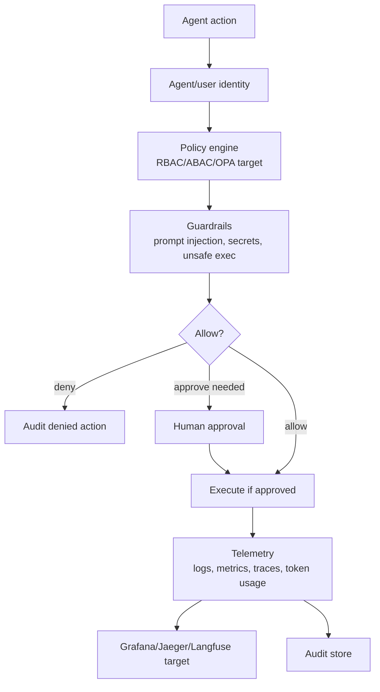

# Agent Platform Architecture Diagrams

## 1. Layered Architecture Flow

## 2. Agent Runtime Flow

## 3. Tool Governance Flow

## 4. Memory And RAG Flow

## 5. Governance And Observability Flow

