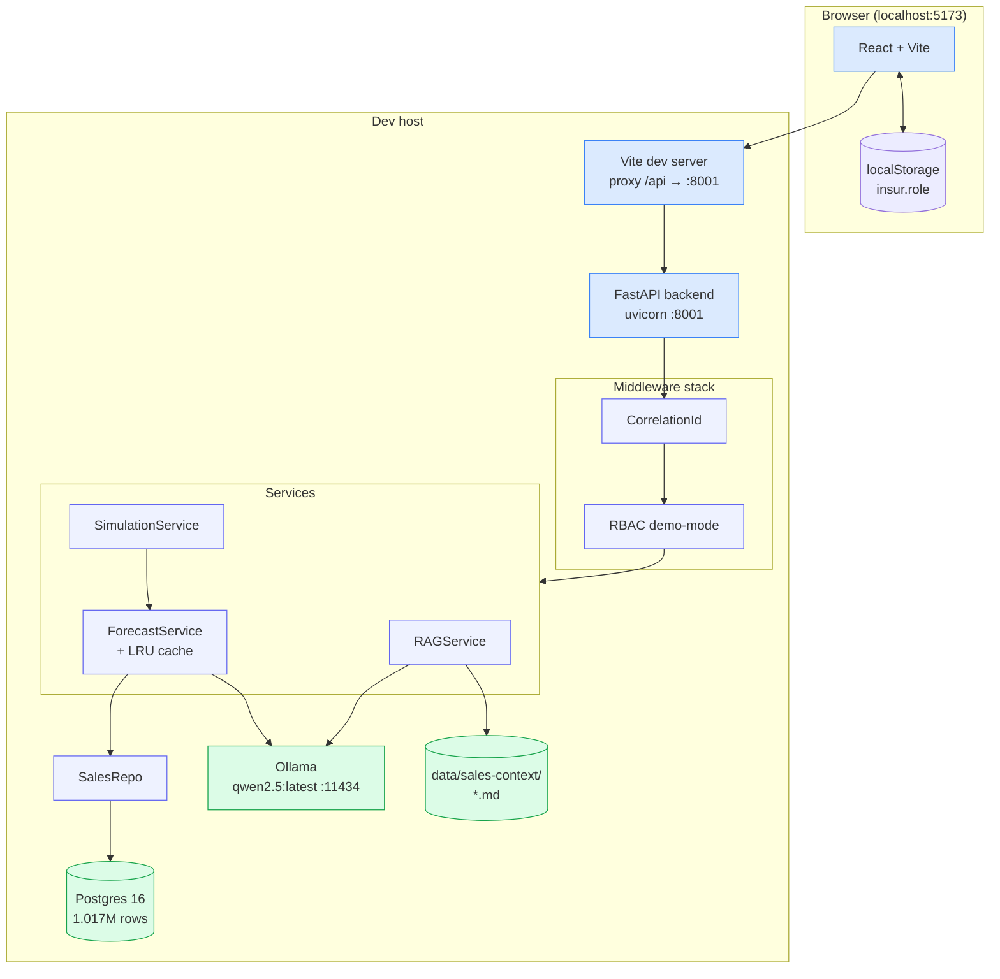

# Sales Flagship — Container View (C4-lite)

**Notes:**
- Vite proxy removes CORS concerns in dev. Production uses nginx or equivalent.
- No real auth — `insur.role` in localStorage feeds `X-Demo-Role` header; middleware enforces the matrix.
- `data/sales-context/` is hand-authored markdown for RAG grounding.
