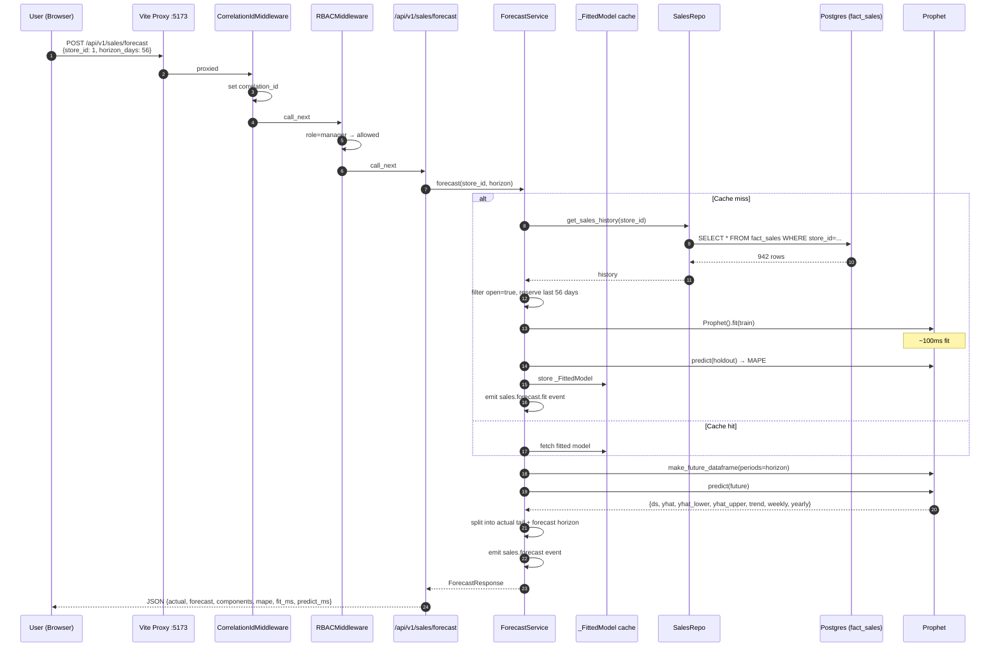

# Sales Forecast — Prophet Sequence

**Cache behavior:** `_FittedModel` is cached in-process per store. First call per store costs ~5–15 s (query + fit). Subsequent calls cost ~100–300 ms (predict only). No TTL — cache lives for the uvicorn process lifetime. Phase 2b adds scheduled re-fits.
