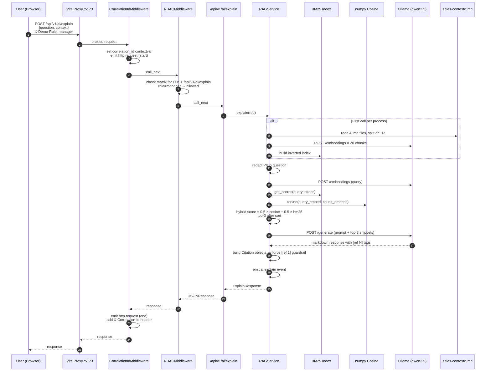

# Sales AI Explain — RAG Sequence

**Key latency contributors (cold-cache):** Ollama embedding calls (~400 ms × 20 = 8 s), Ollama generation (~2-4 s). Subsequent calls skip the index-build — only query-embed + generation run (~3 s total).

**Guardrails active in this flow:** PII redaction (email, phone), timeout (30 s), `[ref N]` required in response, max tokens capped at 800.
