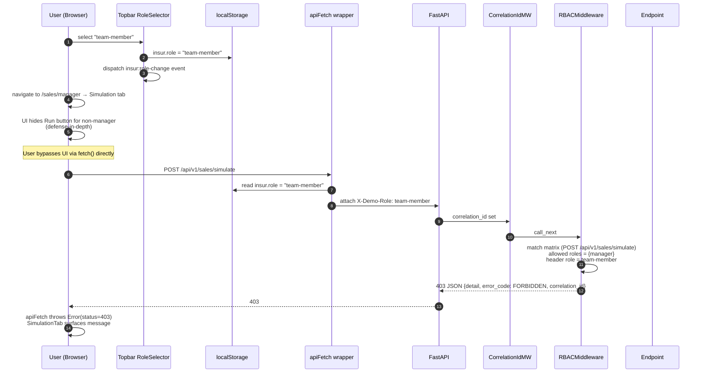

# Sales RBAC — Demo-Mode Enforcement Flow

**Matrix (Sales only):**

| Endpoint | Manager | Team Member | Compliance | Reporting & Monitoring |
|---|:-:|:-:|:-:|:-:|
| GET /stores | ✅ | ✅ | ✅ | ✅ |
| POST /forecast | ✅ | ✅ | ✅ | ✅ |
| POST /simulate | ✅ | ❌ | ❌ | ❌ |
| POST /ai/explain | ✅ | ✅ | ✅ | ✅ |

Default role when `X-Demo-Role` absent: **manager** (so existing unauthenticated flows pass).
