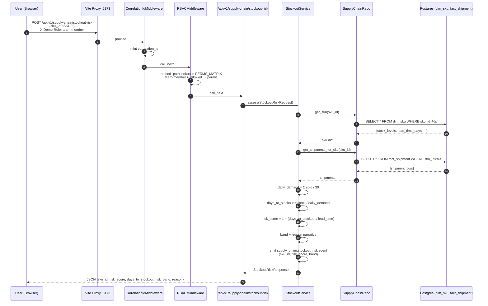

# Supply Chain Stockout Risk — Sequence

Request/response flow for `POST /api/v1/supply-chain/stockout-risk`. Mirrors
the Sales forecast-sequence structure so reviewers see a consistent shape
across flagships.

**Latency profile.** Typical response is 50–200 ms — a single `dim_sku` point
read plus a small `fact_shipment` scan for the requested SKU. No model fit,
no cache needed. The heuristic is deliberately simple for a 100-row
dataset; the same interface extends to an XGBoost classifier in Phase 2b
without touching the router or the service contract.

**Downstream observability.** The `emit_event` call is picked up by the
existing structured-logger pipeline (`ζ` observability from Sales) and
carries the correlation_id set by the first middleware. Every stockout-risk
request is therefore traceable from browser fetch → Postgres row read →
JSON response in the logs.
