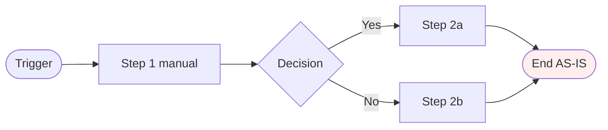
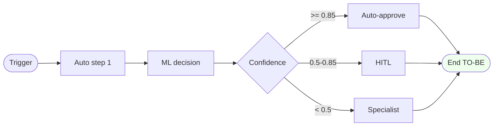
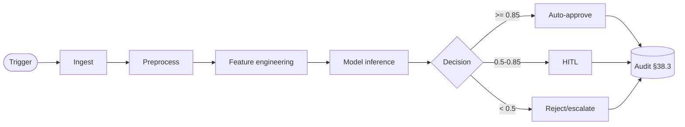

# Claim Audit

> Department 7 · Claims · slug `claim-audit` · AI items: 3
> Auto-generated stub. Operator fills in TODO. Per global §86 + §87.

## 1. Problem explanation

- **Current pain**: TODO
- **Root-cause hypothesis** (per §82.14): TODO
- **Stakeholders**: TODO
- **Frequency / severity**: TODO

## 2. AS-IS flow (manual today · per §64.27)

| Step | Actor | Time | Tool | Notes |
|---|---|---|---|---|
| 1 | TODO | TODO min | TODO | TODO |
| 2 | TODO | TODO min | TODO | TODO |

**Total cycle (AS-IS)**: TODO

## 3. TO-BE flow (automated target · per §64.27)

| Step | Actor | Time | Tool | AI capability |
|---|---|---|---|---|
| 1 | TODO | TODO sec | TODO | TODO |

**Total cycle (TO-BE)**: TODO

## 4. Impact analysis — Productivity / Cost / Revenue (detailed)

### 4.1 Productivity

| Metric | AS-IS | TO-BE | Δ | Notes |
|---|---|---|---|---|
| Cycle time | TODO | TODO | TODO x | from §2 + §3 |
| Per-FTE throughput | TODO/day | TODO/day | TODO x | |
| FTE hours saved/yr | — | TODO hrs | TODO hrs | |
| Error rework rate | TODO % | TODO % | TODO pp | |
| Peak throughput | TODO/hr | TODO/hr | TODO x | |
| Backlog reduction | TODO days | TODO days | TODO days | |

Narrative: TODO (1-2 paragraphs).

### 4.2 Cost

| Category | AS-IS $/yr | TO-BE $/yr | Δ $/yr | Driver |
|---|---|---|---|---|
| Labor (loaded @$TODO/hr) | $TODO | $TODO | -$TODO | hours saved |
| Error / rework | $TODO | $TODO | -$TODO | lower error rate |
| Legacy tool (decommissioned) | $TODO | $0 | -$TODO | |
| New AI infra | $0 | +$TODO | +$TODO | tokens · vector DB · compute |
| Compliance penalty avoided | $TODO | $TODO | -$TODO | audit findings closed |
| Customer-churn $ saved | $TODO | $TODO | -$TODO | CSAT × LTV |
| **Net cost change** | | | **-$TODO** | |

Narrative: TODO.

### 4.3 Revenue

| Lever | AS-IS $/yr | TO-BE $/yr | Δ $/yr | Driver |
|---|---|---|---|---|
| New-business conversion | $TODO | $TODO | +$TODO | faster quote |
| Cross-sell / upsell | $TODO | $TODO | +$TODO | next-best-action |
| Retention | $TODO | $TODO | +$TODO | proactive outreach |
| Premium optimization | $TODO | $TODO | +$TODO | better pricing |
| New product enablement | — | +$TODO | +$TODO | AI unlocks |
| **Net revenue uplift** | | | **+$TODO** | |

Narrative: TODO.

### 4.4 Net impact

| Bucket | $/yr | Confidence |
|---|---|---|
| Productivity | $TODO | low/medium/high |
| Cost reduction | -$TODO | |
| Revenue uplift | +$TODO | |
| **NET ANNUAL VALUE** | **$TODO** | |
| Implementation cost | $TODO (one-time) | |
| **Payback period** | **TODO months** | |

## 5. AI capabilities (from blueprint)

- None
- None
- None

## 6. User demo flow (operator-runnable)

### 6.1 Persona + goal

- Persona: TODO
- Goal: TODO
- Pain addressed: TODO (link §1)
- Success metric proved: TODO

### 6.2 Setup

| Item | What | Where |
|---|---|---|
| Test data | TODO scrubbed sample | `data/demo/claim-audit/` |
| Test user | demo_user@example.com | seeded login |
| Model loaded | TODO v1.x | MLflow registry |
| Browser tabs | TODO | bookmark file |

### 6.3 Demo script

| Step | Action | Expected | Operator says |
|---|---|---|---|
| 1 | Open URL | TODO | "Today we'll show..." |
| 2 | Click X | TODO | "Notice..." |
| 3 | Submit | TODO (loading + score) | "Model scores against..." |
| 4 | Observe result | TODO (confidence + rec) | "Because..." |
| 5 | Show explanation | TODO (SHAP/CF) | "Compared to manual..." |
| 6 | Show audit row | TODO (§38.3 fields) | "Every decision traceable" |
| 7 | Edge case (low conf) | TODO (→ HITL) | "When confidence drops..." |
| 8 | Wrap | TODO (recap §4) | "We saved TODO" |

### 6.4 Pitch

- **One-liner**: TODO
- **Demo URL**: `http://192.168.1.88:3210/insurance/7/<domain>/claim-audit?tab=user-demo`
- **Recording**: TODO
- **Readiness score**: TODO / 100

## 7. Simulation (what-if scenarios · per Simulation tab)

| Parameter | Default | Range |
|---|---|---|
| Volume multiplier | 1.0 | 0.1 - 10 |
| Noise injection % | 0 | 0 - 50 |
| Network latency added (ms) | 0 | 0 - 5000 |
| Failure rate | 0.0 | 0.0 - 1.0 |
| Cost per call | TODO | 0.001 - 1.0 |

Outputs: latency p50/p95/p99 · throughput · error rate · cost · HITL escalation rate · audit completeness.

Simulation URL: `http://192.168.1.88:3210/insurance/7/<domain>/claim-audit?tab=simulation`

## 8. Manual process workbench (UI tab)

> Where user selects data + runs process manually with full component control.

| # | Component | Type | Source / Path | User-configurable |
|---|---|---|---|---|
| 1 | Input dataset | data | `data/insurance/claims/` | yes (file picker) |
| 2 | Feature schema | data spec | `backend/ml/insurance/schemas/claim-audit.yaml` | view-only |
| 3 | Model | ML artifact | MLflow registry | yes (version) |
| 4 | Accuracy threshold | decision rule | default 0.85 | yes (slider) |
| 5 | Hyperparameters | training config | Optuna search space | yes (form) |
| 6 | Eval metrics | metric suite | per §75 12-axis | yes (multi-select) |
| 7 | Train/val/test split | CV config | stratified · subject-wise (§83) | yes |
| 8 | Explanation method | XAI | SHAP / LIME / counterfactual | yes |
| 9 | Audit schema | governance | per §38.3 / §57.6.1 | view-only |
| 10 | HITL threshold | decision policy | < 0.5 → human | yes (slider) |

Manual run URL: `?tab=manual-process` · every run = new MLflow run_id.

## 9. Automatic process pipeline (production)

Orchestration: Celery + Redis (sync <500ms) OR LangGraph DAG (multi-step agentic).
Idempotency: UUID request_id · cached re-submit.
SLO: p95 < 2s end-to-end. Cost target: $TODO per execution.

Rollout: shadow → canary 5% → ramp 50% → 100%. Rollback per §47.7 4-layer.

## 10. Phase tracking (threshold · score · status · QC)

| Phase | Threshold | Current | Updated | Status | QC file |
|---|---|---|---|---|---|
| 1 Framing | label-agreement ≥ 0.8 | TODO | TODO | open | `phase1.json` |
| 2 Data design | data-card complete | TODO | TODO | open | `phase2.json` |
| 3 Preprocessing | QC ≥ 95% | TODO | TODO | open | `phase3.json` |
| 4 Normalization | leakage-check pass | TODO | TODO | open | `phase4.json` |
| 5 EDA | top features d ≥ 0.5 | TODO | TODO | open | `phase5.json` |
| 6 Feature selection | stability ≥ 0.7 | TODO | TODO | open | `phase6.json` |
| 7 Training | gap < tolerance | TODO | TODO | open | `phase7.json` |
| 8 Validation | LOSO + CI computed | TODO | TODO | open | `phase8.json` |
| 9 Testing | metric ≥ target + CI | TODO | TODO | open | `phase9.json` |
| 10 Benchmarking | vs baseline + literature | TODO | TODO | open | `phase10.json` |
| 11 Deployment | shadow → canary → 100% | TODO | TODO | open | `phase11.json` |

Composite (§75 + §77):
| Formula | Current | Target |
|---|---|---|
| Generic 0.5·F1 + 0.5·AUC | TODO | ≥ 0.85 |
| Clinical 0.3·Sens + 0.3·NPV + 0.2·PPV + 0.2·AUC | TODO | ≥ 0.85 |

JSON schema per phase: `{"phase": N, "threshold": {...}, "score": 0.0, "updated": "ISO", "status": "open|pass|fail", "evidence": [], "reviewer": "", "notes": ""}`.

## 11. Testing + summary report

| Test | Tool | Trigger | Output | Status |
|---|---|---|---|---|
| Unit | pytest | per commit | coverage | open |
| Integration | pytest + real DB | per PR | report | open |
| E2E | Playwright | nightly | E2E report + screenshots | open |
| Load/perf | k6 / locust | weekly | latency + throughput | open |
| ML eval | run_dept_pipelines | per release | manifest.json + plots | open |
| Bias/fairness | Fairlearn | per release | bias report | open |
| Robustness | per-process fixtures | per release | robustness table | open |
| Security (red-team) | Garak / Promptfoo (LLM) | per release | red-team report | open |

Release summary: auto-gen `docs/processes/claims/claim-audit/release-summary-vX.Y.md` covering §1 problem · §4 impact deltas · §10 phase scorecard · §11 test pass/fail · top 3 failure modes · sign-off · git SHA + image digest.

## 12. Cron jobs + DB writes

| Cron tag | Schedule | Purpose | DB updated |
|---|---|---|---|
| `INSUR-CLAIM_AUDIT-DAILY-REFRESH` | daily 02:00 | refresh model on new data | MLflow + audit |
| `INSUR-CLAIM_AUDIT-DRIFT-CHECK` | hourly | data + concept drift | drift_metrics |
| `INSUR-CLAIM_AUDIT-HITL-AUDIT` | daily 09:00 | sample HITL overrides for retrain | hitl_audit |
| `INSUR-CLAIM_AUDIT-RAG-REINDEX` | weekly Mon 03:00 | re-embed source docs | vector_db |
| `INSUR-CLAIM_AUDIT-COST-REPORT` | weekly Mon 08:00 | dollar impact reconciliation | cost_report |
| `INSUR-CLAIM_AUDIT-EVAL-DEEPEVAL` | weekly Mon 04:00 | Ragas + DeepEval regression | eval_metrics |
| `INSUR-CLAIM_AUDIT-VECTOR-INGEST` | */15 * * * * | move new data into vector DB | vector_db |

## 13. Database layers (graph · vector · historical)

| Layer | Engine | Refresh | Target |
|---|---|---|---|
| **Vector DB** (semantic retrieval) | Chroma / Qdrant / pgvector | weekly | Recall@K ≥ 0.85 |
| **Graph DB** (relationships) | Neo4j / JanusGraph / NetworkX | weekly | coverage ≥ 80% key entities |
| **Historical DB** (audit / WORM) | Postgres partitioned + S3 archive | append-only | replay ≥ 95% |
| **Redis cache** | Redis | TTL 1h · invalidate on doc-version change | hit-rate ≥ 30% after warmup |

Chunk strategy (RAG): semantic 300-800 tokens · 10-20% overlap. Embedding model version-locked.

## 14. RAG eval + DeepEval (mandatory if LLM/retrieval)

Gold set: `data/eval/claims/claim-audit/gold_set.jsonl` (100-500 queries · stratified · monthly refresh).

| Metric | Threshold | Current | Tool |
|---|---|---|---|
| Retrieval Recall@K | ≥ 0.85 | TODO | Ragas |
| Context precision | ≥ 0.75 | TODO | Ragas |
| Answer relevance | ≥ 0.80 | TODO | Ragas |
| **Citation accuracy** | **100%** | TODO | custom (§48.5) |
| Faithfulness | ≥ 0.85 | TODO | Ragas |
| Unsupported claim rate | ≤ 3% | TODO | custom |
| Latency p95 | < SLA | TODO | telemetry |
| Cost per query | ≤ budget | TODO | telemetry |

DeepEval suite weekly · LLM-as-judge for hallucination · toxicity · bias · faithfulness.

Negative red-team: 30 prompt injection · 20 exfiltration · 20 refusal bypass · 30 hallucination induction · 30 OOD queries.

## 15. Vector DB ingestion (cron-driven)

Every data artifact embedded automatically · per `INSUR-CLAIM_AUDIT-VECTOR-INGEST` cron above.

- Process input data → embedded per-row
- Process output decisions → rationale text embedded
- HITL adjudication notes → embedded
- Audit log narratives → embedded
- Policy/SOP docs → embedded weekly

Query UI: `?tab=vector-db` — semantic search · cluster browse · drift inspect.

## 16. Per-operation universal audit (input · process · output · log · trace · prompt)

Every operation emits a row with all 6 fields:

| Field | Captured how | Storage |
|---|---|---|
| **Input** | full request payload (PII redacted per §76) | audit table · BLOB |
| **Process** | step trace · model called · features · decision | OTel span tree |
| **Output** | full response payload | audit table · BLOB |
| **Log** | structured · level · ts · correlation_id | ELK / Loki |
| **Trace** | distributed (OTel) · all spans · attributes | Jaeger / Tempo |
| **Prompt** | LLM prompt sent · model version · response | data/prompts.db (§21 dual write) |

Audit row UUID = `request_id` propagated through every layer (§47.4 baggage).

## 17. Crash recovery (every state change saved before continuing)

| State change | Save-before-continue | Recovery |
|---|---|---|
| Incoming request | write to audit FIRST · then process | retry from audit · idempotent UUID |
| Mid-pipeline decision | checkpoint after each major stage | resume from last checkpoint |
| HITL hand-off | persist queue · ack after handover | reload pending HITL |
| External call success | write to outbound_calls BEFORE returning | exactly-once |
| Audit log | dual write SQLite fsync + markdown | markdown crash-safe |
| Prompt save | dual write per §21 | MD survives DB corruption |

Supervisor cron `INSUR-CRASH-RECOVERY-SCAN` finds incomplete records and resumes/marks-failed.

## 18. Comprehensive testing matrix (UI · API · data · model · accuracy · output · chunking · agent · orchestration · mCP · Ragas · DeepEval · PII)

| Class | Tool | Trigger | Pass | Status |
|---|---|---|---|---|
| UI | Playwright | per commit | 0 failures · baseline match | open |
| API | pytest + httpx | per commit | 100% endpoints covered | open |
| Data | Great Expectations | per data refresh | schema · null rate · drift | open |
| Model | pytest + sklearn | per model release | acc ≥ target | open |
| Accuracy | held-out set | per release | primary metric ≥ target | open |
| Output | golden diff | per commit | schema valid | open |
| Chunking | RAG QA | per corpus refresh | semantic integrity ≥ 95% | open |
| Agent | unit + integration | per agent change | tool acc ≥ target · no loops | open |
| Orchestration | DAG executor tests | per orch change | DAG correctness | open |
| mCP | policy red-team | per policy change | 0 bypass · injection = 0 | open |
| Ragas | Ragas suite | weekly | faithfulness ≥ 0.85 | open |
| DeepEval | LLM-as-judge | weekly | hallucination/toxicity/bias PASS | open |
| PII | regex + NER + spot-check | per release | 0 unhandled PII | open |

## 19. ResAI · ExpAI · Statistical · DBA · Management analysis (per tab)

> Per operator instruction: all of these visible per process in tab.

### 19.1 ResAI (Responsible AI · 20-row per §82.19)

- Stakeholder + impact map (§82.19 #2)
- Misuse register (#3)
- Harm mitigation plan (#4)
- Fairness responsibility report (#5)
- Explainability artifacts (#6)
- Human oversight workflow (#7)
- Accountability register (#8)
- Data responsibility audit (#9)
- Privacy assurance (#10)
- Safety assurance evidence (#11)
- Reliability report (#12)
- Post-deployment logs (#13)
- User transparency statement (#14)
- Redress + appeal SOP (#15)
- Vendor responsibility (#16)
- Environmental + social impact (#17)
- Compliance alignment (#18)
- Responsibility drift report (#19)
- Governance + enforcement (#20)

→ Tab: `?tab=resai` · evidence files: `data/eval/claims/claim-audit/resai/`

### 19.2 ExpAI (Explainable AI · 20-row per §82.20)

- Scope + audience definition · purpose mapping
- **Local SHAP / LIME / counterfactual** (per-instance)
- **Global SHAP / feature importance / PDP/ICE**
- Feature effect viz · interaction maps
- Counterfactual examples · faithfulness validation
- Stability + consistency across methods
- Bias-in-explanations audit · minority-class explanations
- Temporal explainability (time-series)
- Deep model XAI (Grad-CAM · Integrated Gradients · attention)
- **LLM/GenAI XAI** (token attribution · retrieval grounding)
- Human comprehension report
- Explainability limits + reproducibility
- Workflow usage (override behavior · HITL integration)
- Governance + audit cadence

→ Tab: `?tab=expai` · artifacts: `data/eval/claims/claim-audit/expai/`

### 19.3 Statistical analysis (per §83 Phase 6 · 14-row)

- Pre-registered hypotheses
- **Effect size (Cohen's d · Cliff's delta · ΔF1 · ΔAUC)**
- **95% CI via subject-level bootstrap** (NOT window-level)
- **Paired comparison** (McNemar · DeLong · paired bootstrap)
- CV statistics (mean ± std across folds)
- Multiple-comparison correction (Holm-Bonferroni · BH FDR)
- Nonparametric tests (Wilcoxon signed-rank)
- Rare-event stats (sensitivity @ FAR)
- Calibration stats (ECE + Brier + CI)
- Subgroup disparity testing
- Robustness significance
- Model ranking stability (bootstrap win-rate)
- Power / sample adequacy
- Statistical reporting pack (reproducible)

→ Tab: `?tab=analysis` · evidence: `data/eval/claims/claim-audit/stats/`

### 19.4 DBA-style analysis (managerial-doctoral)

- Practice-oriented framing per §85.2.5 (DBA fit)
- Decision-support artifact (DSR · §85.2.4)
- Stakeholder impact analysis
- Value realization framework (KPI mapping)
- Evaluation matrix
- Iterative refinement loop record
- Anchored in theory: Dynamic Capabilities · TOE · RBV (§85.2)
- Operationalized constructs
- Practical implications section

→ Tab: `?tab=analysis` (sub-tab DBA)

### 19.5 Management analysis

- KPI tree (system → ops → business KPIs · per §85 Half B Domain 12)
- ROI table (direct + risk-avoidance)
- Value leakage report (alert fatigue · unused outputs)
- Executive synthesis score (per §85.2)
- Decision matrix (Go / Scale / Stop)
- Quarterly governance review (per §84 ISO 42001 Clause 9)

→ Tab: `?tab=dashboard` + `?tab=governance-ai`

## 20. Mandatory analysis checklist (per ai-quality-analyses-catalog.md)

- [ ] §82.4 #4 Accountable · named owner + RACI
- [ ] §82.5 #5 Auditable · lineage + audit row
- [ ] §82.17 #17 Governance · under AI Policy
- [ ] §82.18 #18 Compliance · laws mapped
- [ ] §82.19 #19 Responsible AI · 5 pillars assessed
- [ ] §82.21 #21 Secure · security review done

## 21. Sign-off

| Reviewer | Role | Date | Decision |
|---|---|---|---|
| | Process Owner | YYYY-MM-DD | ☐ |
| | AI Reviewer | YYYY-MM-DD | ☐ |
| | Finance ($ impact) | YYYY-MM-DD | ☐ |
| | Compliance | YYYY-MM-DD | ☐ |
| | Security | YYYY-MM-DD | ☐ |

## Composes with

§38.3 · §47.4 · §54 · §57.6.1 · §64.27 · §73 · §75 · §76 · §77 · §80 · §81 · §82 · §83 · §84 · §85 · §86 · §87 (pending)
