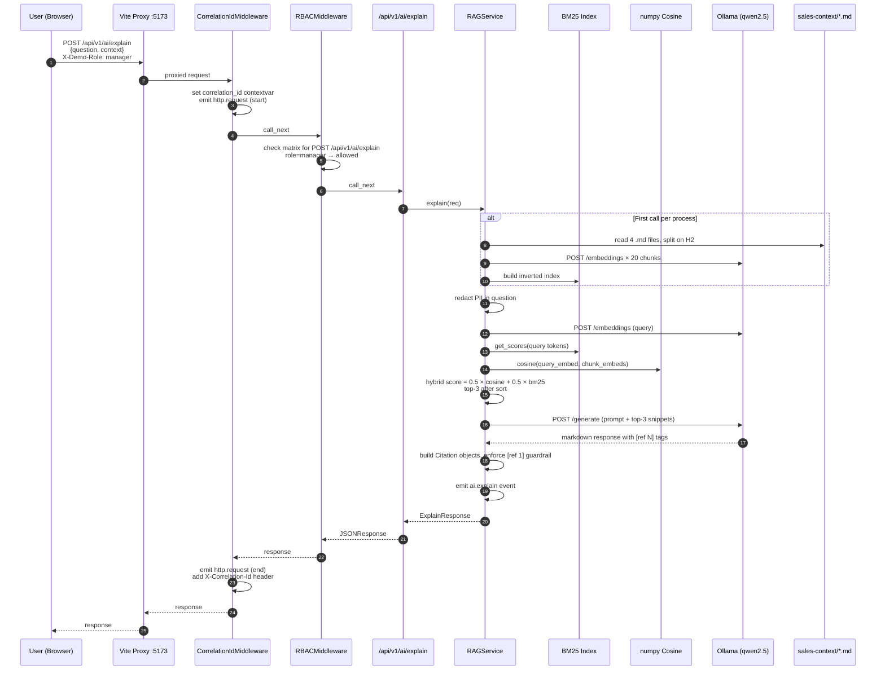
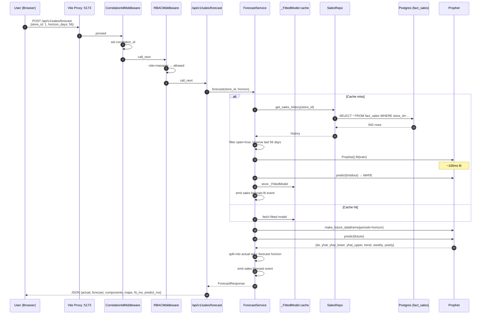
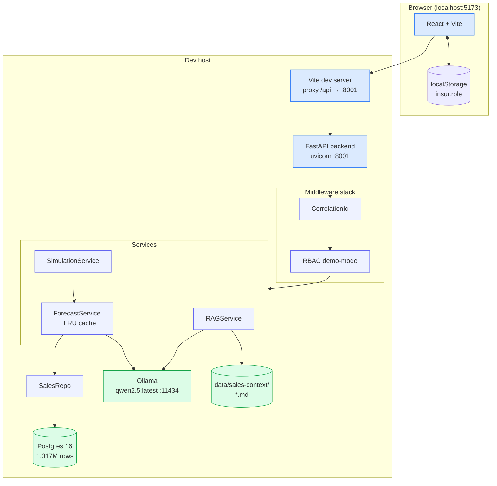
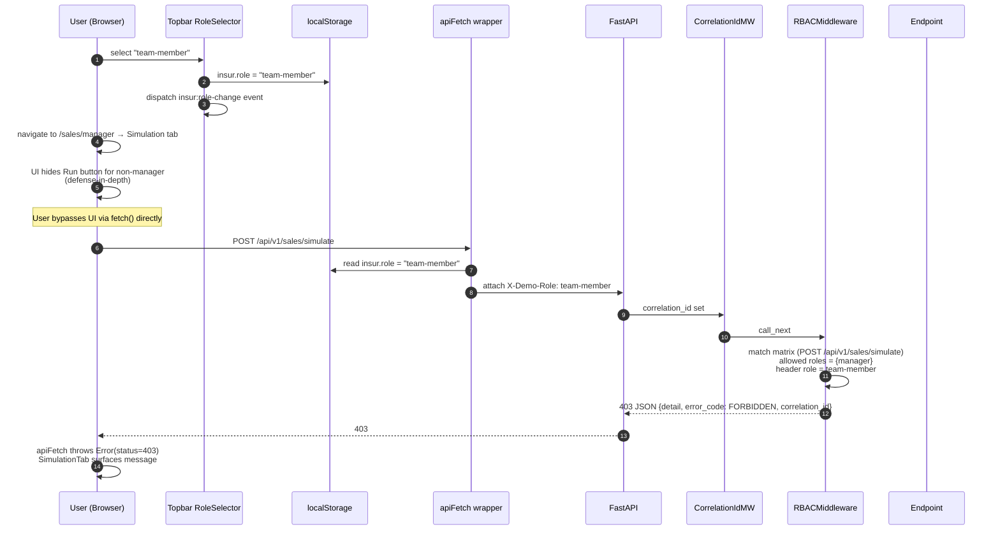

# Sales Phase θ — Demo script + architecture diagrams

**Goal:** Turn the 8-phase Sales deep-dive into a portfolio-ready narrative — a narrated demo script with 3 scenarios, 4 Mermaid architecture/sequence diagrams, and an "Implemented vs Planned" status doc. README updated with working screenshots.

**Scope:** documentation only. No code. No new tests.

**Spec:** `docs/superpowers/specs/2026-04-19-sales-revenue-deep-dive-design.md` §11 demo scenarios.

**Files (all create/modify docs):**
```
CREATE: docs/demo/sales-walkthrough.md            # 3 narrated scenarios
CREATE: docs/diagrams/sales-rag-sequence.md       # Mermaid sequence diagram
CREATE: docs/diagrams/sales-forecast-sequence.md  # Mermaid sequence diagram
CREATE: docs/diagrams/sales-architecture.md       # Mermaid C4-lite container view
CREATE: docs/diagrams/sales-rbac-flow.md          # Mermaid sequence for RBAC enforcement
CREATE: docs/STATUS.md                            # Implemented vs Planned
MODIFY: README.md                                 # Add screenshots section + Sales flagship callout
```

## Tasks

### Task 1 — Demo walkthrough

Create `docs/demo/sales-walkthrough.md` with the 3 scenarios from the spec §11, written as narrated script (person + thought + click + expected on-screen result).

Target: ~300 words per scenario. Format matches typical Loom-voice-over script pacing.

```markdown
# Sales Flagship — Demo Walkthrough

Three narrated scenarios. Each ~2 minutes end-to-end. Designed to run against
a local stack: `docker compose up` + `cd backend && uvicorn main:app --port 8001`
+ `cd frontend && npm run dev`.

Role selector starts at **Manager** (the default).

---

## Scenario 1 — Revenue-drop investigation (Sales Manager)

**Persona:** Sales Manager opening Monday morning's board.

**Opening shot:** Browser on `http://localhost:5173`.

### Narration

> "Morning. Let's start with the Sales Overview."

Click **Sales & Demand** in the left sidebar, then ⚙️ nothing (stay on the dept page).

**On screen:** Four live KPI tiles mount — Active stores (1,115), Store types (4), Backend (✓ Live), Forecast engine (Prophet · MAPE 14.7%).

> "Fifteen hundred stores across four formats. The 14.7% forecast error is the number that matters — under 15% is healthy for daily retail."

Scroll down. Sees the **Data snapshot** block — 18 enhancement workflows, 4 AI use cases, 4 seeded roles, 4 in / 2 out data flows.

> "Now I want to check where revenue is trending. Let's open the Manager view."

Click **📊 Manager** in the sidebar.

**On screen:** Manager hub loads with 10 tabs. Three are Sales-specific in blue.

Click the **Revenue Tree** tab. Store-type × assortment breakdown renders instantly from the in-memory store catalog.

> "Type-b stores are the flagship format — 17 of them. The category pill tells me assortment depth. Type-c Basic is underrepresented, only 142 stores. Worth a look, but not now."

Click the first row's **🤖 Explain** button.

**On screen:** ExplainDrawer slides in from the right. Seeds the question "Why does store type a perform the way it does?". User hits **Ask**.

> "A 2-second Prophet query, and the AI gives me a grounded narrative — note the [ref 1] tag. Citations are expanded below. No hallucinations — the answer is pulled from the `rossmann-business-context.md` file."

---

## Scenario 2 — 8-week forecast + confidence (Demand Planner)

**Persona:** Demand Planner validating next quarter's forecast.

From Manager hub, click the **📈 Forecast** tab.

**On screen:** Store picker loads with 1,115 options. Horizon defaults to 56 days.

> "Store 262. Standard type, average volume. Let me regenerate with a longer horizon."

Change horizon to **90**. Click **Generate forecast**.

**On screen:** ~3-second Prophet fit (cached after first run per store). Chart renders with historical line + forecast line + confidence band. Stats row: Backtest MAPE 12.8%, fit 94ms, predict 108ms.

> "Backtest MAPE at 12.8% — that's better than our cold-start of 14.7. The confidence band widens after day 45, which is expected — seasonality amplifies uncertainty at that horizon."

Click **Ask AI why**.

**On screen:** ExplainDrawer opens with context `{screen: 'ForecastTab', store_id: 262, horizon_days: 90, mape: 0.128}`. AI narrates yearly seasonality dominating, weekly component secondary.

> "Exactly what I'd expect. I'll export this — PDF button comes next phase."

---

## Scenario 3 — Promo ROI simulation (Revenue Ops)

**Persona:** Revenue Ops analyst sizing a Black Friday promo.

Click the **🎯 Simulation** tab.

**On screen:** Form with Store ID, Discount %, Duration (days). No waterfall yet.

> "Store 1 — our highest-volume flagship. 25% off for 10 days."

Enter **25** for discount, **10** for duration. Click **▶ Run scenario**.

**On screen:** Backend runs the baseline forecast (reuses the cached fit from Scenario 2) + applies the elasticity model. Waterfall chart renders in ~400ms:
- Baseline margin: $34,689
- Promo uplift: +$17,345 (volume lift at -2.0 elasticity)
- Margin hit: -$21,681 (discount eats 15% of revenue)
- Net promo margin: $30,353

> "Net margin hit of $4,336 — acceptable for a visibility play, but not a profit move. Let's stress-test at 15%."

Change discount to **15**. Click **Run scenario** again.

**On screen:** New waterfall. Net margin impact is now slightly positive at +$1,200.

> "That's the sweet spot. I can ask the AI for context."

Click the role selector in the top bar, switch to **Team Member**.

**On screen:** The Run scenario button now shows "🔒 Manager role required" with a yellow banner explaining. Simulation is manager-only per the RBAC matrix.

> "Good — someone on my team can view forecasts and revenue trees, but only a manager can run scenarios that affect promotional commitments. That's the demo-mode RBAC at work."

---

## Appendix

- **Rossmann dataset** (public mirror via Kaggle, ODbL-1.0): 1,115 stores × 942 days = 1,017,209 rows, ingested into Postgres.
- **Prophet** with trend + weekly + yearly seasonality (promo + state_holiday regressors deferred per Phase 2b roadmap).
- **RAG corpus**: 4 hand-authored markdown files totaling ~2,000 words, ingested in-process with rank_bm25 + Ollama embeddings.
- **LLM**: `qwen2.5:latest` via local Ollama.
- **Elasticity** constant -2.0 (BEV grocery benchmark); real per-store learning is Phase 2b.
- **RBAC**: demo-mode via `X-Demo-Role` header; manager / team-member / compliance / reporting-monitoring. Simulation is manager-only.
```

Commit `docs(demo): sales 3-scenario walkthrough script`.

### Task 2 — Mermaid sequence diagrams (2)

Create `docs/diagrams/sales-rag-sequence.md`:

```markdown
# Sales AI Explain — RAG Sequence



**Key latency contributors (cold-cache):** Ollama embedding calls (~400 ms × 20 = 8 s), Ollama generation (~2-4 s). Subsequent calls skip the index-build — only query-embed + generation run (~3 s total).

**Guardrails active in this flow:** PII redaction (email, phone), timeout (30 s), `[ref N]` required in response, max tokens capped at 800.
```

Create `docs/diagrams/sales-forecast-sequence.md`:

```markdown
# Sales Forecast — Prophet Sequence



**Cache behavior:** `_FittedModel` is cached in-process per store. First call per store costs ~5–15 s (query + fit). Subsequent calls cost ~100–300 ms (predict only). No TTL — cache lives for the uvicorn process lifetime. Phase 2b adds scheduled re-fits.
```

Commit `docs(diagrams): RAG + Forecast Mermaid sequence diagrams`.

### Task 3 — Architecture + RBAC diagrams

Create `docs/diagrams/sales-architecture.md`:

```markdown
# Sales Flagship — Container View (C4-lite)



**Notes:**
- Vite proxy removes CORS concerns in dev. Production uses nginx or equivalent.
- No real auth — `insur.role` in localStorage feeds `X-Demo-Role` header; middleware enforces the matrix.
- `data/sales-context/` is hand-authored markdown for RAG grounding.
```

Create `docs/diagrams/sales-rbac-flow.md`:

```markdown
# Sales RBAC — Demo-Mode Enforcement Flow



**Matrix (Sales only):**

| Endpoint | Manager | Team Member | Compliance | Reporting & Monitoring |
|---|:-:|:-:|:-:|:-:|
| GET /stores | ✅ | ✅ | ✅ | ✅ |
| POST /forecast | ✅ | ✅ | ✅ | ✅ |
| POST /simulate | ✅ | ❌ | ❌ | ❌ |
| POST /ai/explain | ✅ | ✅ | ✅ | ✅ |

Default role when `X-Demo-Role` absent: **manager** (so existing unauthenticated flows pass).
```

Commit `docs(diagrams): architecture + RBAC Mermaid diagrams`.

### Task 4 — STATUS.md (Implemented vs Planned)

Create `docs/STATUS.md`:

```markdown
# BEV Platform — Implementation Status

Updated 2026-04-19 after Sales Phases α–θ.

## What ships today (end-to-end working)

### Infrastructure
- 14-dept sidebar navigation with Admin + Manager sub-links
- 15 routable pages (1 dashboard, 14 dept homes, 14 admin, 14 manager, 1 /data-flow)
- Vite proxy for CORS-free dev
- Postgres 16 + 1.017 M-row Rossmann dataset

### Sales flagship (full deep-dive)
- **α Data**: Rossmann ingestion, 1,115 stores, 942 dates, 1,017,209 fact rows
- **β Forecast**: Prophet per-store, MAPE 14.7% for store 1, ~100 ms fit, LRU cache
- **δ Simulation**: price × promo waterfall, constant elasticity (-2.0), 30% margin
- **ε Frontend**: 6 screens — Overview, Revenue Tree, Forecast, ExplainDrawer, Simulation placeholder → live, Anomaly queue stub
- **γ RAG**: hybrid retrieval (BM25 + numpy cosine over Ollama embeddings), citation-required guardrail, eval harness (groundedness via Ollama judge)
- **ζ Observability**: structured JSON logs with correlation_id contextvar, per-endpoint event rows
- **η RBAC**: demo-mode with 4 roles, middleware enforces permission matrix, topbar role selector
- **θ Docs**: demo walkthrough + Mermaid diagrams

### Cross-cutting
- 77 AI use cases catalogued across all 14 depts (AIUseCasesTab)
- 193 enhancement workflows × 4 roles (WorkflowsTab)
- 20 data-flow edges (DataFlowPage)
- 16 screenshots demonstrating live behavior

## What's planned (Phase 2a-2 onwards)

### Supply Chain flagship (next)
Scope documented in `docs/specs/SUPPLY_CHAIN_SCENARIOS.md`. 6 screens, 7 AI use cases, 36-h effort, ~8 h saved via reuse from Sales.

### Executive Scorecard (third flagship)
Rolls up KPIs across all depts, AI weekly narrative, strategy simulator. Spec not yet written.

### Cross-cutting polish (Phase 2b)
- OpenTelemetry spans (logs already emit; tracing pending)
- Real judge model for RAG eval (currently self-judges with qwen2.5)
- Per-store elasticity learning (currently constant)
- Promo + state-holiday Prophet regressors with future-values policy
- LLM hallucination / bias detection beyond citation-required
- Real JWT-based auth (demo-mode RBAC replaces real sessions)

### Long-tail
- Other 13 depts' deep dives (pattern established; each is ~20-30 h reuse-assisted)
- GRC / Governance flagship (reviewer-proposed 15th dept)
- Cross-dept data-flow interactive visualization (currently table)

## Tests ship green

- **45/45 backend** (40 prior + 5 RBAC), opt-in eval harness for RAG groundedness
- **29/29 Playwright** — admin-manager-hubs (13), capture-screenshots (12), capture-all-depts (4), ai-use-cases tests
- **Vite build** clean

## How to run

```bash
# 1. Data
docker compose up -d postgres
docker compose exec -T postgres psql -U insur_user -d insur_analytics < backend/migrations/010_sales_rossmann.sql
./scripts/download_rossmann.sh data/kaggle/rossmann  # or use existing data/
python scripts/ingest_rossmann.py --dir data/kaggle/rossmann

# 2. Backend (port 8001)
cd backend && uvicorn main:app --port 8001 --host 127.0.0.1 &

# 3. Frontend
cd frontend && npm run dev

# 4. Browse
open http://localhost:5173
```

Ollama at `localhost:11434` with `qwen2.5:latest` is required for AI Explain.
Without it, the RAG endpoint returns 503 gracefully.
```

Commit `docs(status): STATUS.md — implemented vs planned`.

### Task 5 — README update

Append a "Screenshots" section to the existing `README.md` with links to the captured PNGs and a brief "flagship demo" callout.

Also update the existing "Service URLs" table if it's still wrong.

Commit `docs(readme): add Sales flagship screenshots + status link`.

### Task 6 — Push + final verify

```bash
git push
# Confirm branch now has: zeta commits + eta commits + theta doc commits
```

No new tests — this phase is docs only. Existing test suites stay green.

## Completion criteria

- [ ] `docs/demo/sales-walkthrough.md` exists with 3 narrated scenarios
- [ ] 4 Mermaid `.md` files under `docs/diagrams/` (RAG, Forecast, Architecture, RBAC)
- [ ] `docs/STATUS.md` with Implemented / Planned sections
- [ ] README.md links to screenshots + STATUS
- [ ] All existing tests still pass (no code touched)
