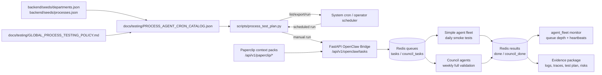
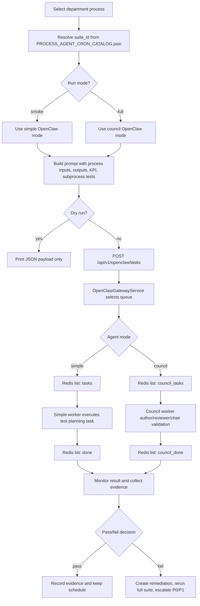
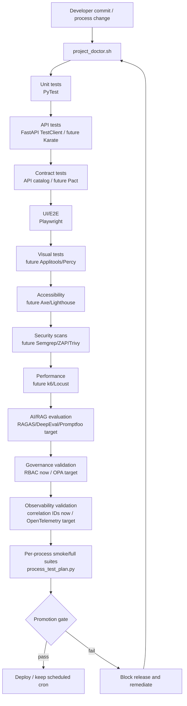
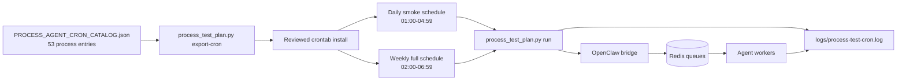
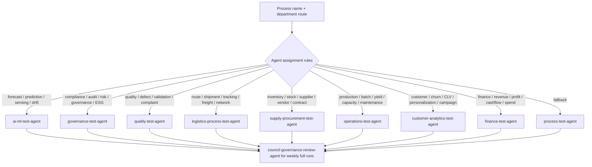
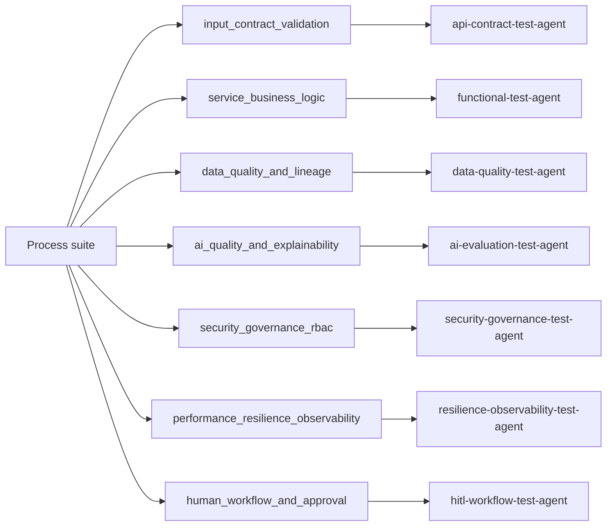

# Process Testing Graphs, Flowcharts, Pipeline, And Cron Scheduling

These diagrams show how the global process testing policy runs across departments, processes, agents, OpenClaw, Redis, workers, and cron.

## 1. System Graph



## 2. Process Test Execution Flowchart



## 3. Enterprise Testing Pipeline



## 4. Cron Scheduling Flow



## 5. Agent Assignment Flow



## 6. Subprocess Test Coverage Graph



## 7. Run Commands

```bash
# Inspect process suites
./scripts/process_test_plan.py list
./scripts/process_test_plan.py list --dept sales

# Export cron entries
./scripts/process_test_plan.py export-cron --mode smoke
./scripts/process_test_plan.py export-cron --mode full --dept supply-chain

# Dry-run one payload
./scripts/process_test_plan.py run --suite-id sales__baseline-forecasting --mode full --dry-run

# Submit one process test through OpenClaw
./scripts/process_test_plan.py run --suite-id sales__baseline-forecasting --mode full

# Monitor workers
./scripts/agent_fleet.sh watch
```
