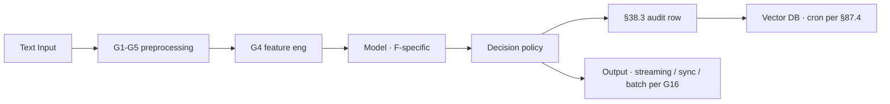

# Fraud-Text-1 · claim-narrative-fraud-signal

> **Problem** · Fraud
> **Modality** · Text
> **Dept** · 8
> **Status** · stub (operator fills sections)
> Per §90 + docs/RECOMMENDER_ANOMALY_FRAUD_SCENARIOS.md

## 1. Use case

Dept 8 SIU · BERT + ensemble

**Business value**: TODO
**KPI moved**: TODO

## 2. Architecture (G13 diagram + key modules)

Key modules: TODO

## 3. Data source + download

| Source | Format | Volume | Download |
|---|---|---|---|
| TODO | TODO | TODO | per `scripts/download_kaggle_datasets.sh` if applicable |

## 4. Planning

| Week | Activity | Owner |
|---|---|---|
| 1 | Data quality (G1-G6) | data-quality-test-agent |
| 2 | Baseline model | model-evaluation-test-agent |
| 3 | HP sweep (§5) | model-evaluation-test-agent |
| 4 | Fairness + ResAI (G10) | council-governance-review-agent |
| 5 | Shadow deploy 5% | load-performance-test-agent |
| 6 | Canary 25%→100% | quality-gate-agent |

## 5. Hyperparameter tuning

- Algorithm: Optuna TPE / BayesianOpt (operator picks)
- Budget: TODO trials
- Search space: TODO
- Objective: TODO weighted composite per §77
- Early stop: TODO

## 6. Noise handling

- Label noise: TODO
- Outliers: TODO
- Missing data: TODO
- Class imbalance (G3 SMOTE): TODO
- Adversarial (G14 edge case): TODO

## 7. Job scheduling

| Cron tag | Schedule | Purpose | DB writes |
|---|---|---|---|
| `INSUR-CLAIM_NARRATIVE_FRAUD_SIGNAL-INFERENCE` | per request OR `*/5 * * * *` | run model | predictions table |
| `INSUR-CLAIM_NARRATIVE_FRAUD_SIGNAL-DRIFT-CHECK` | hourly | PSI / KS drift | drift_metrics |
| `INSUR-CLAIM_NARRATIVE_FRAUD_SIGNAL-RETRAIN` | `0 3 * * 1` | weekly retrain | MLflow run |
| `INSUR-CLAIM_NARRATIVE_FRAUD_SIGNAL-VECTOR-INGEST` | `*/15 * * * *` | embed → vector DB | vector_db |
| `INSUR-CLAIM_NARRATIVE_FRAUD_SIGNAL-HITL-AUDIT` | `0 9 * * *` | sample overrides | hitl_audit |
| `INSUR-CLAIM_NARRATIVE_FRAUD_SIGNAL-FAIRNESS-AUDIT` | `0 9 * * 1` | per-cohort metrics | fairness_audit |

## 8. Top 1% production gates

- ✓ Drift PSI > 0.2 → block deploy (§82.7)
- ✓ Fairness DI ≥ 0.8 across protected groups (§76)
- ✓ Explainability per prediction (§48 · G11)
- ✓ Uncertainty surfaced (§75.5)
- ✓ Shadow + canary 5%→25%→100% (§47.10)
- ✓ Model card mandatory (§48.3 EU AI Act Art. 86)
- ✓ Counterfactual per regulated (§48.7)
- ✓ Rollback via MLflow registry (§47.7)

## 9. Composing § references

§38.3 · §43 · §47 · §48 · §74 · §75 · §76 · §82.19/.20/.21 · §83 · §87 · §88 · §90.

## 10. Insurance-domain mapping

- Dept 8 · Process: TODO
- Sub-process: TODO
- Downstream consumers: TODO

---

# Mandatory sub-blocks G1-G18 (per §90.3)

## G1. Data preprocessing pipeline
See `data-quality-checklist.md` sections 1-5.

## G2. EDA
See `data-quality-checklist.md` section 6.

## G3. Class balance + SMOTE
See `data-quality-checklist.md` section 7.

## G4. Feature engineering + selection
See `data-quality-checklist.md` section 8.

## G5. Data cleaning
See `data-quality-checklist.md` section 9.

## G6. Data scoring + quality
See `data-quality-checklist.md` section 10.

## G7. Statistical analysis
See `analysis-checklist.md` section 1.

## G8. Subjective analysis
See `analysis-checklist.md` section 2.

## G9. Sensitivity analysis
See `analysis-checklist.md` section 3.

## G10. ResAI (5 pillars per §76)
See `responsible-ai-checklist.md` sections 1-5.

## G11. ExpAI (per §48 + §82.20)
See `responsible-ai-checklist.md` sections 6-9.

## G12. Data → DB → Vector DB pipeline
See `pipeline-checklist.md`.

## G13. Architecture diagram
Mermaid in section 2 above + extended detail in `pipeline-checklist.md`.

## G14. Edge case enumeration
- TODO empty input
- TODO out-of-distribution
- TODO adversarial perturbation
- TODO regulatory restriction
- TODO PII in unexpected field
- TODO demographic edge group

## G15. Pipeline catalog (13 pipelines)
See `pipeline-checklist.md` for full table (ingestion · cleaning · feature · training · evaluation · deployment · sync inference · batch inference · stream inference · audit ingest · vector ingest · drift check · retrain trigger).

## G16. Inference modes (mandatory · 3 modes)
- Sync (request-response): TODO p95 < 500ms · FastAPI + Triton/vLLM/MLflow
- Batch (scheduled): TODO Celery + worker pool
- Stream (event-driven): TODO Faust / Flink / Spark streaming

## G17. Workflow tool
Choose ≥1: Temporal / LangGraph / n8n / Airflow / Argo / Celery+Beat / Step Functions / Prefect.

## G18. Communication channels
For user-facing: TODO Email / SMS / Push / Voice / Chat · with ResAI consent + opt-out + accessibility (§46 + §76).

---

## Definition of done (per §90.9)

- [ ] All 28 subsections (10 top-level + G1-G18) have non-TODO content
- [ ] Data downloaded
- [ ] DB tables exist (raw/clean/features/predictions)
- [ ] Vector ingest cron installed (§87.4 + §90.5)
- [ ] §47.6 + §76 + §88 audits pass
- [ ] §48 XAI artifacts exist
- [ ] §83 subject-level bootstrap CI
- [ ] Drift cron active

## Composes with

- [`../../../RECOMMENDER_ANOMALY_FRAUD_SCENARIOS.md`](../../../RECOMMENDER_ANOMALY_FRAUD_SCENARIOS.md) — full 75-scenario catalog
- [`../../../AI_USE_CASES_TOP_1_PERCENT.md`](../../../AI_USE_CASES_TOP_1_PERCENT.md) — 58-scenario master catalog
- §90 of `~/.claude/CLAUDE.md`
