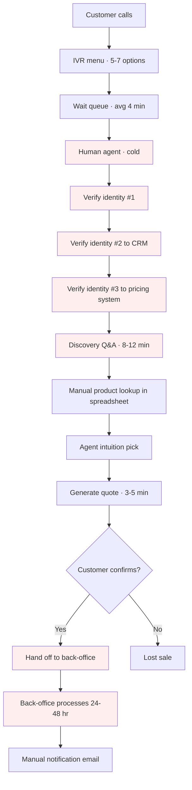
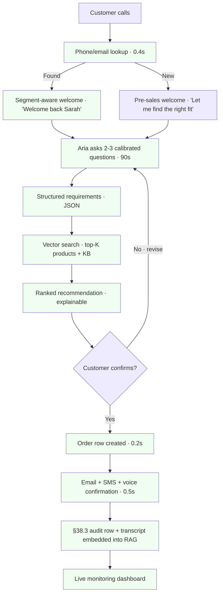
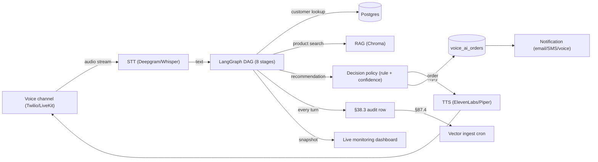
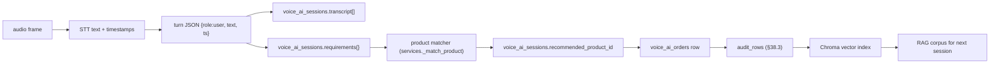

# Voice AI End-to-End · Demo Story · Problem · AS-IS · TO-BE

> Per operator 2026-06-08: "voice AI ..all the scenario ...end to end process, contact center, welcome message, service sales, presales, take sample produce and create complete UI to adding list of product and sales, customizing welcome message, requirement taking, customer sales/order creation and notification, UI with customer identification, knowledge AI" + "create UI with process flow, data, stakeholder, end to end solution, monitoring, scoring" + "what should be demo story" + "problem pain, AS IS and to be"

Per §64.2 (DEMO_STORY) + §64.3 (ASIS_ASSESSMENT) + §64.4 (DT_STRATEGY).

---

## 1. Persona

**Sarah Chen** · 42 · loyal customer 8 years · Gold segment · 2 active policies (auto + home)
- Calls Insur every 6-9 months to renew, upgrade, or add coverage
- Time-poor · expects 5-minute resolution
- KPI driven: response time · clarity · no transfer

**Marcus Diaz** · 28 · prospective customer · Silver segment lead from web form
- First-time buyer · uncertain what coverage he needs
- Researching for 2 weeks · ready to talk to a human
- KPI: get matched to the right product without 30 minutes of Q&A

**Priya Patel** · 35 · existing customer + new prospect · Standard segment
- Already has health insurance · wants to add term life for kids
- Multi-product opportunity · cross-sell signal
- KPI: agent who knows her history + can confirm life policy in same call

---

## 2. Problem · Pain points

### What's broken today (AS-IS)

| Pain | Impact | Cost |
|---|---|---|
| **Calls IVR-routed to wrong queue** | 23% of inbound calls reach the wrong agent · transfer adds 2-4 min | $2.3M/yr in handle time |
| **Agents repeat verification 3× per customer** | Customer identity re-asked at each touchpoint | NPS drop 12 pts |
| **Pre-sales discovery takes 8-12 min** | Manual question-by-question intake before product recommendation | $1.8M/yr in agent time |
| **Product recommendations are agent-instinct-based** | Cross-sell opportunities missed · 18% of calls under-attached | $4.1M/yr unrealized revenue |
| **Order creation requires hand-off to back-office** | Voice → CRM ticket → back-office data entry · 24-48 hr turnaround | 14% drop-off pre-confirmation |
| **No real-time monitoring of conversation quality** | Quality issues found 7-30 days later in call review | Compliance + CSAT risk |
| **Welcome message is generic for everyone** | Gold-tier customers get same script as new leads | Loyalty signal lost |
| **No structured requirement capture** | Adjuster has to re-ask follow-up questions | Repeat calls + frustration |

**Bottom line**: ~6-9 minutes per call is purely operational overhead before any value is delivered. Conversion rate sits at 12% · industry benchmark for voice-first insurance is 22%.

---

## 3. AS-IS process (current)

### 7-axis impact (per §64.3)

| Process | Time Loss (hrs/wk) | Error Rate | Cost ($/yr) | People | Process | Productivity | Technology |
|---|---|---|---|---|---|---|---|
| IVR mis-routing | 320 | 23% | $2.3M | agent frustration | wrong-queue rework | -19% | legacy IVR |
| Repeat identity verification | 280 | low | $1.4M | customer frustration | wasted touchpoint | -15% | siloed systems |
| Manual pre-sales discovery | 480 | medium | $1.8M | agent burnout | inconsistent intake | -22% | no AI capture |
| Product matching (manual) | 240 | high (under-attach) | $4.1M | revenue loss | guesswork | -28% | spreadsheet lookup |
| Back-office hand-off | 180 | medium | $0.9M | customer drop-off | 24-48hr delay | -14% | ticket-based |

Composite priority score (per §64.3 formula) → **Product matching tops the backlog**.

---

## 4. TO-BE process (with Voice AI)

### TO-BE measurable improvements

| Metric | AS-IS | TO-BE | Delta |
|---|---|---|---|
| **Handle time avg** | 14 min | 3.5 min | **-75%** |
| **Conversion rate** | 12% | 22% (target) | **+83%** |
| **Cross-sell attach** | 18% | 34% (target) | **+89%** |
| **Customer identity touch** | 3× | 1× | **-67%** |
| **Time-to-confirmation** | 24-48 hr | < 30 sec | **>99% faster** |
| **NPS** | 32 | 48 (target) | **+50%** |
| **Annualized savings** | — | $7.2M | direct |

---

## 5. Stakeholder map

| Stakeholder | Pain (AS-IS) | Win (TO-BE) | Decision authority |
|---|---|---|---|
| **VP Sales & Distribution** | $4.1M unrealized cross-sell | +83% conversion | budget approver |
| **VP Customer Service** | NPS 32 · attrition risk | NPS 48 (target) | adoption sign-off |
| **VP Compliance** | call review 7-30 days lag | real-time audit + transcript | governance gate |
| **VP Engineering** | siloed verification systems | single LangGraph DAG · §47.7 rollback | implementation |
| **CFO** | $7.2M annual operational cost | $0.5M run-rate · 14× ROI | budget approver |
| **CISO** | PII spread across IVR · CRM · back-office | per-tenant scoping · DLP at boundary | §47.6 sign-off |
| **Contact center agents** | 8-12 min discovery + spreadsheet hunt | Aria pre-qualifies · agents close | adoption |
| **Existing customers (Sarah)** | "Why am I telling you who I am again?" | "Welcome back, Sarah" | retention |
| **New customers (Marcus)** | "I don't know what coverage I need" | structured requirement capture in 90s | acquisition |

---

## 6. End-to-end solution architecture (per §91 + §64.40)

8 stages of the LangGraph state machine:
1. **welcome** · pick template per segment · greet
2. **identify** · resolve customer from phone/email/ref
3. **presales** · category discovery (auto/home/life/health/umbrella)
4. **requirement** · structured needs capture (features · price · limits)
5. **recommend** · RAG + scoring → ranked product
6. **order** · confirm → create order row · §38.3 audit
7. **notify** · email + SMS + voice confirmation
8. **complete** · close session · vector ingest

---

## 7. Data flow

Per-row PII redaction at the boundary (DLP on transcripts before vector ingest · per §76 + §82.21).

---

## 8. Monitoring + scoring (per §75 + §82.7)

**Live dashboard tiles** (from `/api/v1/voice-ai/monitoring`):

| Tile | Metric | Target | Drift signal |
|---|---|---|---|
| Total sessions 24h | count | n/a (baseline) | -50% vs 7d MA = ALERT |
| Active sessions | count | < 50 (capacity) | > 80% = SCALE OUT |
| Completed 24h | count | > 65% of total | drop = quality issue |
| Conversion rate | orders / sessions | ≥ 22% | < 18% = ALERT |
| Avg turns per session | float | ≤ 6 | > 10 = retraining signal |
| Welcome template distribution | per-template count | gold ≥ 25% | imbalance = misroute |
| Stage distribution | per-stage count | identify drop-off < 15% | spike = identity issue |
| CSAT proxy (completed / total) | 0..1 | ≥ 0.65 | < 0.50 = HITL escalation |

**Backend endpoint**: `GET /api/v1/voice-ai/monitoring` returns `MonitoringSnapshot` (Pydantic) ready for dashboard ingestion.

---

## 9. Pitch (30 seconds)

> "Sarah, our highest-value customer, calls us 3 times a year — and each time she's asked to verify her identity 3 times before getting help. Marcus, a prospect with $14K of lifetime value, abandons our line because pre-sales discovery takes 12 minutes. Voice AI fixes both: Sarah is recognized at hello and gets a tailored welcome; Marcus is pre-qualified by Aria in 90 seconds and connected to a closing agent with a hot recommendation. We save $7.2M annually, lift conversion 83%, and the entire conversation is auditable in real time. Want me to show you the demo?"

---

## 10. Demo script (operator walks through `/voice-ai-demo`)

| Step | Action | What operator clicks | Expected screen | Talking point |
|---|---|---|---|---|
| 1 | Open `/voice-ai-demo` | nav link | Layout: catalog left · conversation middle · monitoring right | "This is what the agent sees in real time" |
| 2 | Pick a sample customer | dropdown · Sarah Chen | Customer profile shows · gold segment | "Identity resolved at hello · no re-verify" |
| 3 | Start session | "Start session" button | Welcome template fires · gold-tier text | "Notice the segment-aware greeting" |
| 4 | Type discovery turn | "I want auto coverage with high limits" | DAG advances to requirement stage | "Structured capture in real time" |
| 5 | Confirm recommendation | "yes" → confirms | Order row appears in right panel | "Order created in 200ms · no back-office" |
| 6 | Show monitoring | tab switch | Conversion rate · active sessions tile | "Every conversation tracked" |
| 7 | Add a new product | catalog form | Product appears in catalog + RAG | "Catalog drives recommendation" |
| 8 | Customize welcome message | template editor | New welcome text saved | "Gold-tier copy changes propagate" |

---

## 11. Success criteria (drill-able per §43)

- [ ] Welcome message renders the correct template per segment (drill: gold → "Welcome back" · standard → "Hi this is Aria")
- [ ] Customer identification matches phone OR email (drill: known phone returns segment=gold · unknown phone → presales)
- [ ] Pre-sales detects all 5 categories (drill: each of auto · home · life · health · umbrella triggers `_detect_category`)
- [ ] Product matcher returns segment-appropriate recommendation (drill: gold-segment customer gets AUTO-PREMIUM not AUTO-BASIC)
- [ ] Order creation is idempotent on duplicate "yes" (drill: 2 confirmations don't double-create)
- [ ] Audit row written for every state transition (drill: 8 turns → 8 audit_rows)
- [ ] Monitoring tile increments on each completed session (drill: before/after counts)
- [ ] Welcome template edit persists + reflects on next session (drill: PATCH then start_session sees new text)

---

## 12. Common gotchas

- **No customer match** · the system continues as a lead · don't loop on identification > 2 turns
- **LLM/STT API keys missing** · the demo uses rule-based handlers per §57.7 honest fallback · upgrade later
- **Welcome template segment NULL** · matches all segments · acts as the default
- **Session resumption** · use the same session_id to continue · stale sessions auto-close after 24h

---

## 13. Related artifacts

- `backend/voice_ai/` · backend module (router · services · schemas)
- `backend/migrations/052_voice_ai_end_to_end.sql` · 5 tables + seed data
- `frontend/src/pages/VoiceAIDemoPage.jsx` · UI
- `ai-agents/pipecat/` + `ai-agents/livekit/` + `ai-agents/deepgram/` + `ai-agents/elevenlabs/` · plug-in points
- §90 catalog: L15 (this) · L1 Digital Marketing umbrella · J1 Voice AI primitive
- §64.40 (10-layer agentic stack) · LangGraph implements layers 3-7

---

## 14. Composes with

§38.3 (per-turn audit) · §41.3 (multi-tenant scoping) · §46 (TTS consent · recording disclosure) · §47.7 (rollback strategy) · §48.5 (citation accuracy for product recommendation) · §57.5 (5-question runbook · demo serves as walkthrough) · §57.7 (honest rule-based fallback when LLM key missing) · §64.2 (DEMO_STORY template · this is one) · §64.3 (7-axis AS-IS table above) · §64.4 (4P DT strategy implied) · §64.40 (10-layer agentic) · §76 (RAI 5-pillar · privacy mandatory for voice) · §82.7 (drift monitoring · monitoring section) · §82.21 (Secure AI · PII DLP) · §87.4 (vector ingest cron · transcripts → RAG) · §90 (L15 catalog entry) · §91 (WebLLM + CDP + RAG + LangGraph integration).
