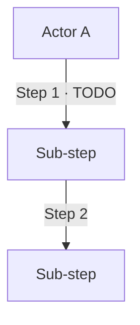
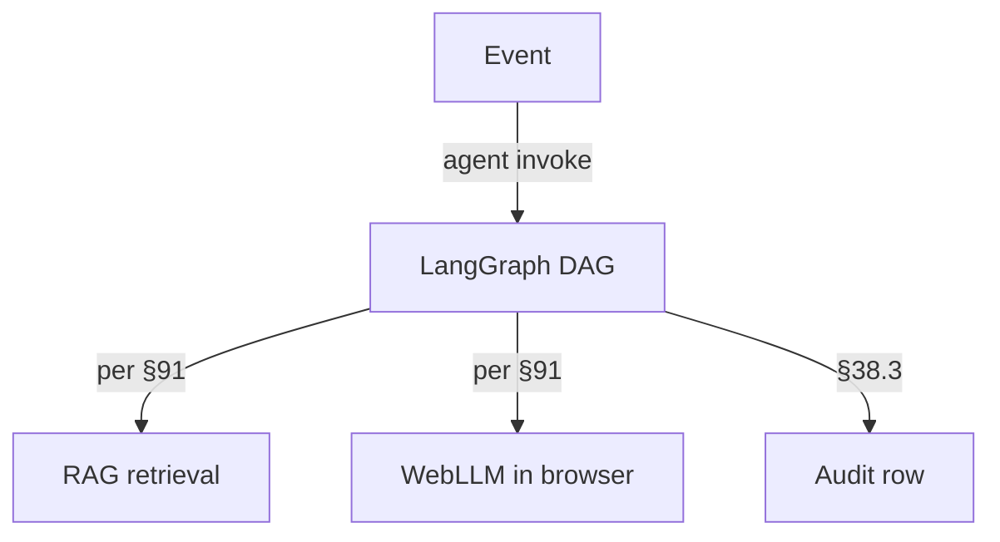

# HOLY_FLOW.md · Dept 20 · Cybersecurity / Fraud Defense

> Generated scaffold per §64.27 · Manual + Automatic flow + Architecture.

## Per-process flow

### Process 1.0 · TODO

#### Manual flow (AS-IS)

#### Automatic flow (TO-BE)

#### Architecture view (C4 L2)
TODO · per §47.2 C4 model.

#### Per-step table

| # | Actor | Action | AI augmentation | Decision rule | Log/trace point | Fallback path |
|---|---|---|---|---|---|---|
| 1 | TODO | TODO | TODO | TODO | TODO | TODO |

#### Comparison table (Manual vs Auto)

| Metric | Manual | Auto | Delta |
|---|---|---|---|
| Time per instance | TODO | TODO | TODO |
| Error rate | TODO | TODO | TODO |
| Cost | TODO | TODO | TODO |
| Human-touch-points | TODO | TODO | TODO |

Composes with §38.3 · §43 · §47.2 (C4) · §59 (DDD process modeling) · §64.7 (manual/auto tags) · §64.27 · §91.
