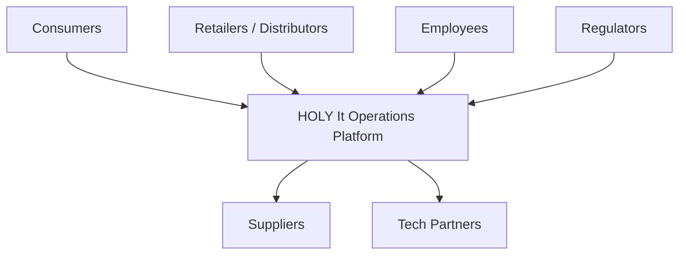
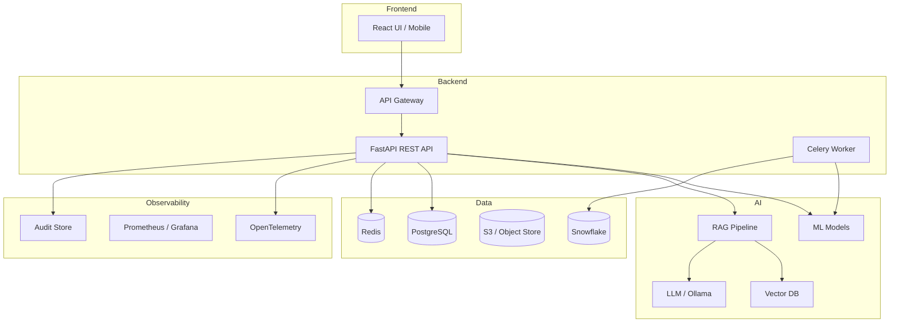
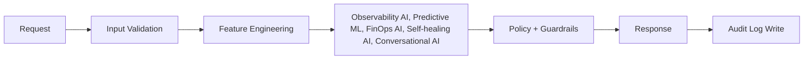

# HOLY Beverage — It Operations C4 Model

**Source:** operator brief 2026-05-21. Mermaid + ASCII per §47 architecture standard.

## L1 — System Context

## L2 — Container View

## L3 — Component View (per AI process)

## L4 — Code View

See `docs/lld/HOLY_LLD.md` for API contracts + DB schemas + sequence diagrams.

## L5 — Governance Surface

- ADRs at `documentation/adr/` (HOLY_ADR-NNN-*.md for dept-specific decisions)
- AI policies: `governance-trust-compliance-layer/ai-policies/`
- Decision lineage: every API call writes a row to `it_operations_audit` (see LLD §2)

## L6 — Observability

- Logs: structured JSON with `correlation_id`, `tenant_id`, `user_id`, `model_version`, `prompt_version`
- Metrics: `it-operations_request_count`, `it-operations_latency_p95`, `it-operations_model_confidence`, `it-operations_hallucination_rate`
- Traces: OpenTelemetry spans across API → feature → model → guard → audit
- Alerts: drift > threshold, latency > SLA, accuracy drop > 5%

## L7 — Lifecycle

| Stage | Surface |
|---|---|
| Build | `.github/workflows/` per dept |
| Release | Model registry (MLflow), prompt registry (versioned in repo) |
| Rollback | App: blue/green; DB: expand→migrate→contract; AI: registry rollback |
| Retire | ADR-supersession + deprecation notice |

## Compose with

- `HOLY_HLD.md` (this folder) for high-level + NFRs
- `HOLY_LLD.md` for API + DB + sequence
- `HOLY_SAD.md` for executive overview + ADR catalog
- `../network-flow/HOLY_NETWORK_FLOW.md` for runtime traffic
- Global §47 (architecture standards)
