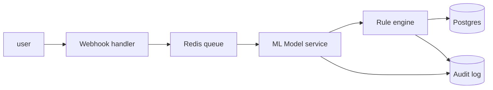

# HOLY Beverage — Marketing — Manual + Automatic Flow + Architecture View

> Per global CLAUDE.md §64.27 + §64.18 — every department MUST have this artifact.
> This stub is the contract; the AI-Strategy role fills in dept specifics.

## Owner

**System Architect** + **DT-Strategy**.

## Process flow comparison (per process in `HOLY_PROCESS_MGMT.md`)

For each end-to-end process in marketing, the operator MUST capture:

### Process: _ (name)

#### Manual flow (current AS-IS)

```
Swimlane: per actor
┌─────────────────────────────────────────────────┐
│ Actor A     │ Actor B     │ Actor C     │ ...  │
├─────────────┼─────────────┼─────────────┼──────┤
│ Step 1 (X m)│             │             │      │
│             │ Step 2 (Y m)│             │      │
│             │             │ Step 3 (Z m)│      │
└─────────────────────────────────────────────────┘
Total time: _ min  |  Errors: _  |  Cost: $_
```

#### Automatic flow (TO-BE)

```
Swimlane: per agent / service
┌─────────────────────────────────────────────────┐
│ Webhook     │ ML Model    │ Rule Engine │ Audit│
├─────────────┼─────────────┼─────────────┼──────┤
│ ingest 0.1s │             │             │      │
│             │ score 0.2s  │             │      │
│             │             │ route 0.05s │      │
│             │             │             │ log  │
└─────────────────────────────────────────────────┘
Total time: 0.4s  |  Errors: _  |  Cost: $0.0005
```

#### Architecture view (C4 L2 — containers)



#### Per-step detail

| Step | Actor | Action | AI augmentation | Decision rule | Log/trace point | Fallback path |
|---|---|---|---|---|---|---|
| 1 | _ | _ | _ | _ | _ | _ |

#### Manual-vs-Auto comparison table

| Dimension | Manual | Automatic | Δ |
|---|---|---|---|
| Time per instance | _ | _ | _ |
| Error rate | _ | _ | _ |
| Cost per instance | _ | _ | _ |
| Human touch-points | _ | _ | _ |

(Repeat the entire structure per process — minimum 3 processes.)

## Live simulation

The simulation engine (`backend/ml/reference/simulation_engine.py`) renders
both flows side-by-side. See `HOLY_SIMULATION.md` for the runtime view.

## Composes with

- `HOLY_PROCESS_MGMT.md` — process catalog (the WHAT)
- `HOLY_SIMULATION.md` — runtime version of these flows
- `HOLY_DT_STRATEGY.md` — 4P impact of each transition
- Global §47 — C4 architecture
- Global §59 — DDD process modeling
