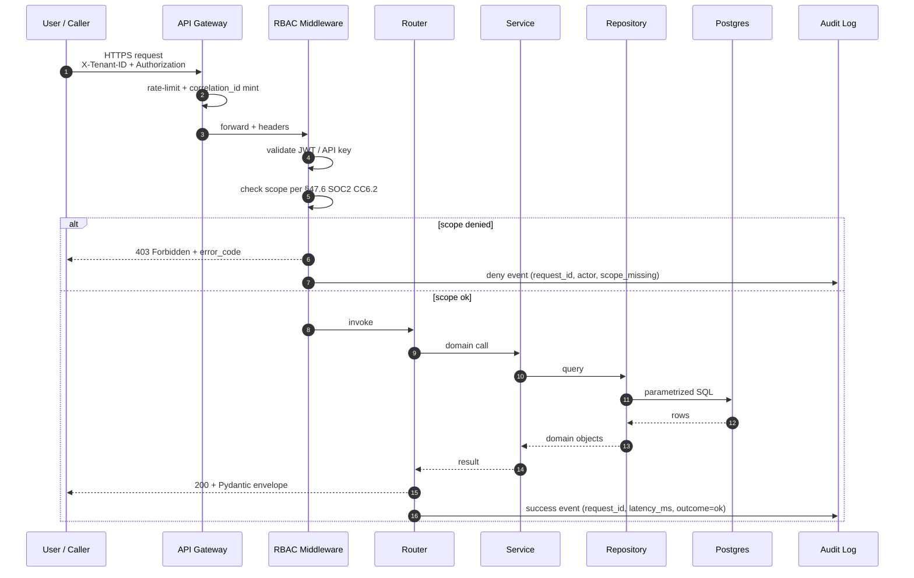
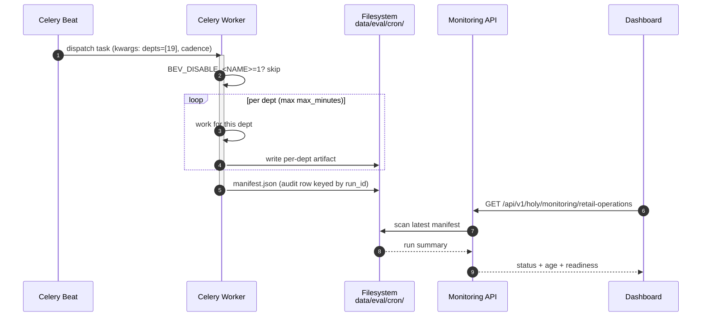
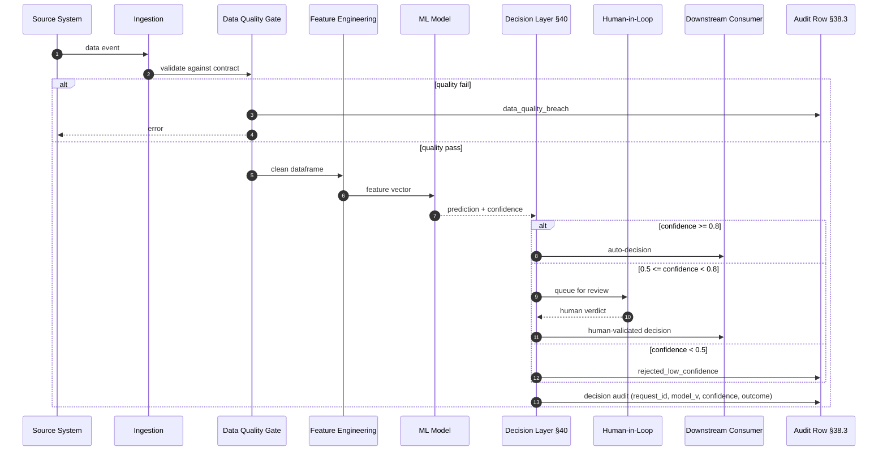
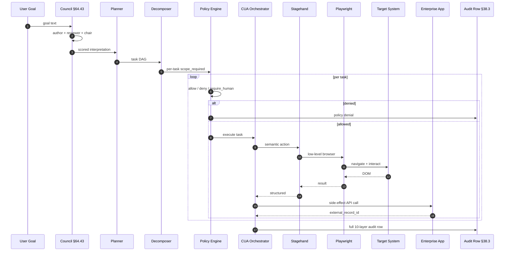
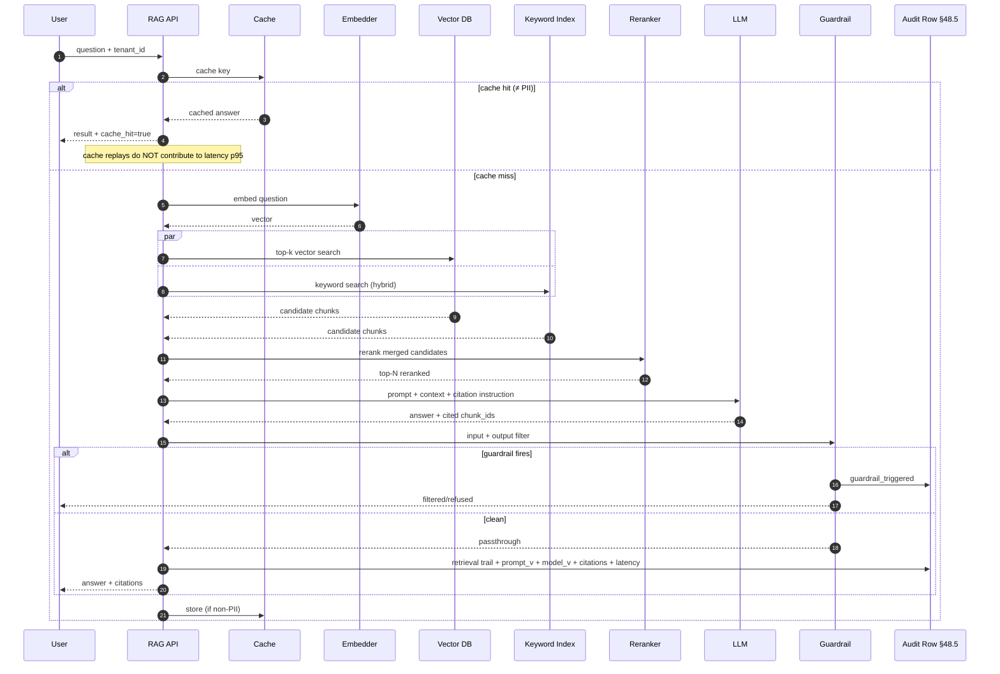
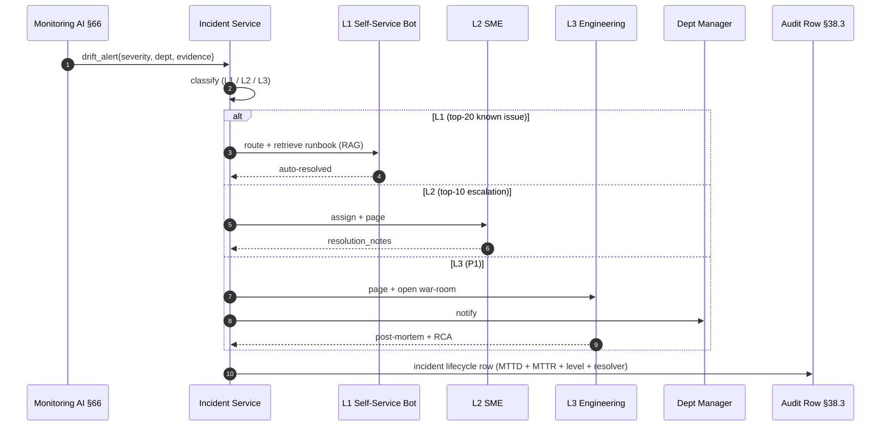

# HOLY Beverage — Retail Operations — Sequence Flow

> Per global §47 (C4 L4 dynamic view) + §38 (request_id propagated end-to-end)
> + §57.6 (canonical fields on every span) + §64 (per-dept artifact).
> Mermaid sequence diagrams below render in GitHub + IDE preview + mkdocs.

## 1. Inbound API request → audit row (canonical flow)

The contract for every dept-scoped HOLY API call:



## 2. Recurring cron job execution (per §65.8.5 + §66)

The 4 recurring jobs (data refresh / retrain / accuracy drift / analysis
rollup) all share this shape:



## 3. Dept-primary AI flow — **Footfall + Staffing**

_Sensor counts → forecast model → staff-recommendation → manager push_



## 4. 10-layer agentic-stack execution (per §64.40)

When a user types a goal in `/holy/retail-operations/agentic`:



## 5. RAG retrieval — citation contract (per §48.5)

For any RAG-backed answer in this dept:



## 6. Incident escalation (per §64.5)

When monitoring AI detects an anomaly that needs human review:



## 7. Cross-references (§49 compose-footer)

- [`HOLY_HLD.md`](../hld/HOLY_HLD.md) — system shape these sequences run within
- [`HOLY_LLD.md`](../lld/HOLY_LLD.md) — class/method-level expansion of each lane
- [`HOLY_NETWORK_FLOW.md`](../network-flow/HOLY_NETWORK_FLOW.md) — runtime topology these sequences traverse
- [`HOLY_FRD.md`](../frd/HOLY_FRD.md) — functional requirements each sequence implements
- [`HOLY_BRD.md`](../brd/HOLY_BRD.md) — business goals each sequence ultimately serves
- [`HOLY_FLOW.md`](../../business-layer/HOLY_FLOW.md) — sibling manual-vs-automatic flow comparison
- [`HOLY_PROCESS_MGMT.md`](../../business-layer/HOLY_PROCESS_MGMT.md) — full IPO + TODO + task catalog
- [`HOLY_MONITORING_AI.md`](../../business-layer/HOLY_MONITORING_AI.md) — runtime evidence each sequence produced

---

## Rendering

GitHub renders Mermaid in markdown natively. For local preview:

```bash
# IDE: VSCode + "Markdown Preview Mermaid Support" extension
# CLI:
npx -p @mermaid-js/mermaid-cli mmdc -i HOLY_SEQUENCE.md -o sequence.svg
```

## The contract

Every sequence above MUST carry the request_id end-to-end (Mermaid does
not show every field — the canonical envelope §57.6 is assumed on every
arrow). Per global §38, the final lane in every sequence is the audit
row; a sequence that doesn't terminate in an audit write is incomplete.
