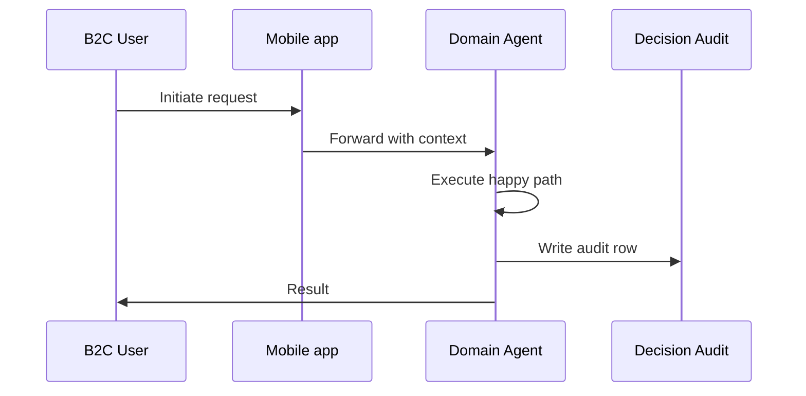
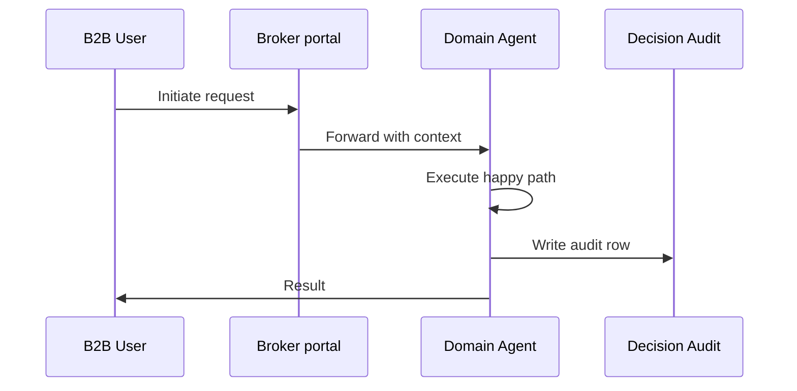
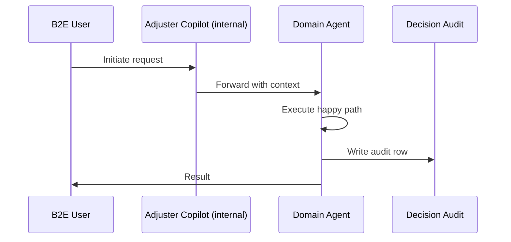
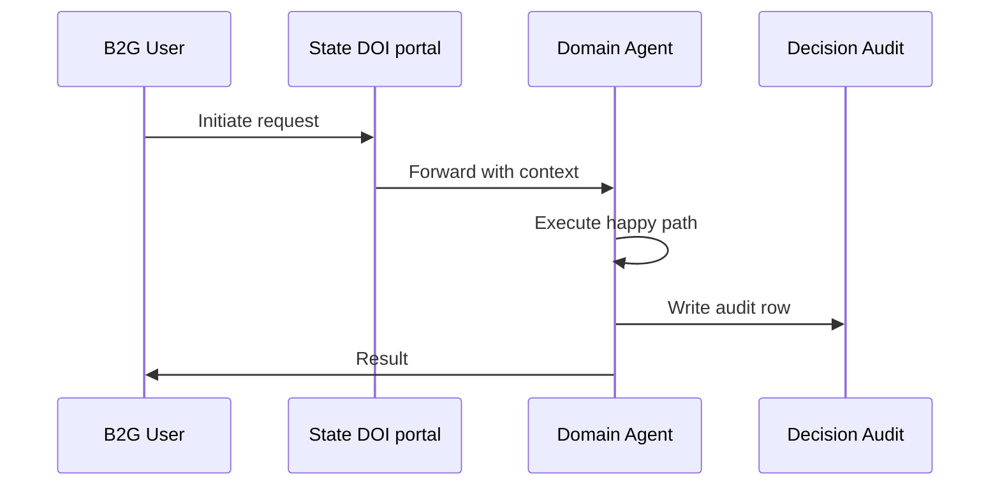

# Business Model Flows (B2C / B2B / B2E / B2G) — Claims

Per operator 2026-06-01.
Each business model gets a distinct scenario, channels, happy path, exceptions, and data sources.

Business models supported by this department: **B2C, B2B, B2E, B2G**

## B2C — Auto policyholder files first-party collision claim

**Channels**: Mobile app, Web portal, Call center

### Happy Path
1. Policyholder uploads accident photos + dash-cam via mobile app
2. CV agent estimates damage in <30 sec
3. Coverage agent verifies policy in force
4. Fraud agent scores transaction (sub-2-sec)
5. Settlement agent recommends $4,200 payout (auto-approve threshold)
6. EFT issued same-day; customer notified via SMS + email

### Exception Branches
- Total loss → manual review
- Injury claim → triage to bodily-injury workflow
- Suspected fraud → SIU queue

### Data Sources
- Customer profile
- Policy in force
- Photos / video
- Telematics (if opt-in)
- Police report (if filed)

### Mermaid Flow

## B2B — Commercial fleet operator submits multi-vehicle claim from warehouse fire

**Channels**: Broker portal, Direct EDI, Account-manager email

### Happy Path
1. Broker submits bulk loss notification + spreadsheet of vehicles
2. Document extraction agent parses 40-vehicle inventory
3. Coverage agent applies fleet master policy + per-vehicle limits
4. Reserve agent calculates aggregate reserve ($2.4M)
5. Adjuster assigned for in-person inspection of high-value units
6. Settlement negotiated with broker; payment via wire

### Exception Branches
- Contractor liability cross-claim
- Reinsurance trigger (>$1M)
- Subrogation against fire suppression vendor

### Data Sources
- Commercial policy
- Fleet roster
- Vehicle inspection reports
- Fire marshal report
- Reinsurance treaty

### Mermaid Flow

## B2E — Internal adjuster handles a complex catastrophe claim (hurricane)

**Channels**: Adjuster Copilot (internal), Mobile field-app, Vendor coordination portal

### Happy Path
1. Adjuster Copilot pre-loads similar past claims from RAG corpus
2. Field adjuster captures property photos via mobile
3. Geospatial AI overlays storm-track + parcel data
4. Copilot drafts loss-of-use, ALE, dwelling, contents estimates
5. Vendor portal auto-assigns mitigation contractor
6. Closure summary auto-generated; sent to underwriting feedback loop

### Exception Branches
- FEMA coordination required
- Mortgagee payment routing
- Co-insurance dispute

### Data Sources
- NOAA storm data
- Property records
- Past CAT claims (RAG)
- Vendor scorecards
- Mitigation contractor inventory

### Mermaid Flow

## B2G — Regulatory examiner requests claims sample for market-conduct exam

**Channels**: State DOI portal, Audit response workflow

### Happy Path
1. Examiner submits sample request (100 claims by criteria)
2. Audit agent pulls qualifying claims with full decision audit rows per §38.3
3. Compliance copilot generates response narrative
4. Legal review gate before submission
5. Submitted via secure regulator channel

### Exception Branches
- Findings → remediation plan
- Penalty negotiation
- Consent-order workflow

### Data Sources
- Decision audit log
- Customer correspondence
- Settlement records
- Compliance playbook

### Mermaid Flow

## Cross-model considerations

| Concern | B2C | B2B | B2E | B2G |
|---|---|---|---|---|
| Authentication | Customer auth (OTP / bio) | Broker license + appointment | SSO + RBAC | Mutual TLS + signed envelope |
| Audit depth | Per-decision audit row | Per-transaction + treaty link | Per-action + supervisor | Per-record + regulator-readable |
| Compliance gate | State DOI consumer rules | Commercial / multi-state | Internal policy + HR | Regulator-mandated SLA |
| Reporting cadence | On-demand | Quarterly broker scorecard | Daily ops dashboard | Per state requirement |
