# Process Flow Diagrams — Claims

Per operator 2026-06-01.
Mermaid flowcharts per L2 process. Each L2 → ordered L3 sub-process chain.

## L1 → L2 Process Hierarchy

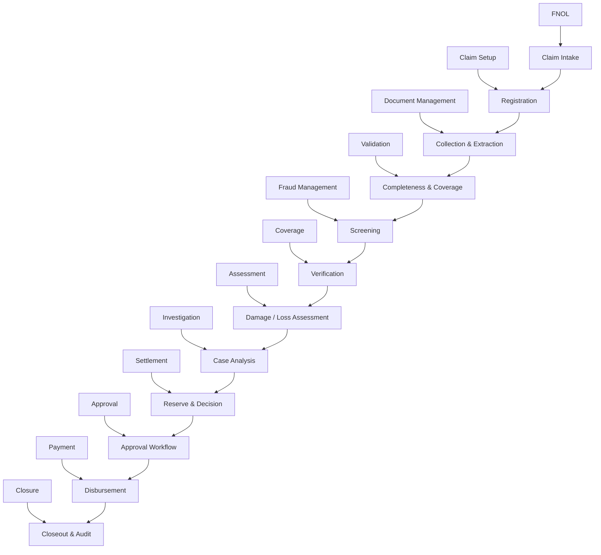

### FNOL → Claim Intake

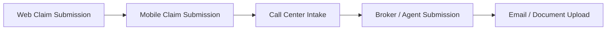

### Claim Setup → Registration

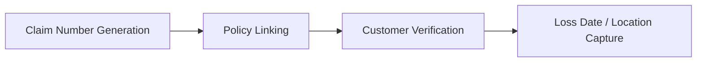

### Document Management → Collection & Extraction

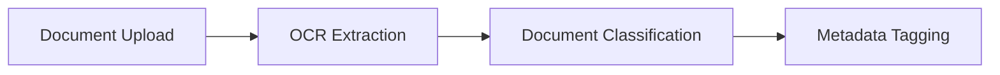

### Validation → Completeness & Coverage

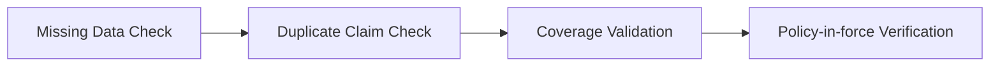

### Fraud Management → Screening

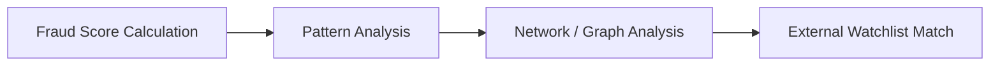

### Coverage → Verification

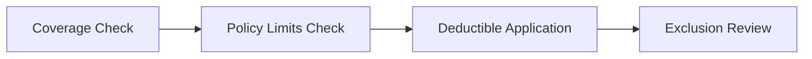

### Assessment → Damage / Loss Assessment

```mermaid
flowchart LR
    A[Image / Video Analysis (CV)]
    B[Adjuster Field Review]
    C[Repair Estimate]
    D[Medical Bill Review]
    A --> B
    B --> C
    C --> D
```

### Investigation → Case Analysis

```mermaid
flowchart LR
    A[Field Investigation]
    B[External Verification (Police / Medical)]
    C[Witness Interview]
    D[Subrogation Review]
    A --> B
    B --> C
    C --> D
```

### Settlement → Reserve & Decision

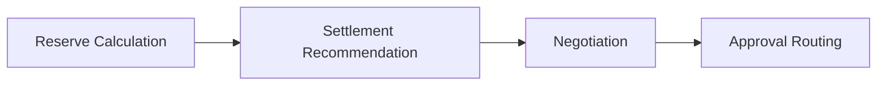

### Approval → Approval Workflow

```mermaid
flowchart LR
    A[Auto Approval (STP)]
    B[Manual Approval]
    C[Manager Escalation]
    D[Committee Review]
    A --> B
    B --> C
    C --> D
```

### Payment → Disbursement

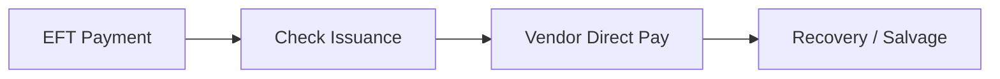

### Closure → Closeout & Audit

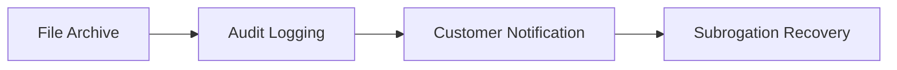


## End-to-End Happy Path

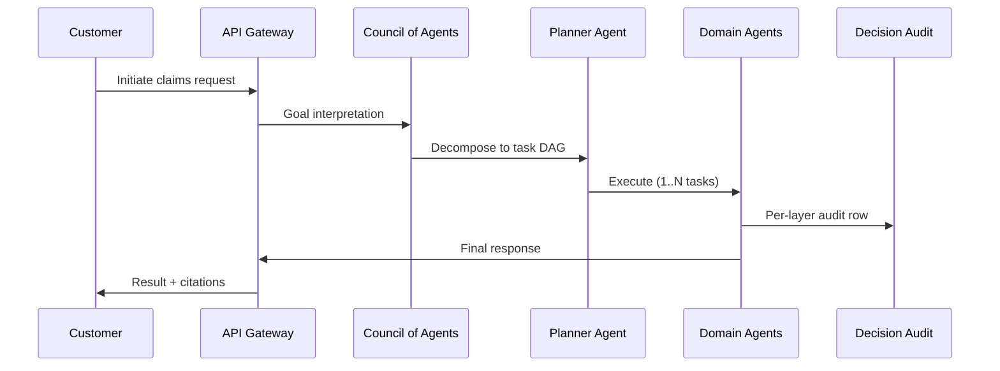
