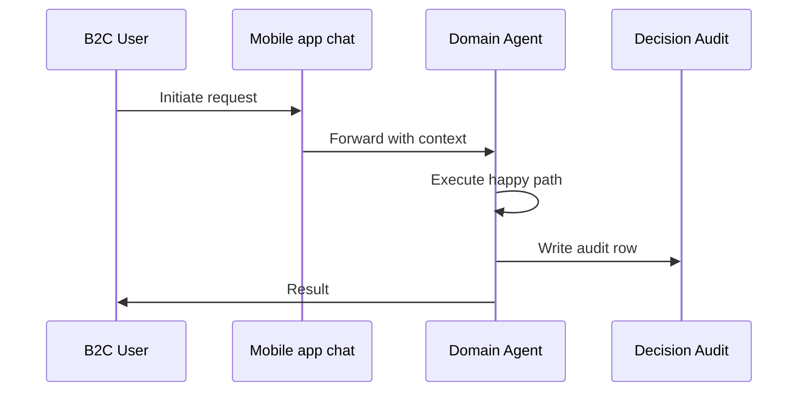
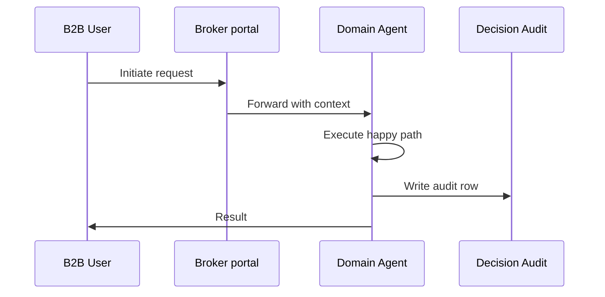
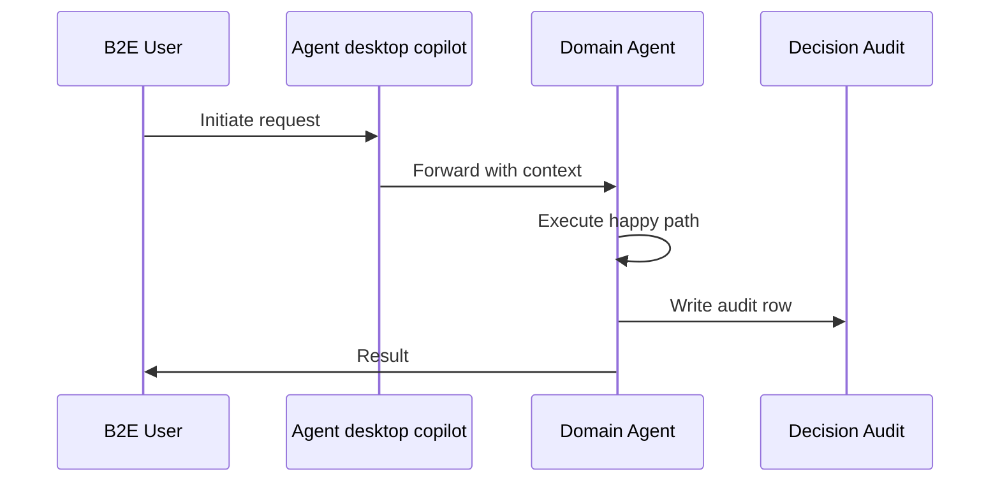
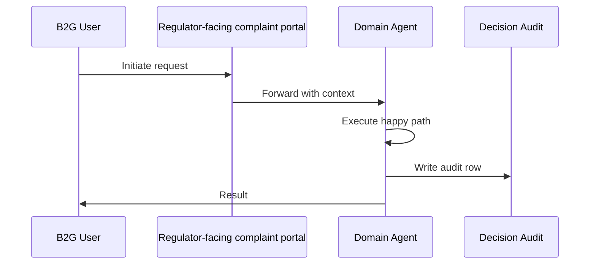

# Business Model Flows (B2C / B2B / B2E / B2G) — Customer Service / Contact Center

Per operator 2026-06-01.
Each business model gets a distinct scenario, channels, happy path, exceptions, and data sources.

Business models supported by this department: **B2C, B2B, B2E, B2G**

## B2C — Policyholder asks about claim status via mobile chat

**Channels**: Mobile app chat, Web chat, SMS

### Happy Path
1. Customer opens chat → identity confirmed via app session
2. Intent classifier: 'claim_status'
3. Knowledge agent retrieves real-time claim from claims system
4. Generates personalized status update with ETA
5. Offers proactive actions (upload missing docs, schedule adjuster)
6. Chat ends with CSAT prompt; sentiment scored

### Exception Branches
- Authentication fail → step-up to voice bio
- Complex claim query → warm transfer to claims adjuster
- Negative sentiment → manager alert

### Data Sources
- Customer profile
- Active claims
- Policy in force
- Past interaction history
- Sentiment history

### Mermaid Flow

## B2B — Commercial broker requests certificates of insurance for 12 clients via account-manager portal

**Channels**: Broker portal, Email, Account manager

### Happy Path
1. Broker submits bulk COI request
2. Verification agent confirms broker license + appointment
3. Doc-gen agent produces 12 COIs with each client's specific holder
4. Compliance check (state-specific COI language)
5. Bulk delivery via portal + e-mail

### Exception Branches
- Broker appointment expired → retention escalation
- Holder requires special endorsement → underwriter referral
- International COI → global program team

### Data Sources
- Broker license registry
- Policy schedules
- State-specific COI templates

### Mermaid Flow

## B2E — Agent Copilot whispers next-best-action during a save call

**Channels**: Agent desktop copilot, Voice headset

### Happy Path
1. Customer calls intending to cancel
2. Real-time sentiment detects churn risk
3. Copilot surfaces save offers + retention scripts
4. Agent uses copilot suggestions; customer retained
5. Outcome logged for churn-model retraining

### Exception Branches
- Strong intent to leave → empathy script + manager hand-off
- Pricing complaint → UW referral
- Service failure complaint → root-cause loop

### Data Sources
- Customer LTV
- Churn risk score
- Save-offer catalog
- Past complaints
- Retention playbook

### Mermaid Flow

## B2G — State DOI consumer hotline forwards complaint

**Channels**: Regulator-facing complaint portal, Email

### Happy Path
1. DOI submits consumer complaint with case number
2. Compliance agent retrieves customer interaction history
3. Drafts regulator-facing response narrative
4. Legal review gate
5. Submitted within state-mandated SLA (typically 10 days)

### Exception Branches
- Pattern of complaints → market-conduct flag
- Finding → remediation workflow
- Penalty → consent-order workflow

### Data Sources
- Customer history
- Decision audit log
- Complaint catalog
- State complaint regulations

### Mermaid Flow

## Cross-model considerations

| Concern | B2C | B2B | B2E | B2G |
|---|---|---|---|---|
| Authentication | Customer auth (OTP / bio) | Broker license + appointment | SSO + RBAC | Mutual TLS + signed envelope |
| Audit depth | Per-decision audit row | Per-transaction + treaty link | Per-action + supervisor | Per-record + regulator-readable |
| Compliance gate | State DOI consumer rules | Commercial / multi-state | Internal policy + HR | Regulator-mandated SLA |
| Reporting cadence | On-demand | Quarterly broker scorecard | Daily ops dashboard | Per state requirement |
