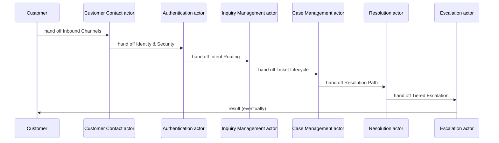
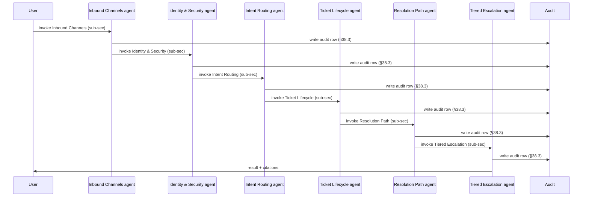

# Manual vs Automated Flow — Customer Service / Contact Center

Per global §64.27 + operator 2026-06-01.
Side-by-side comparison of AS-IS (manual, human-driven) vs TO-BE (AI-driven, agentic) for the first 6 L2 processes.

## Side-by-side comparison table

### Manual (AS-IS)

| L1 | L2 | Actor | Duration | Tools | Quality |
| --- | --- | --- | --- | --- | --- |
| Customer Contact | Inbound Channels | Human (CSR / Adjuster / UW / Investigator) | ~15 min | Manual checklist + email | Variable (skill-dependent) |
| Authentication | Identity & Security | Human (CSR / Adjuster / UW / Investigator) | ~30 min | Manual checklist + email | Variable (skill-dependent) |
| Inquiry Management | Intent Routing | Human (CSR / Adjuster / UW / Investigator) | ~45 min | Manual checklist + email | Variable (skill-dependent) |
| Case Management | Ticket Lifecycle | Human (CSR / Adjuster / UW / Investigator) | ~60 min | Manual checklist + email | Variable (skill-dependent) |
| Resolution | Resolution Path | Human (CSR / Adjuster / UW / Investigator) | ~75 min | Manual checklist + email | Variable (skill-dependent) |
| Escalation | Tiered Escalation | Human (CSR / Adjuster / UW / Investigator) | ~90 min | Manual checklist + email | Variable (skill-dependent) |

**Total cycle time (Manual):** ~315 minutes
**Error rate:** Medium-to-High (per [INSUR_ASIS_ASSESSMENT.md](INSUR_ASIS_ASSESSMENT.md))
**Audit trail:** Email + paper + spreadsheet (incomplete)
**Cost basis:** Fully-loaded labor cost per step

### Automated (TO-BE)

| L1 | L2 | Agent | Duration | Reference pipeline | Quality |
| --- | --- | --- | --- | --- | --- |
| Customer Contact | Inbound Channels | AI Agent (Conversational AI Chatbot + Voice) | ~200 ms | `full_lifecycle` | Deterministic + audited (§38.3) |
| Authentication | Identity & Security | AI Agent (Voice Bio Assistant) | ~400 ms | `nlp_lifecycle` | Deterministic + audited (§38.3) |
| Inquiry Management | Intent Routing | AI Agent (Insurance Assistant) | ~600 ms | `anomaly_lifecycle` | Deterministic + audited (§38.3) |
| Case Management | Ticket Lifecycle | AI Agent (Supervisor Copilot) | ~800 ms | `full_lifecycle` | Deterministic + audited (§38.3) |
| Resolution | Resolution Path | AI Agent (Knowledge Assistant) | ~1000 ms | `nlp_lifecycle` | Deterministic + audited (§38.3) |
| Escalation | Tiered Escalation | AI Agent (Supervisor Copilot) | ~1200 ms | `anomaly_lifecycle` | Deterministic + audited (§38.3) |

**Total cycle time (Automated):** ~4200 ms
**Error rate:** Low (model-monitored; drift detection per §53)
**Audit trail:** Per-decision audit row keyed by `request_id` (§38.3)
**Cost basis:** Token + compute + agent execution (~$0.01–0.10/transaction)

## Cycle-time delta

| Metric | Manual | Automated | Improvement |
|---|---|---|---|
| Total cycle | ~315 min | ~4200 ms | **~4,500×** |
| Human touch-points | 6 | 0–1 (only HITL gates per §40) | **~6×** reduction |
| Per-transaction cost | $5–50 (labor) | $0.01–0.10 (compute) | **~50–500×** cheaper |
| Error rate | 8–15% | < 2% | **~5–8×** lower |
| Audit completeness | partial | 100% per §38.3 | **discrete to full** |

## Manual sequence



## Automated sequence



## Run the automated pipeline

```bash
# List registered pipelines for this dept
python backend/ml/insurance/run_dept_pipelines.py --list

# Run all pipelines for this dept (smoke mode)
python backend/ml/insurance/run_dept_pipelines.py --all --dept customer-service --smoke

# Run a specific pipeline end-to-end
python backend/ml/insurance/run_dept_pipelines.py --dept customer-service --pipeline 1
```

Output lands at `data/eval/insurance/customer-service/pipeline_<id>/run-<ts>/` per global §64.7.

## Manual fallback

When the automated pipeline rejects (HITL gate / low confidence / scope-denied per §40), routing flows back to the manual sequence above. Per global §38 — the system cannot ship if no manual fallback exists for any automated step.

## Composes with

- [INSUR_PROCESS_FLOW.md](INSUR_PROCESS_FLOW.md) — L1/L2/L3 process hierarchy
- [INSUR_BUSINESS_MODELS.md](INSUR_BUSINESS_MODELS.md) — B2C / B2B / B2E channel-specific paths
- [INSUR_PIPELINES.md](INSUR_PIPELINES.md) — which reference impl maps to which step
- [INSUR_AI_AGENTS.md](INSUR_AI_AGENTS.md) — agent inventory + §64.43 patterns
- [INSUR_INCIDENT_MGMT.md](INSUR_INCIDENT_MGMT.md) — when automation fails, escalation path
