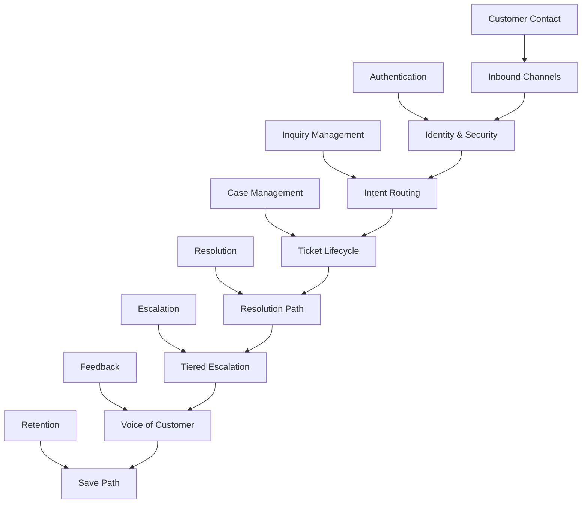
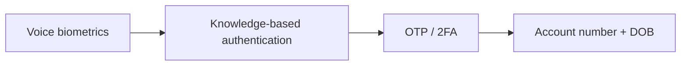
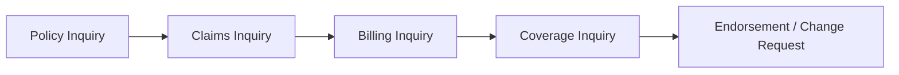
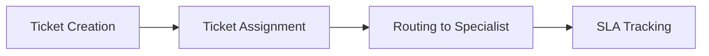
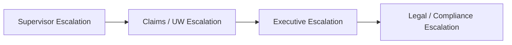
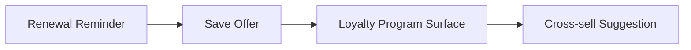
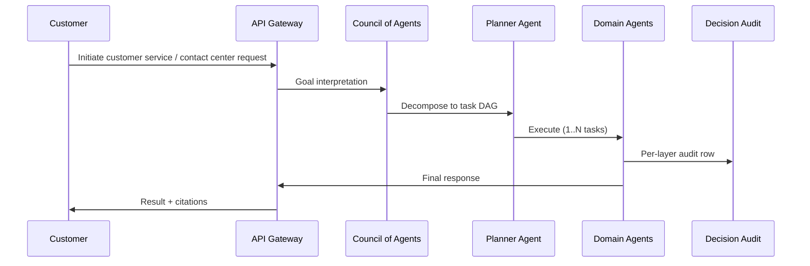

# Process Flow Diagrams — Customer Service / Contact Center

Per operator 2026-06-01.
Mermaid flowcharts per L2 process. Each L2 → ordered L3 sub-process chain.

## L1 → L2 Process Hierarchy



### Customer Contact → Inbound Channels

```mermaid
flowchart LR
    A[Phone (IVR + agent)]
    B[Email]
    C[Chat (web + mobile)]
    D[Mobile app]
    E[Social media]
    F[WhatsApp]
    A --> B
    B --> C
    C --> D
    D --> E
    E --> F
```

### Authentication → Identity & Security



### Inquiry Management → Intent Routing



### Case Management → Ticket Lifecycle



### Resolution → Resolution Path

```mermaid
flowchart LR
    A[Self-Service (KB / chatbot)]
    B[Agent Resolution]
    C[Escalation]
    A --> B
    B --> C
```

### Escalation → Tiered Escalation



### Feedback → Voice of Customer

```mermaid
flowchart LR
    A[Survey (CSAT)]
    B[Net Promoter Score]
    C[Complaint Capture]
    D[Compliment Capture]
    A --> B
    B --> C
    C --> D
```

### Retention → Save Path




## End-to-End Happy Path


