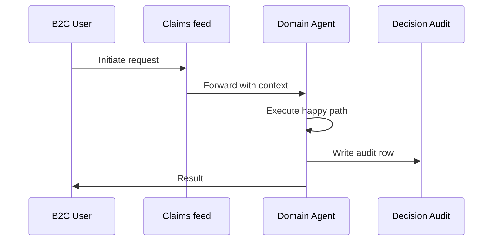
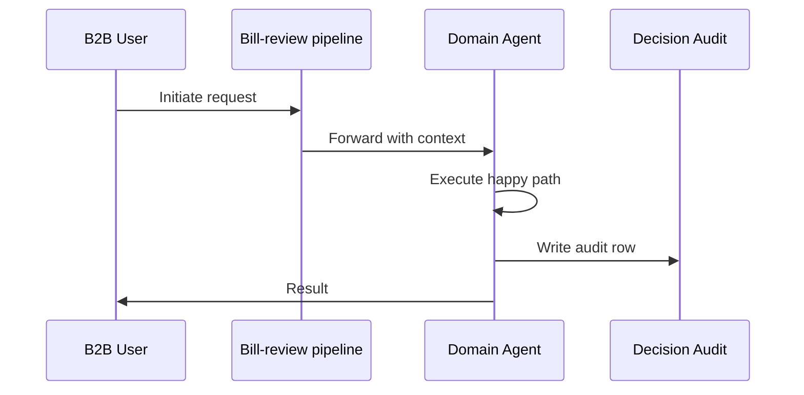
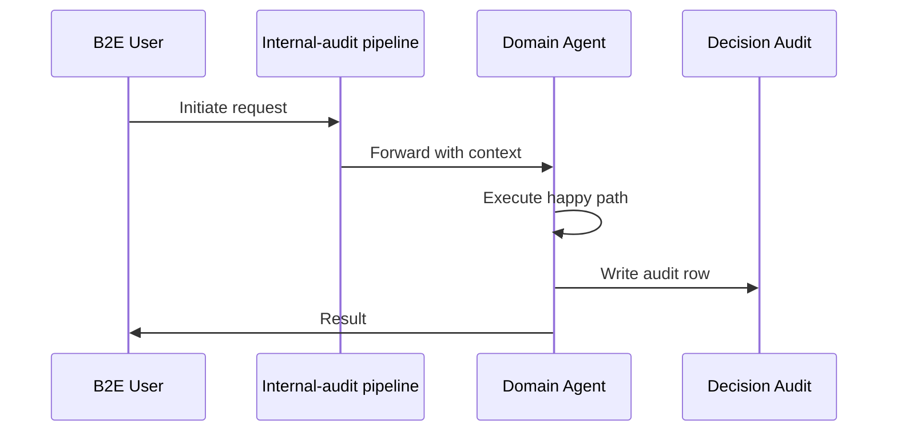

# Business Model Flows (B2C / B2B / B2E / B2G) — Fraud / Special Investigations Unit (SIU)

Per operator 2026-06-01.
Each business model gets a distinct scenario, channels, happy path, exceptions, and data sources.

Business models supported by this department: **B2C, B2B, B2E**

## B2C — Suspicious auto-glass claim flagged at FNOL

**Channels**: Claims feed, Fraud scoring pipeline

### Happy Path
1. FNOL → fraud scoring agent flags claim (score 0.87)
2. Graph analysis surfaces shared address with 4 other recent glass claims
3. OSINT agent pulls social media; finds business posing as policyholder
4. Investigator confirms ring; case routed to legal
5. Claim denied; NICB report filed; provider de-networked

### Exception Branches
- Insufficient evidence → monitor list
- Cross-state ring → multi-state coordination
- Federal interest (RICO) → FBI referral

### Data Sources
- Claims history
- Address graph
- Provider network data
- OSINT (social, biz registries)
- NICB watchlist

### Mermaid Flow

## B2B — Provider-fraud detected in workers' comp medical billing

**Channels**: Bill-review pipeline, Provider audit workflow

### Happy Path
1. Continuous billing analysis detects up-coding pattern at provider
2. Anomaly score escalates → provider audit triggered
3. Audit agent reviews 200 recent bills; finds systematic up-coding
4. Provider notified; required to remediate or de-network
5. Recovery initiated for past 18 months of overbilling

### Exception Branches
- Provider counter-claim → legal review
- Multi-carrier pattern → industry consortium alert
- Criminal referral → DOJ healthcare fraud

### Data Sources
- Billing history
- CPT code patterns
- Provider credentials
- State medical board
- Peer-comparison benchmarks

### Mermaid Flow

## B2E — Internal fraud — employee colluding with vendor

**Channels**: Internal-audit pipeline, HR coordination

### Happy Path
1. Anomaly detected: same employee approves vendor 200% above average
2. Graph analysis reveals personal relationship with vendor
3. Investigation: interviews + email forensics + transaction review
4. Confirmed; termination + recovery + criminal referral

### Exception Branches
- Multi-employee ring → broader investigation
- Whistleblower protection requirements
- Privileged communication review

### Data Sources
- Employee approval history
- Vendor relationships
- Email metadata (HR-supervised)
- Bank record subpoena

### Mermaid Flow

## Cross-model considerations

| Concern | B2C | B2B | B2E | B2G |
|---|---|---|---|---|
| Authentication | Customer auth (OTP / bio) | Broker license + appointment | SSO + RBAC | Mutual TLS + signed envelope |
| Audit depth | Per-decision audit row | Per-transaction + treaty link | Per-action + supervisor | Per-record + regulator-readable |
| Compliance gate | State DOI consumer rules | Commercial / multi-state | Internal policy + HR | Regulator-mandated SLA |
| Reporting cadence | On-demand | Quarterly broker scorecard | Daily ops dashboard | Per state requirement |
