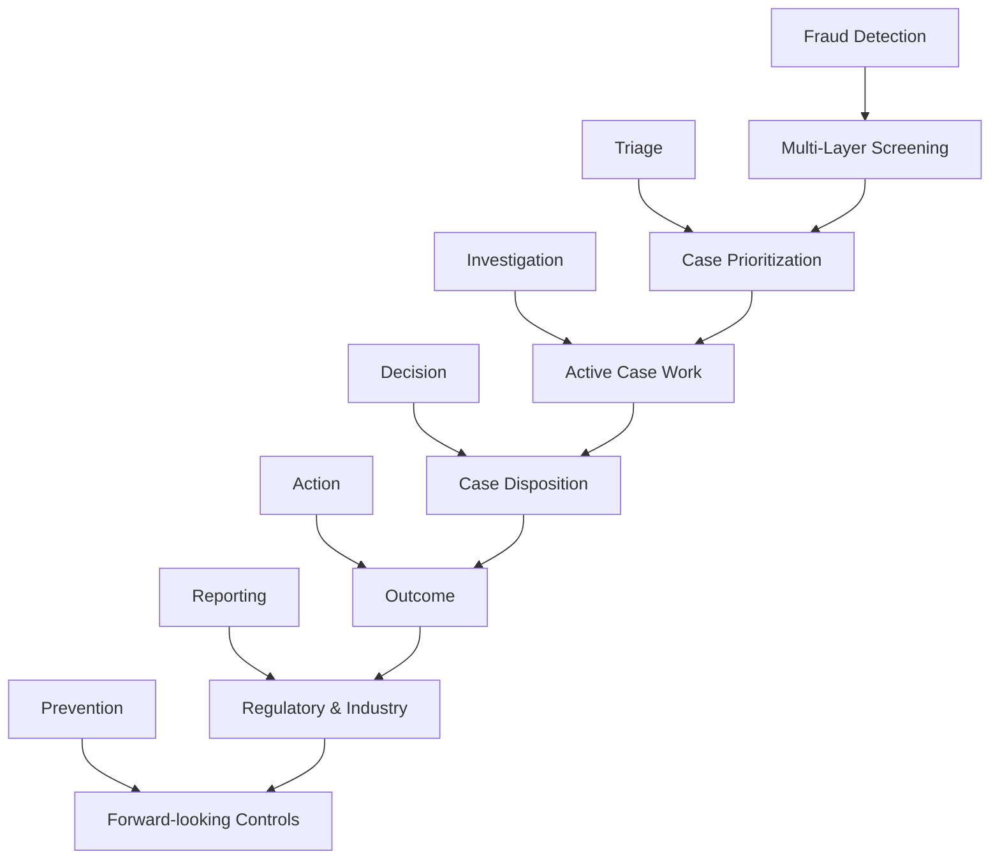
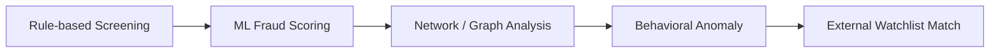
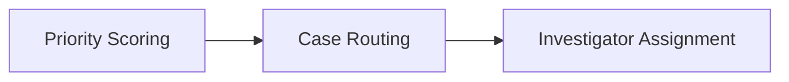
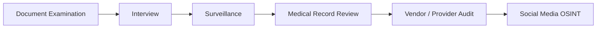
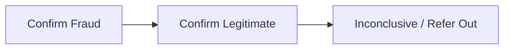
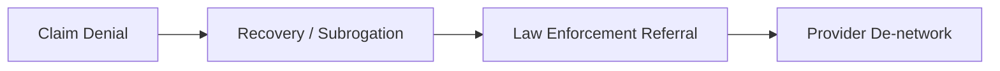
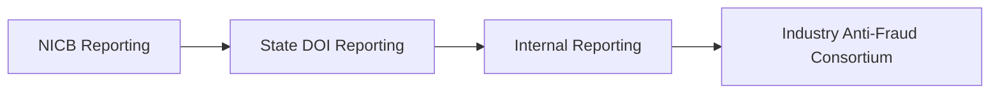
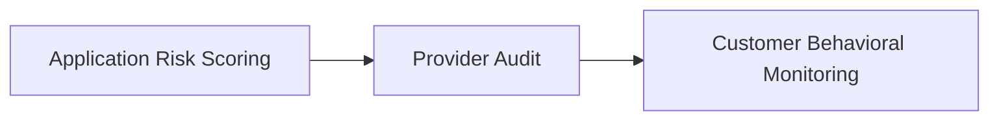
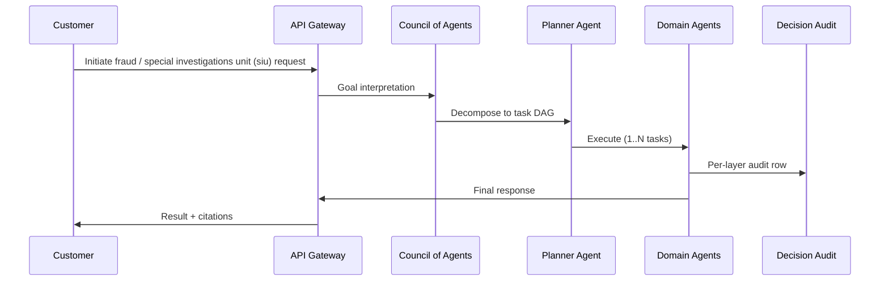

# Process Flow Diagrams — Fraud / Special Investigations Unit (SIU)

Per operator 2026-06-01.
Mermaid flowcharts per L2 process. Each L2 → ordered L3 sub-process chain.

## L1 → L2 Process Hierarchy

### Fraud Detection → Multi-Layer Screening

### Triage → Case Prioritization

### Investigation → Active Case Work

### Decision → Case Disposition

### Action → Outcome

### Reporting → Regulatory & Industry

### Prevention → Forward-looking Controls

## End-to-End Happy Path

