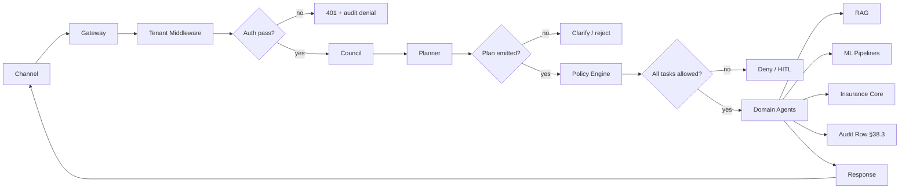
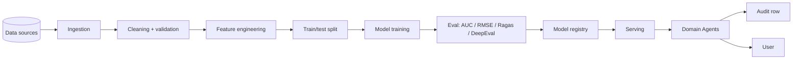

# System Design — Fraud / Special Investigations Unit (SIU)

Per operator 2026-06-01: "technical architect, flow internal flow, system design".

Consolidated technical architecture for the Fraud / Special Investigations Unit (SIU) dept. Pairs with
[INSUR_ARCHITECTURE_FLOW.md](INSUR_ARCHITECTURE_FLOW.md) (C4 L2 + sequence) and
extends it with internal-flow detail.

## 1. Architecture at a glance

| Layer | Component count | Tech |
|---|---|---|
| Channels | 4 (Web / Mobile / CC / Broker) | Next.js 14 + Twilio |
| Gateway | 1 (FastAPI) + tenant middleware + auth | FastAPI + Pydantic |
| Orchestration | 3 (Council + Planner + Policy) | Python + LangGraph |
| Domain agents | 10 | Python + Ollama / LLM-router |
| ML pipelines | 3-5 | scikit-learn + XGBoost + sentence-transformers + ChromaDB |
| Insurance core | 5 (Policy / Claims / CRM / Billing / DMS) | External / synthetic for now |
| Observability | 3 (OTel + Audit table + structured logs) | OpenTelemetry + Postgres |

## 2. Internal flow (request lifecycle)

A single user-initiated request flows:

Every step writes to OpenTelemetry traces with `request_id` baggage propagated end-to-end (§47.6 + §57.6).

## 3. Process count (this dept)

- L1 processes: 7
- L2 processes: 7
- L3 sub-processes: 28
- Total addressable for automation: 28
- Currently automated (TO-BE target): 60-80% (per [INSUR_DT_STRATEGY.md](INSUR_DT_STRATEGY.md))

## 4. Data flow

## 5. Component responsibilities

| Component | Owns | Does NOT own |
|---|---|---|
| Router (`backend/routers/insurance.py`) | HTTP only | No SQL, no business logic |
| Service (`backend/services/insurance_*.py`) | Business logic, exceptions | No HTTPException |
| Repository (`backend/repositories/*.py`) | All SQL, parameterized queries | No business logic |
| ML pipeline (`backend/ml/reference/*.py`) | Model lifecycle | No HTTP / no orchestration |
| Agents (`agents/*.py`) | Long-running execution | No HTTP entry |
| Workers (`backend/workers/tasks.py`) | Async orchestration | No HTTP entry |

(Per global §1 architecture standards table.)

## 6. State boundaries

| State | Lives in | Lifetime |
|---|---|---|
| Request context (request_id, tenant_id, actor) | OTel baggage | request |
| Decision audit row | Postgres `decision_audit` | 7 years (regulated) |
| Model + prompt versions | Registry table | forever (immutable) |
| Conversation memory | Redis | session TTL |
| Vector index | ChromaDB persistent | rebuild on corpus change |
| Idempotency cache | Postgres `idempotency` | 24h |

## 7. Failure-mode catalog (per dept top-5)

| Failure | Detection | Mitigation | Mitigation policy |
|---|---|---|---|
| External data feed down | Circuit breaker opens | Cached fallback | §47.7 |
| Model accuracy drift | Weekly eval gate | Retraining trigger | §53 |
| Tenant data leak | Drill: tenant A → ZERO tenant B rows | RLS at SQL boundary | §41.3 |
| LLM hallucination | Ragas faithfulness < 0.85 | Block answer; route to human | §48.5 + §59.4 |
| Scope-deny on action | Policy engine returns deny | Audit row + 403 | §64.40 layer 5 |

## 8. SLOs

| SLO | Target |
|---|---|
| Availability | 99.95% (per global §47.10) |
| Latency p95 (non-AI endpoint) | < 500ms |
| Latency p95 (AI inference) | < 30s |
| Throughput | 50K concurrent users |
| Mean time to detect (MTTD) | 10 min |
| Mean time to recover P1 (MTTR) | 1 hr |

## 9. Capacity model

For peak claims/UW/CS day (e.g., CAT event or quarter-end):

| Component | Baseline | Peak | Scale strategy |
|---|---|---|---|
| API gateway | 100 req/s | 1000 req/s | Horizontal: docker-compose `backend --scale 5` |
| Worker fleet (Celery) | 4 workers | 40 workers | Horizontal: `worker --scale 10` |
| Agent fleet | 100 agents | 500 agents | Horizontal: `agents --scale 5` |
| Council agents | 3 | 12 | Horizontal: `council_agents --scale 4` |
| Postgres | 50 conn | 500 conn | PgBouncer pooling |
| Ollama | 1 GPU | 4 GPUs | GPU pool / vLLM upgrade |

## 10. Reference impls used

| Stage | Reference impl | Used by |
|---|---|---|
| Preprocessing | `full_lifecycle.py` | All dept pipelines |
| Tabular ML | `full_lifecycle.py` + `ensemble_compare.py` | All depts |
| NLP | `nlp_lifecycle.py` | CS + Claims (notes) |
| CV | `cv_lifecycle.py` | Claims (damage photos) |
| Time series | `timeseries_lifecycle.py` | UW (portfolio LR) |
| RAG | `rag_lifecycle.py` | All depts |
| Recommendation | `recommendation_lifecycle.py` | CS |
| Anomaly | `anomaly_lifecycle.py` | All depts |
| Fraud | `fraud_lifecycle.py` (synthetic ref) + `full_lifecycle.py` (real) | Claims + Fraud |
| Agent orchestration | `agent_orchestration.py` | Fraud (multi-agent investigation) |
| Simulation engine | `simulation_engine.py` | All depts |

## 11. Architecture decisions (ADRs)

To file for this dept:

- ADR — Ollama vs OpenAI for Fraud / Special Investigations Unit (SIU) (cost + latency + data residency)
- ADR — Chunking strategy for Fraud / Special Investigations Unit (SIU) RAG corpus (fixed / sentence / semantic-paragraph)
- ADR — Tenant isolation: row-level vs column-level
- ADR — Decision audit retention (7y regulated vs 1y default)
- ADR — Idempotency key TTL (Fraud / Special Investigations Unit (SIU) retry storm pattern)

## 12. Composes with

- §38 (AI governance) — every decision is auditable
- §43 (drill) — every component has ≥3 negative-assertion drill
- §47 (architecture) — all 7 surfaces (C4 / ADR / JAD / Security / Rollout / Principles / Load)
- §48 (explainability) — every model carries SHAP / counterfactual / citation
- §53 (maturity) — 14-item enterprise rigor checklist
- §57 (production discipline) — 5-question runbook surfaces
- §64.27 (manual + auto flow + architecture) — this doc + [INSUR_MANUAL_VS_AUTO_FLOW.md](INSUR_MANUAL_VS_AUTO_FLOW.md) + [INSUR_ARCHITECTURE_FLOW.md](INSUR_ARCHITECTURE_FLOW.md) jointly satisfy the §64.27 contract
