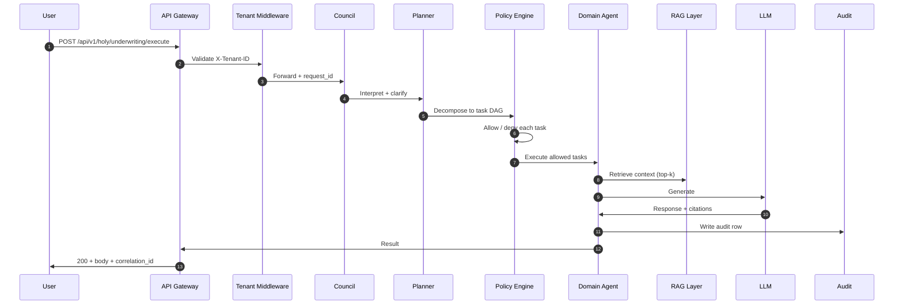

# Architecture Flow — Underwriting

Per operator 2026-06-01.
C4 L2 container diagram — services + agents + models that back this department.

## C4 L2 Container Diagram

```mermaid
flowchart TB
    subgraph Channels
        Web[Web Portal]
        Mobile[Mobile App]
        CC[Contact Center]
        Broker[Broker / Agent Portal]
    end

    subgraph Gateway
        API[API Gateway<br/>FastAPI]
        Auth[Auth + Tenant Middleware]
    end

    subgraph Orchestration
        Council[Council of Agents<br/>3-stage author/reviewer/chair]
        Planner[Planner Agent]
        Policy[Policy Engine<br/>OPA + scope grants]
    end

    subgraph "Domain Agents — Underwriting"
        A0[Application Intake Agent]
        A1[Document Verification Agent]
        A2[Risk Scoring Agent]
        A3[Pricing Agent]
        A4[Underwriting Decision Agent]
        A5[Policy Generation Agent]
        A6[Compliance Verification Agent]
        A7[Portfolio Monitoring Agent]
    end

    subgraph Models
        LLM[LLM Layer<br/>Ollama / GPT / Claude]
        Embed[Embedding Model<br/>nomic-embed]
        ML[ML Models<br/>XGBoost / NN]
    end

    subgraph Memory
        Vector[Vector DB<br/>Pinecone / pgvector]
        Graph[Graph DB<br/>Neo4j]
        RAG[RAG Corpus<br/>Policy + Claims + KB]
    end

    subgraph Insurance Core
        Policy_Sys[Policy Admin System]
        Claims_Sys[Claims System]
        CRM[CRM]
        Billing[Billing]
        DMS[Document Mgmt]
    end

    subgraph Observability
        OTel[OpenTelemetry]
        Audit[Decision Audit §38.3]
        Logs[Structured Logs]
    end

    Channels --> Gateway
    Gateway --> Orchestration
    Orchestration --> "Domain Agents — Underwriting"
    "Domain Agents — Underwriting" --> Models
    "Domain Agents — Underwriting" --> Memory
    "Domain Agents — Underwriting" --> Insurance Core
    "Domain Agents — Underwriting" --> Observability
```

## Component Inventory

| Layer | Component | Role | Owner |
|---|---|---|---|
| Channels | Web / Mobile / CC / Broker | Customer-facing entry | Frontend |
| Gateway | API Gateway (FastAPI) | HTTP + auth + tenant | Platform |
| Orchestration | Council / Planner / Policy | Goal → plan → policy gate | AI Platform |
| Domain | 9 agents | Underwriting business logic | Domain |
| Models | LLM + Embed + ML | Foundation models | AI Platform |
| Memory | Vector + Graph + RAG | Retrieval substrate | Data Platform |
| Insurance Core | Policy / Claims / CRM / Billing / DMS | Systems of record | Core Platform |
| Observability | OTel + Audit + Logs | Trace + governance | SRE |

## Request Flow (single endpoint deep-dive)



## Cross-Cutting Concerns

| Concern | Mechanism | Reference |
|---|---|---|
| AuthN / AuthZ | API key + tenant + RBAC | §47.6 SOC2 CC6.2 |
| Rate limiting | Per-tenant token bucket | §41.4 |
| Circuit breaker | 3-fail / 30s reset on every external call | §47 |
| Tracing | OpenTelemetry baggage carries request_id | §47.6 |
| Audit | Every decision → audit row | §38.3 |
| Explainability | SHAP / counterfactual on every model output | §48 |
