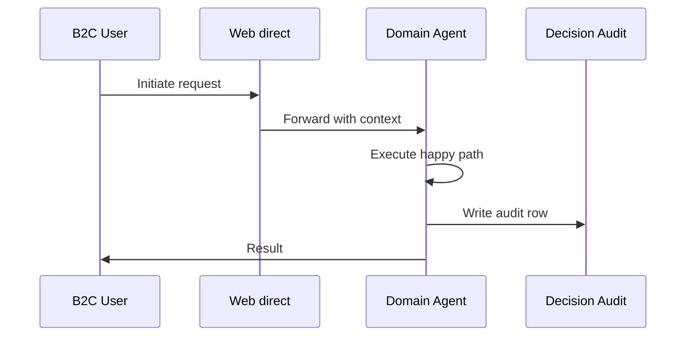
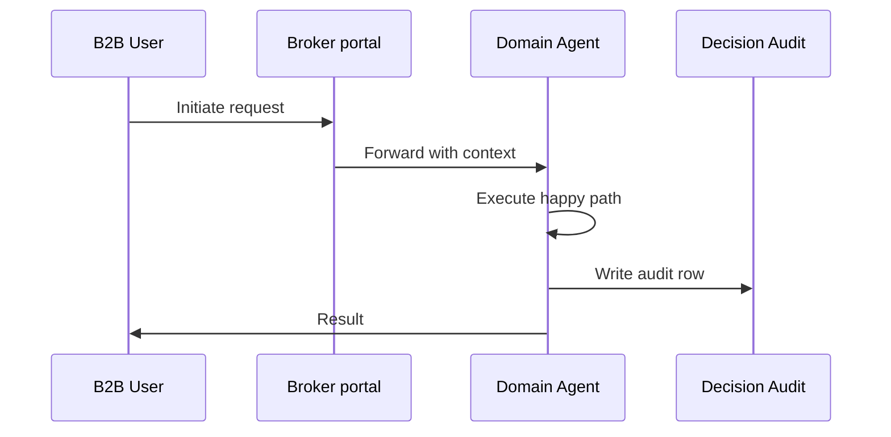
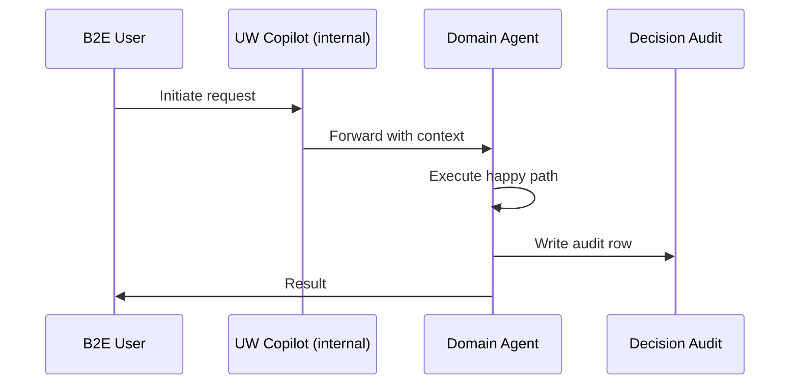

# Business Model Flows (B2C / B2B / B2E / B2G) — Underwriting

Per operator 2026-06-01.
Each business model gets a distinct scenario, channels, happy path, exceptions, and data sources.

Business models supported by this department: **B2C, B2B, B2E**

## B2C — Individual buys homeowners policy online

**Channels**: Web direct, Mobile app

### Happy Path
1. Applicant enters address + basic info
2. Property risk agent pulls satellite imagery, CLUE history, geo-perils
3. Risk scoring ensemble returns score in <3 sec
4. Pricing agent computes dynamic premium
5. STP decision (auto-approve if risk ≤ tier-2)
6. Policy document generated + e-delivered within 60 sec

### Exception Branches
- Wildfire zone → manual review
- Prior CAT claim → endorsement required
- Coastal exposure → reinsurance referral

### Data Sources
- Address geocoding
- CLUE
- Property valuation
- Catastrophe model
- Credit-based insurance score

### Mermaid Flow

## B2B — Manufacturing firm seeks commercial property + liability + workers' comp via broker

**Channels**: Broker portal, ACORD-form submission

### Happy Path
1. Broker uploads ACORD 125/126/130 + loss runs
2. Document agent extracts structured data
3. Risk agent assesses occupancy + COPE + loss history
4. Senior UW reviews complex risks (asbestos, PFAS exposure)
5. Reinsurance check for limits > $5M
6. Quote bound; policy issued within 24 hrs

### Exception Branches
- EPA-listed site → environmental UW
- Cyber endorsement → cyber-UW handoff
- International exposure → global program

### Data Sources
- ACORD forms
- Loss runs
- OSHA records
- Dun & Bradstreet
- Reinsurance treaty wordings

### Mermaid Flow

## B2E — Underwriter handles a complex group-life renewal for a Fortune-500 employer

**Channels**: UW Copilot (internal), Renewal workflow

### Happy Path
1. Copilot pre-loads 3-year experience + benchmark data
2. Predicts loss-ratio trajectory + recommends rate action
3. Drafts renewal proposal with rate-action narrative
4. Senior UW reviews + approves rate-pass-through
5. Auto-generates renewal package; sent to broker

### Exception Branches
- Large rate action (>15%) → senior committee
- Industry under-performance → re-class
- Pandemic IBNR adjustment

### Data Sources
- 3-year claims experience
- Industry benchmarks
- Demographic shift data
- Reinsurance pool data

### Mermaid Flow

## Cross-model considerations

| Concern | B2C | B2B | B2E | B2G |
|---|---|---|---|---|
| Authentication | Customer auth (OTP / bio) | Broker license + appointment | SSO + RBAC | Mutual TLS + signed envelope |
| Audit depth | Per-decision audit row | Per-transaction + treaty link | Per-action + supervisor | Per-record + regulator-readable |
| Compliance gate | State DOI consumer rules | Commercial / multi-state | Internal policy + HR | Regulator-mandated SLA |
| Reporting cadence | On-demand | Quarterly broker scorecard | Daily ops dashboard | Per state requirement |
