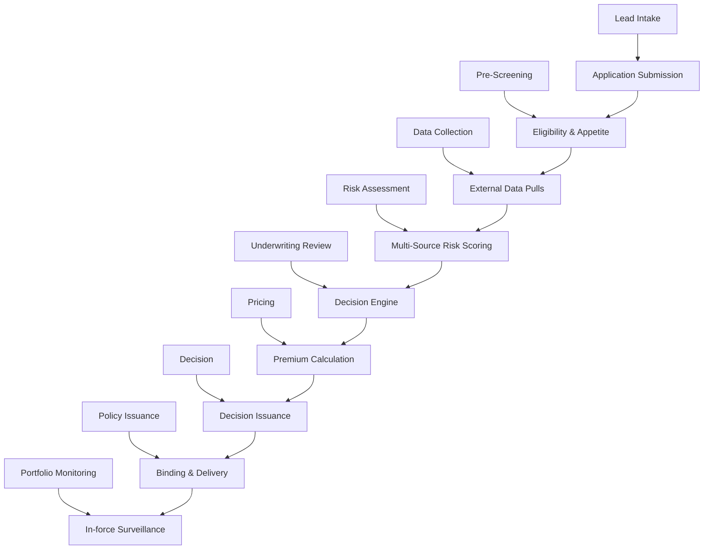
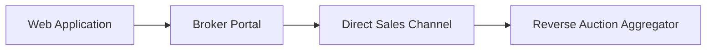
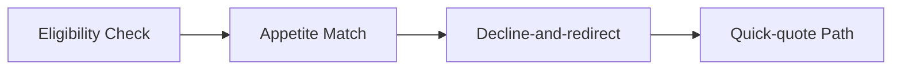
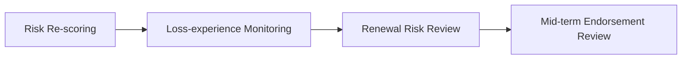
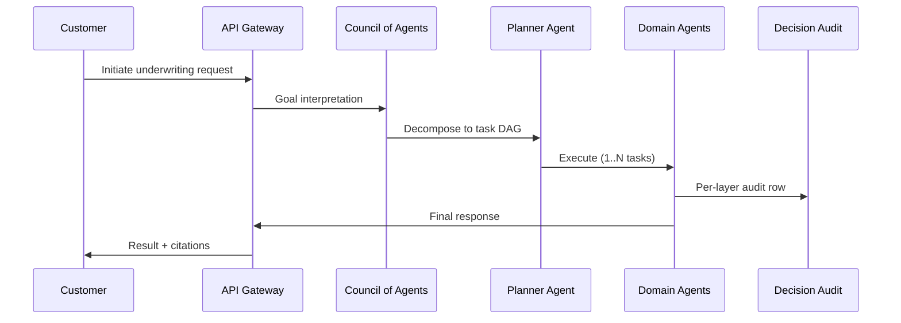

# Process Flow Diagrams — Underwriting

Per operator 2026-06-01.
Mermaid flowcharts per L2 process. Each L2 → ordered L3 sub-process chain.

## L1 → L2 Process Hierarchy



### Lead Intake → Application Submission



### Pre-Screening → Eligibility & Appetite



### Data Collection → External Data Pulls

```mermaid
flowchart LR
    A[KYC / Identity Verification]
    B[Credit Bureau Pull]
    C[Medical Records (HIPAA-compliant)]
    D[Motor Vehicle Records (MVR)]
    E[CLUE Loss History]
    F[Telematics Onboarding]
    A --> B
    B --> C
    C --> D
    D --> E
    E --> F
```

### Risk Assessment → Multi-Source Risk Scoring

```mermaid
flowchart LR
    A[Demographic Risk Scoring]
    B[Behavioral Risk Scoring]
    C[Catastrophe Exposure (Geo)]
    D[Credit-based Insurance Score]
    E[Predictive Lapse Risk]
    A --> B
    B --> C
    C --> D
    D --> E
```

### Underwriting Review → Decision Engine

```mermaid
flowchart LR
    A[Auto Underwriting (STP)]
    B[Manual Underwriting Review]
    C[Senior UW Referral]
    D[Reinsurance Referral (treaty / facultative)]
    A --> B
    B --> C
    C --> D
```

### Pricing → Premium Calculation

```mermaid
flowchart LR
    A[Base Premium Calculation]
    B[Dynamic Adjustment (telematics, behavior)]
    C[Discount Application]
    D[Surcharge Application]
    E[Rate-filing Compliance Check]
    A --> B
    B --> C
    C --> D
    D --> E
```

### Decision → Decision Issuance

```mermaid
flowchart LR
    A[Approve]
    B[Reject (with reason codes)]
    C[Refer (with conditions)]
    D[Counter-offer]
    A --> B
    B --> C
    C --> D
```

### Policy Issuance → Binding & Delivery

```mermaid
flowchart LR
    A[Policy Document Generation]
    B[ID Card Issuance]
    C[Welcome Kit Generation]
    D[Policy Delivery (e-delivery / mail)]
    A --> B
    B --> C
    C --> D
```

### Portfolio Monitoring → In-force Surveillance




## End-to-End Happy Path


